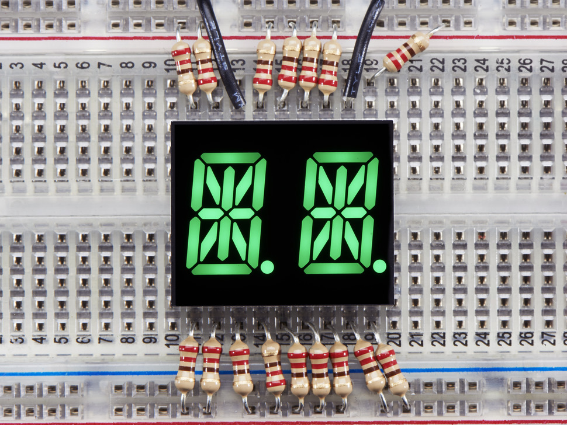

# Lucky Light KWA-541CPGB Green Alphanumeric Display

## Details

- **Location**: Cabinet-1, Bin 19
- **Category**: Alphanumeric Displays
- **Type**: 14-Segment LED Character Display
- **Color**: Green
- **Size**: 0.54 inch (13.60mm) character height
- **Quantity**: 4
- **Datasheet**: https://cdn-shop.adafruit.com/datasheets/2156datasheet.pdf

## Description

Lucky Light KWA-541CPGB green alphanumeric LED display with 14-segment configuration for displaying letters, numbers, and symbols. Single character display with common cathode configuration and bright green LEDs.

## Specifications

- **Part Number**: KWA-541CPGB
- **Character Height**: 13.60mm (0.54 inch)
- **Segments**: 14-segment alphanumeric
- **Emitting Color**: Green
- **Face Color**: Black
- **Polarity**: Common Cathode
- **Luminous Intensity**: 40mcd (typical)
- **Wavelength**: 565nm (typical green)
- **Interface**: Parallel (direct segment control)
- **Package**: Through-hole DIP style
- **RoHS Compliant**: Yes

## Features

- **0.54" Digit Height**: Standard size for good visibility
- **Low Current Operation**: Efficient power consumption
- **Excellent Character Appearance**: Clear, crisp character display
- **Available in CA and CC**: Common anode and cathode versions
- **RoHS Compliant**: Environmental compliance
- **Standard Green Color**: Classic 565nm wavelength
- **High Contrast**: Excellent visibility with black face

## Pinout

- **Common Cathode**: Single common cathode pin
- **Segment Pins**: Individual pins for each of the 14 segments
- **Decimal Point**: Separate pin for decimal point control

## Applications

- Home and smart appliances
- Display time and digital combinations
- Industrial and instrumental applications
- Instrument panels
- Numeric status displays
- Test and measurement equipment
- Point-of-sale terminals
- Telecom systems
- Office equipment
- Consumer electronics
- Medical equipment

## Image

## Interface Requirements

- **Microcontroller**: Any MCU with sufficient GPIO pins
- **Current Limiting**: Resistors required for each segment
- **Multiplexing**: For multiple displays, consider multiplexing circuit
- **Driver ICs**: Can use segment driver ICs for easier control

## Notes

- Common cathode configuration (cathode shared, anodes individual)
- Requires current limiting resistors for each segment
- Can display A-Z, 0-9, and some special characters
- Green color provides good visibility and is easy on the eyes
- Through-hole mounting for easy prototyping
- Similar specifications to red and white versions in same series

## Related Components

- **White Version**: [[luckylight-kwa-541cwb-y]] (Cabinet-1, Bin 17 & 19) - 8 units
- **Red Version**: [[luckylight-kwa-541cvb]] (Cabinet-1, Bin 17, 18 & 19) - 8 units

## Tags

led-display, alphanumeric, green, 14-segment, lucky-light, common-cathode
