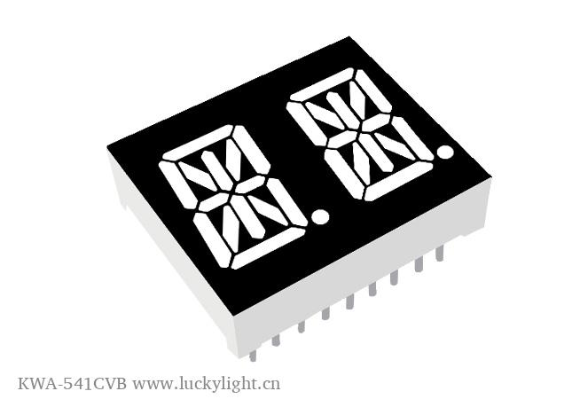

# Lucky Light KWA-541CVB Red Alphanumeric Display

## Details

- **Location**: Cabinet-1, Bin 17 (2 units), Bin 18 (2 units) & Bin 19 (4 units)
- **Category**: Alphanumeric Displays
- **Type**: 14-Segment LED Character Display
- **Color**: Red
- **Size**: 0.54 inch (13.60mm) character height
- **Quantity**: 8 total
- **Product URL**: https://www.luckylight.cn/en/products/led-display/alphanumeric/kwa-541cvb/

## Description

Lucky Light KWA-541CVB red alphanumeric LED display with 14-segment configuration for displaying letters, numbers, and symbols. Single character display with common cathode configuration and standard red LEDs.

## Specifications

- **Part Number**: KWA-541CVB
- **Character Height**: 13.60mm (0.54 inch)
- **Segments**: 14-segment alphanumeric
- **Emitting Color**: Red
- **Face Color**: Black
- **Polarity**: Common Cathode
- **Luminous Intensity**: 40mcd (typical)
- **Wavelength**: 624nm
- **Interface**: Parallel (direct segment control)
- **Package**: Through-hole DIP style
- **RoHS Compliant**: Yes

## Image

## Features

- **0.54" Digit Height**: Standard size for good visibility
- **Low Current Operation**: Efficient power consumption
- **Excellent Character Appearance**: Clear, crisp character display
- **Available in CA and CC**: Common anode and cathode versions
- **RoHS Compliant**: Environmental compliance
- **Standard Red Color**: Classic 624nm wavelength

## Pinout

- **Common Cathode**: Single common cathode pin
- **Segment Pins**: Individual pins for each of the 14 segments
- **Decimal Point**: Separate pin for decimal point control

## Applications

- Home appliances
- Instrument panels
- Digital readout displays
- Test and measurement equipment
- Point-of-sale terminals
- Telecom systems
- Office equipment
- Consumer electronics
- Medical equipment

## Interface Requirements

- **Microcontroller**: Any MCU with sufficient GPIO pins
- **Current Limiting**: Resistors required for each segment
- **Multiplexing**: For multiple displays, consider multiplexing circuit
- **Driver ICs**: Can use segment driver ICs for easier control

## Notes

- Common cathode configuration (cathode shared, anodes individual)
- Requires current limiting resistors for each segment
- Can display A-Z, 0-9, and some special characters
- Standard red color provides good visibility
- Through-hole mounting for easy prototyping
- Lower luminous intensity compared to white version (40mcd vs 160mcd)

## Tags

led-display, alphanumeric, red, 14-segment, lucky-light, common-cathode
