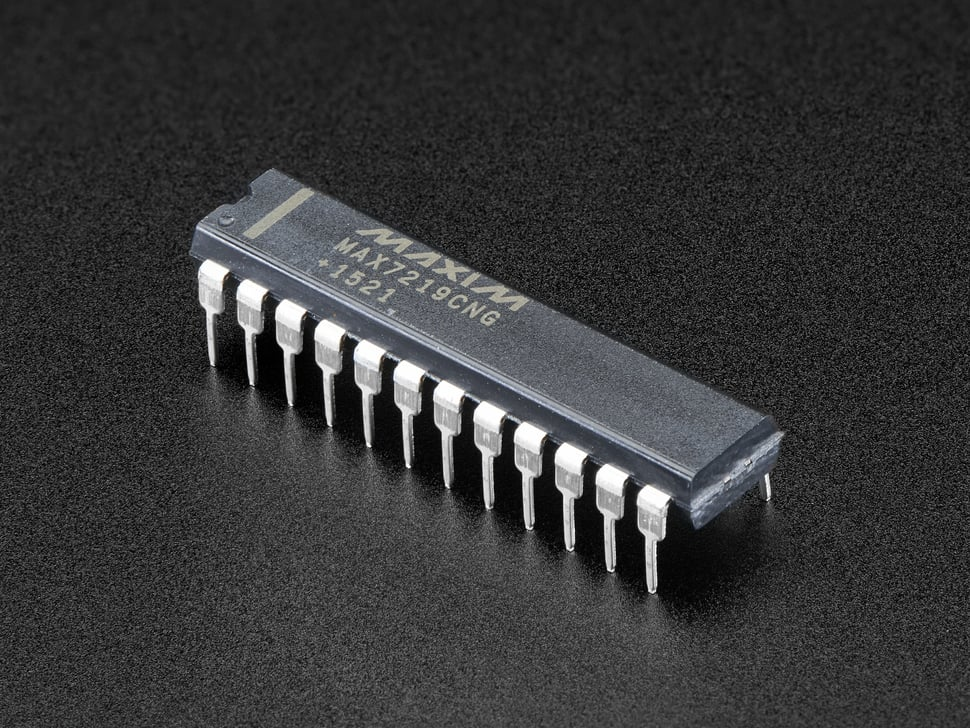

# MAX7219CNG - LED Matrix/Digit Display Driver

## Details

- **Location**: Cabinet-3, Bin 39, Section C
- **Category**: Display Drivers
- **Brand**: Adafruit (Maxim Integrated IC)
- **Part Number**: MAX7219CNG
- **Package**: 24-DIP
- **Quantity**: 20
- **Status**: Available
- **Price Range**: $12.95 (single), $11.66 (10-99), $10.36 (100+)
- **Datasheet**: [MAX7219 Datasheet](https://cdn-shop.adafruit.com/datasheets/MAX7219.pdf)
- **Product URL**: https://www.adafruit.com/product/453

## Description

The MAX7219 is a serially interfaced, 8-digit LED display driver that can control either an 8x8 LED matrix or up to 8 seven-segment displays (64 LEDs total). This IC handles all the multiplexing, current regulation, and refresh duties automatically, requiring only a simple 4-pin SPI interface for control. It eliminates the need for external current-limiting resistors for each LED segment and provides built-in BCD code-B decoder, multiplex scan circuitry, segment and digit drivers, and an 8x8 static RAM for storing each digit.

## Specifications

### Electrical Characteristics
- **Operating Voltage**: 4.0V ~ 5.5V
- **Supply Current**: 330mA maximum (all segments on)
- **Interface**: 4-wire SPI (CLK, CS, DIN, DOUT)
- **Output Current**: Up to 40mA per segment
- **Scan Rate**: 800Hz typical
- **Power Dissipation**: 665mW maximum

### Physical Characteristics  
- **Package**: 24-pin DIP (Dual In-line Package)
- **Dimensions**: 0.600" (15.24mm) width
- **Pin Pitch**: 0.100" (2.54mm)
- **Operating Temperature**: 0°C to +70°C

### Key Features
- Drives 8x8 LED matrix or 8-digit 7-segment displays
- SPI-compatible serial interface
- Individual LED segment control
- Built-in BCD code-B decoder
- 16-step digital brightness control
- Display blanking and shutdown modes
- No external current-limiting resistors needed per segment

## Image



## Pinout Diagram

```
    MAX7219 24-Pin DIP
    ┌─────────────────┐
DIN │1              24│ VCC
DIG0│2              23│ ISET
DIG4│3              22│ V+
GND │4              21│ SEG DP
DIG6│5              20│ SEG A
DIG2│6              19│ SEG F
DIG3│7              18│ GND
DIG7│8              17│ SEG B
GND │9              16│ SEG G
DIG5│10             15│ DOUT
DIG1│11             14│ SEG C
LOAD│12             13│ SEG E
    └─────────────────┘
```

## Pin Descriptions

| Pin | Name | Description |
|-----|------|-------------|
| 1   | DIN  | Serial Data Input |
| 2-11| DIG0-DIG7 | Digit Drive Lines (cathodes for common-cathode displays) |
| 12  | LOAD | Load Data (Chip Select) |
| 13-20| SEG E,C,G,B,F,A,DP | Segment Drive Lines (anodes) |
| 21  | V+   | LED Supply Voltage |
| 22  | ISET | Current Set (connect resistor to GND) |
| 23  | DOUT | Serial Data Output (for daisy chaining) |
| 24  | VCC  | Logic Supply Voltage |

## Applications

Common use cases for the MAX7219:
- 8x8 LED matrix displays for graphics and text
- Multi-digit 7-segment numeric displays
- Digital clocks and counters
- Status indicators and scoreboards
- Scrolling text displays
- Arduino and microcontroller projects
- Educational electronics projects
- Retro gaming displays

## Circuit Examples

### Basic 8x8 LED Matrix Connection
```
Arduino/MCU    MAX7219
VCC     ----   VCC (Pin 24)
GND     ----   GND (Pins 4, 9, 18)
D13     ----   CLK (connect to DIN via shift register logic)
D11     ----   DIN (Pin 1)
D10     ----   CS/LOAD (Pin 12)

ISET (Pin 22) ---- 10kΩ resistor ---- GND
V+ (Pin 21) ------ VCC (LED supply)
```

### Current Setting Resistor
```
ISET Resistor Value = 31,500 / (desired segment current in mA)
For 20mA: R = 31,500 / 20 = 1.575kΩ (use 1.5kΩ)
For 40mA: R = 31,500 / 40 = 787.5Ω (use 820Ω)
```

## Programming Examples

### Arduino Example
```cpp
#include <LedControl.h>

// DIN, CLK, LOAD, number of devices
LedControl lc = LedControl(12, 11, 10, 1);

void setup() {
  lc.shutdown(0, false);  // Wake up MAX7219
  lc.setIntensity(0, 8);  // Set brightness (0-15)
  lc.clearDisplay(0);     // Clear display
}

void loop() {
  // Set LED at row 0, column 0
  lc.setLed(0, 0, 0, true);
  delay(1000);
  lc.setLed(0, 0, 0, false);
  delay(1000);
}
```

### CircuitPython Example  
```python
import board
import digitalio
from adafruit_max7219 import matrices

spi = board.SPI()
cs = digitalio.DigitalInOut(board.D5)
matrix = matrices.Matrix8x8(spi, cs)

# Set pixel at (0,0)
matrix.pixel(0, 0, 1)
matrix.show()
```

## Technical Notes

Important considerations for the MAX7219:
- **Current Setting**: Use appropriate ISET resistor to set segment current
- **Power Supply**: Separate V+ supply may be needed for high-current applications
- **Daisy Chaining**: Multiple MAX7219s can be chained using DOUT to DIN
- **Decoupling**: Use 0.1µF capacitor between VCC and GND
- **Heat Dissipation**: Consider heat sinking for high-current applications

## Tags

display-driver, led-matrix, max7219, spi, multiplexing, adafruit, maxim #cabinet-3 #bin-39 #status-available

## Notes

The MAX7219 is an essential component for anyone working with LED matrix displays or multi-digit 7-segment displays. Having 20 of these ICs provides excellent flexibility for building multiple display projects or large multi-matrix installations. The SPI interface makes it easy to integrate with Arduino, Raspberry Pi, and other microcontrollers. The built-in multiplexing and current regulation eliminate much of the complexity typically associated with driving LED matrices, making it perfect for both beginners and advanced projects. These ICs can be daisy-chained to create larger displays, and the digital brightness control allows for professional-looking results.
