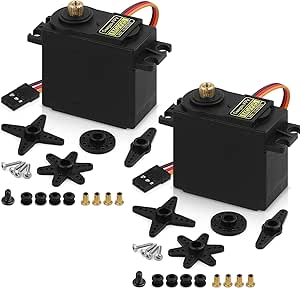

# MG995 55G Metal Gear Servo Motors

## Details

- **Location**: Cabinet 4, Bin 19
- **Category**: Servo Motors
- **Brand**: DEEGOO-FPV
- **Part Number**: MG995-55G
- **Package**: Individual servos
- **Quantity**: ~2 servos
- **Status**: Available
- **Price Range**: $13.99 (2-pack)
- **Product URL**: https://a.co/d/c10wWyk

## Description

High-performance MG995 55g metal gear servo motors designed for demanding applications requiring higher torque and durability. These servos feature metal gears for increased longevity and can handle heavier loads compared to plastic gear servos. Ideal for RC cars, robotic arms, and other applications requiring reliable, high-torque positioning.

## Image



## Specifications

### Servo Characteristics
- **Model**: MG995 (industry standard)
- **Weight**: 55 grams
- **Dimensions**: 40.7 x 19.7 x 42.9mm
- **Gear Type**: Metal gears (full metal gear train)
- **Rotation Range**: 180 degrees (±90 degrees)
- **Operating Speed**: 0.17 sec/60° (4.8V no load), 0.13 sec/60° (6V)

### Electrical Specifications
- **Operating Voltage**: 4.8V - 7.2V DC
- **Current Draw**: 100mA (no load), 3A (stall)
- **Control Signal**: PWM (Pulse Width Modulation)
- **Pulse Width**: 1ms-2ms (20ms period)
- **Neutral Position**: 1.5ms pulse width
- **Dead Band**: 5μs

### Mechanical Properties
- **Torque**: 12 kg⋅cm (6V), 13 kg⋅cm (7.2V)
- **Gear Ratio**: Approximately 1:298
- **Bearing Type**: Dual ball bearings
- **Output Shaft**: 25-tooth spline
- **Temperature Range**: 0°C to 55°C

## Pinout/Connection Information

### Wire Configuration
- **Red Wire**: VCC (Power) - Connect to 4.8V-7.2V
- **Brown/Black Wire**: Ground - Connect to system ground
- **Yellow/Orange Wire**: Signal - Connect to PWM output pin

### PWM Control Signals
```
Position Control:
0° (Full CCW)    = 1.0ms pulse width
90° (Center)     = 1.5ms pulse width  
180° (Full CW)   = 2.0ms pulse width

Pulse Period: 20ms (50Hz)
Voltage Levels: 0V (Low), 3.3V/5V (High)
```

### Arduino Connection Example
```
Servo Pin    Arduino Pin
VCC     -->  6V External Supply (NOT Arduino 5V)
GND     -->  Common Ground
Signal  -->  Digital Pin (e.g., Pin 9)
```

## Circuit Integration Notes

### Power Requirements
- **External Power Supply**: Use dedicated 6V supply for best performance
- **Current Capacity**: Ensure power supply can handle 3A stall current
- **Voltage Regulation**: Use regulated supply to prevent voltage drops
- **Decoupling**: Add large capacitors to handle current spikes

### Arduino Programming
- **Library**: Use Arduino Servo library
- **Initialization**: `Servo myServo; myServo.attach(9);`
- **Position Control**: `myServo.write(angle);` (0-180 degrees)
- **Microsecond Control**: `myServo.writeMicroseconds(pulseWidth);`

## Technical Specifications

### Performance Parameters
- **Resolution**: Approximately 0.5-1 degrees
- **Repeatability**: ±0.5 degree typical
- **Linearity**: Excellent linearity across operating range
- **Response Time**: Fast response to command changes
- **Holding Torque**: Strong holding torque when powered

### Environmental Specifications
- **Operating Temperature**: 0°C to 55°C
- **Storage Temperature**: -20°C to 70°C
- **Humidity**: 85% RH max (non-condensing)
- **Vibration**: High vibration resistance
- **Shock**: Suitable for demanding applications

### Reliability Features
- **Metal Gears**: Full metal gear train for durability
- **Ball Bearings**: Dual ball bearings for smooth operation
- **Overload Protection**: Internal circuit protection
- **Thermal Protection**: Temperature-sensitive operation
- **Coreless Motor**: Anti-vibration coreless motor design

## Applications

### RC Vehicles
- **Steering Servos**: Primary steering control for RC cars
- **Throttle Control**: Engine throttle and brake linkages
- **Suspension**: Active suspension systems
- **Differential Control**: Locking differential mechanisms

### Heavy-Duty Robotics
- **Robotic Arms**: Joint actuation for larger robots
- **Gripper Systems**: High-force gripping mechanisms
- **Walking Robots**: Hip and knee joints for walking robots
- **Industrial Automation**: Positioning systems requiring high torque

### RC Aircraft (Large Models)
- **Control Surfaces**: Large aircraft primary controls
- **Retractable Gear**: Heavy landing gear mechanisms
- **Flap Systems**: High-load flap and slat controls
- **Rudder Control**: Large rudder and elevator systems

## Troubleshooting

### Common Issues
1. **Overheating**: Ensure adequate power supply and ventilation
2. **Jittery Movement**: Check power supply stability and signal quality
3. **Limited Torque**: Verify voltage is within 6-7.2V range
4. **No Response**: Check wiring and ensure adequate current capacity

### Performance Optimization
- **Power Supply**: Use 6V regulated supply with 5A+ capacity
- **Signal Quality**: Use short, shielded wires for signal connections
- **Heat Management**: Provide adequate ventilation for continuous operation
- **Load Matching**: Ensure mechanical load doesn't exceed torque specifications

### Installation Tips
- **Mounting**: Use proper servo mounting hardware to prevent stress
- **Linkages**: Use quality linkages rated for servo torque
- **Alignment**: Ensure proper mechanical alignment to prevent binding
- **Lubrication**: Gears are pre-lubricated; avoid over-lubrication

## Compatibility Notes

### Microcontroller Compatibility
- **Arduino**: All Arduino boards (with external power supply)
- **Raspberry Pi**: Use GPIO with external power supply
- **ESP32/ESP8266**: Built-in PWM channels with external power
- **RC Receivers**: Standard PWM servo outputs

### RC System Compatibility
- **Receivers**: Standard PWM servo outputs (Futaba, JR, Spektrum)
- **Transmitters**: Compatible with all standard RC transmitters
- **Flight Controllers**: Works with autopilot systems
- **Speed Controllers**: Compatible with servo-controlled ESCs

### Mechanical Compatibility
- **Servo Arms**: Standard 25-tooth spline (included)
- **Mounting**: Standard servo mounting tabs (40mm spacing)
- **Linkages**: Compatible with heavy-duty RC linkage hardware
- **Gears**: Metal replacement gears available

## Notes

The MG995 servo offers significantly higher torque and durability compared to plastic gear servos like the SG90. The metal gear train and ball bearings make it suitable for applications requiring continuous operation under load.

**Power Considerations**: These servos require more power than micro servos. Always use an external power supply rated for at least 3A continuous current. The Arduino 5V rail cannot provide sufficient current.

**Quality Note**: DEEGOO-FPV branded servos typically feature full metal gear trains, unlike some variants that may have mixed plastic/metal gears. Verify gear type upon receipt.

**Application Recommendation**: Ideal for RC car steering, robotic arm joints, and any application requiring torque greater than 5 kg⋅cm.

## Related Components

- [[beffkkip-sg90-micro-servos]] - Smaller servos in same bin
- [[servo-accessories]] - Servo arms, linkages, and mounting hardware
- [[power-supplies]] - High-current power supplies for servo systems
- [[rc-car-components]] - Compatible RC car parts and accessories
