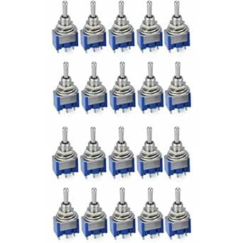

# MTS-103 3-Position SPDT Toggle Switches

## Details

- **Location**: Cabinet-5, Bin 9
- **Category**: Switches & Controls
- **Brand**: hiBCTR
- **Part Number**: B0DTHR25QB
- **Model**: MTS-103
- **Package**: Panel Mount Toggle Switch
- **Quantity**: 10 switches (from 20-piece pack)
- **Status**: Available
- **Price Range**: $9.65 (pack of 20)
- **Product URL**: https://a.co/d/d61g7yp

## Description

MTS-103 toggle switches are 3-terminal, 3-position SPDT (Single Pole, Double Throw) switches with ON/Off/ON configuration. These panel-mount switches feature a center-off position, making them ideal for reversing circuits, motor control, and general switching applications. The switches have a professional appearance with silver and blue coloring and include mounting hardware.

## Specifications

### Electrical Characteristics

- **AC Voltage Rating**: 250V AC (3A) / 125V AC (6A)
- **Contact Configuration**: SPDT (Single Pole, Double Throw)
- **Switch Positions**: 3 (ON/Off/ON)
- **Contact Resistance**: <50 milliohms
- **Insulation Resistance**: >100 MΩ
- **Dielectric Strength**: 1500V AC (1 minute)

### Physical Characteristics

- **Mounting Type**: Panel Mount
- **Thread Diameter**: 5.7mm (0.22 inches)
- **Terminal Type**: Screw terminals
- **Housing Material**: Metal with plastic actuator
- **Colors**: Silver housing with blue actuator
- **Operating Temperature**: -25°C to +85°C
- **Mechanical Life**: >50,000 cycles

### Switch Operation

- **Position 1 (UP)**: Center terminal connected to bottom terminal
- **Position 2 (CENTER)**: All terminals isolated (OFF)
- **Position 3 (DOWN)**: Center terminal connected to top terminal
- **Actuation Force**: 2-4 lbs typical
- **Switch Type**: Latching (maintains position)

## Image

## Applications

Common use cases and applications for these toggle switches:

- **Motor Control**: Forward/Off/Reverse motor control circuits
- **Electronics Projects**: General purpose switching in hobby projects
- **Control Panels**: Industrial and automotive control applications
- **Audio Equipment**: Input selection and routing switches
- **Power Control**: ON/OFF switching with center-off safety position
- **Automotive**: Dashboard switches and accessory control
- **Marine Applications**: Boat electrical system controls
- **Test Equipment**: Manual switching in test setups
- **Lighting Control**: Multi-way lighting control systems
- **Robotics**: Manual override switches for robotic systems

## Wiring Configuration

### Terminal Identification
- **Terminal 1 (Top)**: First switched output
- **Terminal 2 (Center)**: Common input/output
- **Terminal 3 (Bottom)**: Second switched output

### Common Wiring Examples
- **Motor Reversing**: Center = motor common, Top/Bottom = forward/reverse
- **Power Switching**: Center = power input, Top/Bottom = different outputs
- **Signal Routing**: Center = signal input, Top/Bottom = different destinations

## Technical Notes

Important technical considerations and usage tips:

- Always observe voltage and current ratings for safe operation
- Use appropriate wire gauge for the current being switched
- Ensure proper panel mounting with included hardware
- Center-off position provides safety isolation when needed
- Suitable for both AC and DC applications within ratings
- Screw terminals provide secure wire connections
- Professional appearance suitable for front panel mounting

## Installation

- Drill 5.7mm (0.22") hole in panel
- Insert switch through hole from front
- Secure with included nut and washers from rear
- Connect wires to screw terminals as needed
- Test operation before final installation

## Safety Considerations

- **Voltage Rating**: Never exceed 250V AC or equivalent DC
- **Current Rating**: Do not exceed 3A at 250V AC or 6A at 125V AC
- **Proper Mounting**: Ensure secure panel mounting for safety
- **Wire Gauge**: Use appropriate wire gauge for current load
- **Environmental**: Protect from moisture in outdoor applications

## Tags

hibctr, mts-103, toggle-switch, spdt, on-off-on, 3-position, panel-mount #cabinet-5 #bin-9 #status-available

## Notes

These MTS-103 toggle switches are excellent for general-purpose switching applications where a center-off position is needed. The SPDT configuration with ON/Off/ON operation makes them particularly useful for motor reversing circuits and safety applications. The professional appearance and reliable construction make them suitable for both hobby projects and commercial applications. The included mounting hardware and screw terminals ensure easy installation and secure connections.
