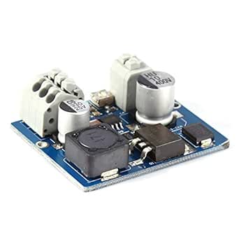

# NCH6100HV High Voltage DC Power Supply Module

## Details

- **Location**: Cabinet-4, Bin 21
- **Category**: Power Supply
- **Brand**: LiebeWH
- **Part Number**: NCH6100HV
- **Package**: PCB Module
- **Quantity**: 2
- **Status**: available
- **Price Range**: $15-20
- **Product URL**: https://a.co/d/f0lRm2y

## Description

The NCH6100HV is a high voltage DC power supply module specifically designed for nixie tubes and discharge tube applications. This compact module provides regulated high voltage output with convenient screw terminal connections and an external control pin for easy on/off control of the high voltage output. The module uses a high performance fixed frequency current control mode controller as its core component.

## Specifications

### Electrical Characteristics
- **Input Voltage**: DC input (voltage range to be determined)
- **Output Voltage**: High voltage DC output for nixie/discharge tubes
- **Current Control**: Fixed frequency current control mode
- **Control**: External control pin for output enable/disable
- **Regulation**: High performance controller-based regulation

### Physical Characteristics  
- **Package**: Compact PCB module
- **Terminals**: Non-screw type input/output terminals
- **Control**: External control pin
- **Mounting**: PCB module format
- **Operating Temperature**: Standard electronic component range

### Key Features
- Built-in ceramic adjustable potentiometer for output adjustment
- Non-screw type input/output terminals for convenient connection
- External control pin for easy high voltage output control
- High performance fixed frequency current control mode controller
- High efficiency and low heat generation
- Compact module design for easy integration

## Image

## Applications

Common use cases for the NCH6100HV power supply module:
- Nixie tube displays and clocks
- Discharge tube applications
- High voltage indicator tubes
- Vintage tube-based projects
- Educational electronics demonstrations
- High voltage experiments and testing

## Technical Notes

Important considerations and usage notes:
- Features adjustable output via built-in ceramic potentiometer
- External control pin allows remote on/off control of high voltage
- High efficiency design minimizes heat generation
- Fixed frequency current control provides stable output
- Compact module format suitable for integration into projects
- Non-screw terminals provide secure and convenient connections

## Circuit Integration

The NCH6100HV module is designed for easy integration:
- **Input**: Connect DC power supply to input terminals
- **Output**: High voltage output available at output terminals
- **Control**: External control pin allows logic-level on/off control
- **Adjustment**: Built-in potentiometer allows output voltage adjustment
- **Mounting**: Standard PCB module can be mounted in projects

## Tags

nixie, power-supply, high-voltage, module, discharge-tube #cabinet-4 #bin-21 #status-available

## Notes

This module provides a convenient solution for nixie tube and discharge tube applications where a regulated high voltage supply is needed. The external control pin feature makes it particularly useful for projects requiring remote control of the high voltage output. The compact module format and non-screw terminals make integration straightforward. Suitable for both hobbyist and educational applications involving high voltage tube displays.
