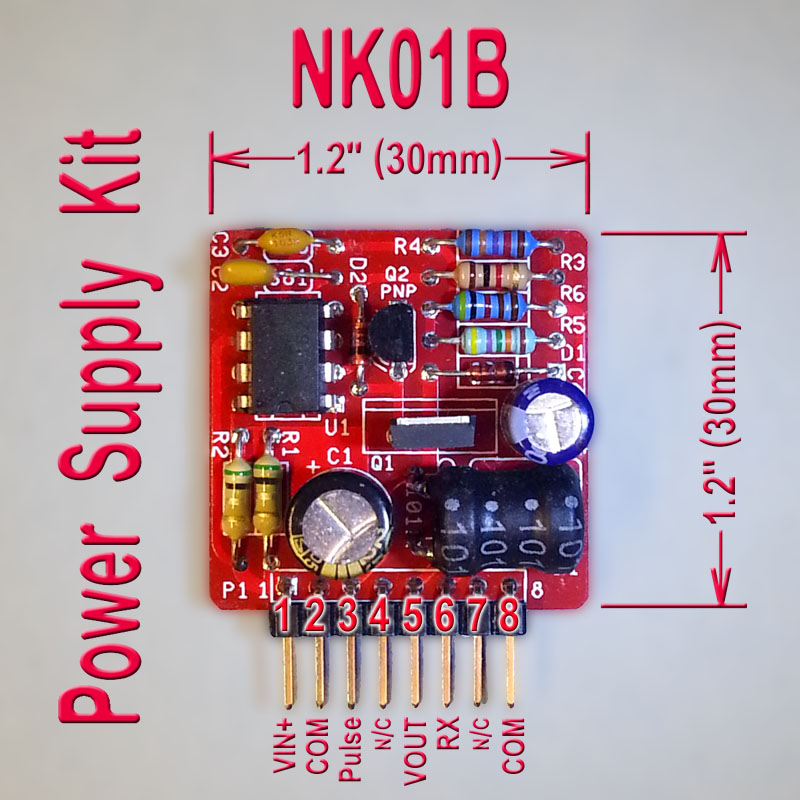

# NK01B Nixie Power Supply Kit

## Details

- **Location**: Cabinet-4, Bin 21
- **Category**: Power Supply
- **Brand**: Threeneurons
- **Part Number**: NK01B
- **Package**: PCB Kit
- **Quantity**: 2
- **Status**: available
- **Price Range**: $15-25
- **Datasheet**: [NK01B Datasheet](https://threeneurons.wordpress.com/wp-content/uploads/2022/01/hv_supply_kit_1a-1b.pdf)
- **Product URL**: https://threeneurons.wordpress.com/nixie-power-supply/hv-supply-kit/

## Description

The NK01B is a regulated switch-mode high voltage power supply kit designed specifically for nixie tubes and similar high voltage applications. This compact kit converts a nominal 12VDC input to any voltage from 45V to 190V with 5W output power and 75% average efficiency. The circuit is based on the proven Motorola MC34063 switch-mode controller chip and uses a boost converter topology.

## Specifications

### Electrical Characteristics
- **Input Voltage**: 12VDC nominal (up to 18V max recommended)
- **Output Voltage**: 45V to 190V (adjustable via resistor selection)
- **Output Power**: 5W (5.5W maximum tested)
- **Input Power**: ~6.7W (75% efficiency)
- **Output Current**: 120mA at 45V, 32mA at 170V
- **Regulation**: Regulated output with feedback control

### Physical Characteristics  
- **PCB Size**: 1.2" x 1.2" (30.5 x 30.5mm)
- **Package**: Through-hole component kit
- **Connector**: 8-pin right angle header
- **Weight**: Lightweight kit components
- **Operating Temperature**: Standard electronic component range

### Key Features
- MC34063-based boost converter design
- Compact 1.2" x 1.2" PCB footprint
- Adjustable output voltage via resistor selection
- Regulated output with feedback control
- Pulse output for voltage multipliers
- TO-220 power FET package support
- Ultrafast rectifier for efficient switching

## Image

## Circuit Design

The NK01B uses a boost converter topology with the MC34063 switch-mode controller. The circuit stores energy in an inductor (L1) by switching power FET Q1 on and off. When Q1 turns off, the inductor dumps its stored energy through ultrafast rectifier D1, creating the high voltage output. The addition of D2 and Q2 provides fast switching control, making this design significantly more efficient than basic MC34063 circuits.

### Voltage Selection
Output voltage is set by resistor network R4, R5, R6, and optional RX:
- **45V**: RX open (no resistor)
- **190V**: RX shorted (0 ohms)
- **Custom voltages**: Calculate RX using provided formula

## Applications

Common use cases for the NK01B nixie power supply:
- Nixie tube clocks and displays
- High voltage indicator tubes
- Dekatron displays
- Magic eye tubes
- General high voltage applications requiring regulated supply

## Technical Notes

Important considerations and limitations:
- Maximum input voltage is 18V (higher voltages may damage components)
- Output current decreases as output voltage increases
- Adequate for 6-digit IN-18 nixie clock (24mA total at 4mA per tube)
- Uses ultrafast rectifiers (BAV21, MUR140, HER105, or UF4007)
- Inductor L1 can handle maximum 1.4A input current
- Higher power possible with upgraded inductor and components

## Tags

nixie, power-supply, high-voltage, kit, mc34063, boost-converter #cabinet-4 #bin-21 #status-available

## Notes

This is the revision B version with improved compact layout. The kit includes all necessary components except the optional RX resistor for custom voltage selection. The circuit has been proven reliable and is widely used in the nixie tube community. Assembly requires basic soldering skills and electronic component identification.
