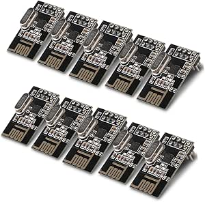
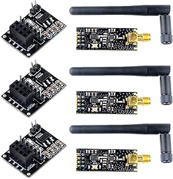

# nRF24L01+ Wireless Modules Collection

## Details

- **Location**: Cabinet-3, Bin 18
- **Category**: Wireless Modules
- **Brand**: MakerFocus
- **Chip**: nRF24L01+ (Nordic Semiconductor)
- **Total Quantity**: 16 modules
- **Amazon Products**: Two different variants purchased

## Description

Collection of nRF24L01+ wireless transceiver modules from MakerFocus, featuring both standard and extended-range variants. These 2.4GHz ISM band transceivers are popular for Arduino and Raspberry Pi projects, offering reliable wireless communication with auto-acknowledge and auto-retransmit capabilities.

## Module Variants

### Standard nRF24L01+ Modules (10 pieces)
- **Product**: MakerFocus 10pcs NRF24L01+ 2.4GHz Wireless RF Transceiver Module
- **Quantity**: 10 modules
- **Range**: Standard range (up to 100m line of sight)
- **Features**:
  - Basic nRF24L01+ chip
  - Compact PCB antenna
  - Low power consumption
  - SPI interface
  - 6 data reception channels
  - Auto-acknowledge and auto-retransmit

### Extended Range PA+LNA Modules (6 pieces)
- **Product**: MakerFocus 3pcs nRF24L01+PA+LNA with Antenna + 3pcs Breakout Adapter
- **Quantity**: 3 PA+LNA modules + 3 breakout adapters
- **Range**: Extended range (up to 1100m with external antenna)
- **Features**:
  - nRF24L01+ with Power Amplifier (PA) and Low Noise Amplifier (LNA)
  - External SMA antenna connector
  - 3 included 2.4GHz antennas
  - 3 breakout adapters with 3.3V regulators
  - Enhanced transmission power and sensitivity

## Images





## Technical Specifications

### Core nRF24L01+ Chip
- **Manufacturer**: Nordic Semiconductor
- **Frequency**: 2.4GHz ISM band (2.400 - 2.4835 GHz)
- **Data Rate**: 250kbps, 1Mbps, 2Mbps
- **Channels**: 125 selectable channels
- **Output Power**: 0dBm (standard), +20dBm (PA+LNA variant)
- **Sensitivity**: -94dBm (standard), enhanced with LNA
- **Supply Voltage**: 1.9V - 3.6V

### Communication Features
- **Protocol**: Enhanced ShockBurst™
- **Auto-Acknowledgment**: Automatic packet acknowledgment
- **Auto-Retransmit**: Configurable retransmission
- **Dynamic Payload**: 1-32 bytes per packet
- **Multiceiver**: Up to 6 data pipes
- **Address Width**: 3, 4, or 5 bytes

### Interface Specifications
- **Interface**: SPI (up to 10Mbps)
- **Control Pins**: CE (Chip Enable), CSN (SPI Chip Select), IRQ (Interrupt)
- **Power Modes**: Power down, standby, RX, TX
- **Current Consumption**: 
  - TX: 11.3mA (0dBm), 115mA (PA+LNA at +20dBm)
  - RX: 13.5mA (standard), enhanced with LNA
  - Power Down: 900nA

## Range Comparison

### Standard nRF24L01+ Modules
- **Indoor Range**: 10-30 meters
- **Outdoor Range**: 50-100 meters (line of sight)
- **Antenna**: PCB trace antenna
- **Best For**: Short-range applications, low power projects

### PA+LNA Extended Range Modules
- **Indoor Range**: 100-300 meters
- **Outdoor Range**: 500-1100 meters (line of sight)
- **Antenna**: External SMA antenna (included)
- **Best For**: Long-range applications, outdoor projects

## Applications

### Home Automation
- **Sensor Networks**: Temperature, humidity, motion sensors
- **Remote Controls**: Wireless switches and dimmers
- **Security Systems**: Door/window sensors, alarms
- **Smart Devices**: IoT device communication

### Robotics Projects
- **Remote Control**: Robot control and telemetry
- **Sensor Data**: Wireless sensor feedback
- **Multi-Robot**: Robot-to-robot communication
- **Base Station**: Central control systems

### Arduino/Raspberry Pi Projects
- **Weather Stations**: Remote sensor data collection
- **RC Vehicles**: Radio-controlled cars, drones
- **Data Logging**: Wireless data transmission
- **Gaming**: Wireless controllers and interfaces

## Arduino Compatibility

### Wiring Connections
```
Arduino Pin    nRF24L01+ Pin
-----------    -------------
3.3V           VCC
GND            GND
D9             CE
D10            CSN
D13            SCK
D11            MOSI
D12            MISO
D2 (optional)  IRQ
```

### Required Libraries
- **RF24**: Primary Arduino library for nRF24L01+
- **RF24Network**: Mesh networking capabilities
- **RF24Mesh**: Dynamic mesh networking
- **TMRh20/RF24**: Enhanced version with additional features

### Basic Code Example
```cpp
#include <SPI.h>
#include <nRF24L01.h>
#include <RF24.h>

RF24 radio(9, 10); // CE, CSN pins
const byte address[6] = "00001";

void setup() {
  radio.begin();
  radio.openWritingPipe(address);
  radio.setPALevel(RF24_PA_MIN);
  radio.stopListening();
}

void loop() {
  const char text[] = "Hello World";
  radio.write(&text, sizeof(text));
  delay(1000);
}
```

## Breakout Adapter Features (PA+LNA Kit)

### 3.3V Voltage Regulator
- **Input**: 5V from Arduino
- **Output**: 3.3V for nRF24L01+ module
- **Current**: Sufficient for PA+LNA operation
- **Protection**: Overcurrent and thermal protection

### Additional Features
- **LED Indicator**: Power-on status LED
- **Pin Compatibility**: Standard nRF24L01+ pinout
- **Mounting**: Breadboard and perfboard compatible
- **Size**: Compact design for easy integration

## Power Considerations

### Standard Modules
- **Arduino 3.3V**: Can power directly from Arduino 3.3V pin
- **Current Draw**: Low current, suitable for battery operation
- **Decoupling**: 10µF capacitor recommended for stable operation

### PA+LNA Modules
- **External Power**: Requires dedicated 3.3V supply or breakout adapter
- **High Current**: Up to 115mA during transmission
- **Capacitor**: 10µF or larger capacitor essential for stable operation
- **Power Supply**: Use breakout adapter or external 3.3V regulator

## Troubleshooting Tips

### Common Issues
- **No Communication**: Check wiring and power supply
- **Short Range**: Verify antenna connection and orientation
- **Intermittent Operation**: Add decoupling capacitors
- **Power Problems**: Use adequate power supply for PA+LNA modules

### Best Practices
- **Antenna Placement**: Keep antennas clear of metal objects
- **Power Supply**: Use stable, clean power source
- **Grounding**: Ensure good ground connections
- **Channel Selection**: Use clear channels to avoid interference

## Advantages

### Design Benefits
- **Low Cost**: Affordable wireless communication solution
- **Easy Integration**: Simple SPI interface
- **Arduino Compatible**: Extensive library support
- **Flexible Range**: Multiple variants for different applications

### Technical Benefits
- **Reliable Protocol**: Enhanced ShockBurst with error correction
- **Low Power**: Suitable for battery-powered applications
- **Multi-Channel**: Avoid interference with channel hopping
- **Bidirectional**: Full duplex communication capability

## Package Contents

### Standard Module Kit (10 pieces)
- 10x nRF24L01+ wireless transceiver modules
- Compact PCB antenna design
- No additional accessories

### PA+LNA Extended Kit (6 pieces total)
- 3x nRF24L01+PA+LNA wireless transceiver modules
- 3x SMA 2.4GHz antennas (1100m range)
- 3x nRF24L01+ breakout adapters with 3.3V regulators
- Power indicator LEDs on breakout boards

## Tags

nrf24l01, wireless, 2.4ghz, arduino, raspberry-pi, makerfocus, rf-transceiver

## Notes

This collection provides both standard and extended-range wireless communication options for various project requirements. The standard modules are perfect for short-range, low-power applications, while the PA+LNA modules excel in long-range outdoor projects. The included breakout adapters make the high-power modules easy to use with 5V Arduino systems. Both variants use the same software libraries and programming interface, making them interchangeable in most applications.
