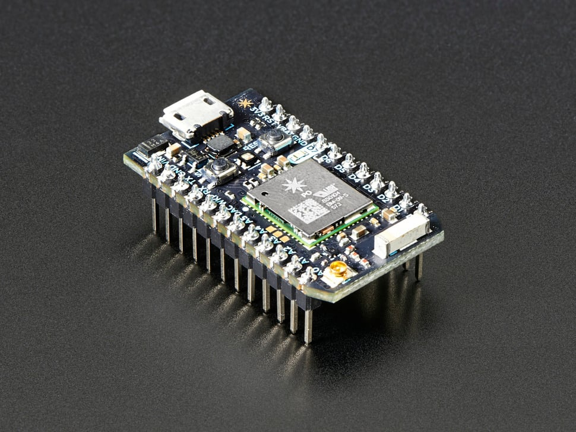

# Particle Photon with Headers

## Details

- **Location**: Cabinet-1, Bin 28
- **Category**: Microcontroller Boards
- **Type**: WiFi Development Board
- **Microcontroller**: STM32F205
- **Brand**: Particle
- **Part Number**: 2721
- **Quantity**: 1
- **Product URL**: https://www.adafruit.com/product/2721

## Description

Compact WiFi-enabled development board designed for Internet of Things (IoT) projects. Features a powerful ARM Cortex-M3 processor with built-in WiFi connectivity and cloud integration. Perfect for connected devices, remote monitoring, and IoT applications requiring reliable wireless communication and cloud services.

## Specifications

- **Part Number**: 2721 (Adafruit distribution)
- **Microcontroller**: STM32F205RGT6
- **Architecture**: 32-bit ARM Cortex-M3
- **Clock Speed**: 120MHz
- **Operating Voltage**: 3.3V
- **Input Voltage**: 3.6V-5.5V (via VIN) or 5V (via USB)
- **Flash Memory**: 1MB
- **RAM**: 128KB
- **Dimensions**: 38.0mm × 21.0mm × 3.0mm
- **Weight**: 5.0g
- **Height with Headers**: 12mm

## Image

## Features

- **WiFi Connectivity**: Built-in 802.11b/g/n WiFi
- **Cloud Integration**: Particle Cloud platform integration
- **ARM Cortex-M3**: High-performance 32-bit processor
- **Over-the-Air Updates**: Remote firmware updates
- **Web IDE**: Browser-based development environment
- **Mobile Apps**: iOS and Android apps for device control
- **Breadboard Ready**: Pre-soldered headers included

## WiFi Capabilities

- **WiFi Chip**: Broadcom BCM43362 (same as Nest Protect, LIFX)
- **Standards**: 802.11b/g/n
- **Security**: WPA/WPA2 Personal and Enterprise
- **Soft AP Mode**: Can create its own WiFi network
- **SSL Support**: Secure communication capabilities
- **Range**: Typical indoor WiFi range

## Pin Configuration

- **Digital I/O**: 18 pins
- **Analog Inputs**: 8 pins (12-bit ADC)
- **PWM Outputs**: 9 pins
- **Communication**:
  - UART: 2 hardware serial ports
  - SPI: 2 SPI interfaces
  - I2C: 1 I2C interface
- **Special Pins**:
  - USB: D+ and D- for USB communication
  - Reset: Hardware reset pin
  - Mode: System mode control

## Programming & Development

- **Particle Web IDE**: Browser-based development environment
- **Particle CLI**: Command-line interface for advanced users
- **Local IDE**: Desktop development tools available
- **Arduino-like**: Familiar syntax for Arduino users
- **C/C++**: Native C/C++ development support
- **Libraries**: Extensive library ecosystem

## Cloud Platform

- **Particle Cloud**: Integrated cloud services
- **Device Management**: Remote device monitoring and control
- **Data Streaming**: Real-time data collection and analysis
- **Webhooks**: Integration with third-party services
- **Functions**: Remote function calls over the internet
- **Variables**: Remote variable access and monitoring

## Power Management

- **USB Power**: 5V via micro-USB connector
- **External Power**: 3.6V-5.5V via VIN pin
- **Power Consumption**: Varies by WiFi usage and application
- **Sleep Modes**: Multiple low-power modes available
- **Power LED**: Indicates power status

## Communication Interfaces

- **WiFi**: Primary communication method
- **USB**: Programming and serial communication
- **UART**: Hardware serial communication
- **I2C**: Inter-integrated circuit communication
- **SPI**: Serial peripheral interface

## Applications

- **IoT Devices**: Connected sensors and actuators
- **Home Automation**: Smart home devices and controls
- **Remote Monitoring**: Environmental and equipment monitoring
- **Asset Tracking**: Location and status tracking
- **Industrial IoT**: Manufacturing and process monitoring
- **Prototyping**: Rapid IoT prototype development

## Advantages

- **Easy WiFi Setup**: Simple WiFi configuration process
- **Cloud Integration**: Built-in cloud connectivity
- **Over-the-Air Updates**: Remote firmware deployment
- **Scalable**: From prototype to production
- **Community**: Active developer community
- **Documentation**: Comprehensive guides and tutorials
- **Mobile Support**: Native mobile app integration

## Development Ecosystem

- **Web IDE**: No software installation required
- **Local Tools**: Desktop development environment
- **Mobile Apps**: Device control and monitoring apps
- **Third-party Integration**: Webhooks and API access
- **Community Libraries**: Shared code and examples

## Certifications

- **FCC/CE/IC**: Certified for commercial use
- **WiFi Certified**: Compliant with WiFi standards
- **Production Ready**: Suitable for commercial products

## Kit Contents

- Particle Photon board with pre-soldered headers
- Quick start documentation
- Access to Particle Cloud platform

## Setup Requirements

- **WiFi Network**: 2.4GHz WiFi network for connectivity
- **Particle Account**: Free account for cloud services
- **USB Cable**: Micro-USB cable for programming
- **Computer or Mobile**: For development and setup

## Notes

- **Discontinued**: No longer in production
- **Replacement**: Adafruit ESP32 Feather recommended as alternative
- **Headers Included**: This version comes with pre-soldered headers
- **Cloud Dependency**: Requires Particle Cloud for full functionality
- **2.4GHz Only**: Does not support 5GHz WiFi networks
- **Legacy Support**: Particle platform still supports existing devices

## Migration Path

- **ESP32 Alternative**: Adafruit ESP32 Feather V2 recommended
- **Arduino Ecosystem**: Migrate to ESP32-based boards
- **Cloud Services**: Consider alternative IoT platforms
- **Code Compatibility**: Some porting required for alternatives

## Historical Context

- Part of the original Particle IoT ecosystem
- Pioneered easy WiFi setup for makers
- Influenced modern IoT development practices
- Large installed base in maker community
- Educational impact in IoT learning
