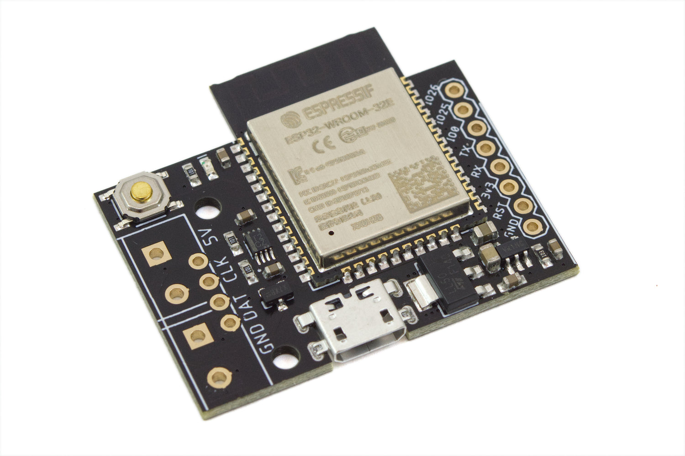

# Pixelblaze V3 Standard - WiFi LED Controller

## Details

- **Location**: Cabinet-1, Bin 28
- **Category**: Microcontroller Boards
- **Type**: WiFi LED Controller
- **Microcontroller**: ESP32
- **Brand**: ElectroMage
- **Model**: Pixelblaze V3 Standard
- **Quantity**: 1
- **Product URL**: https://shop.electromage.com/products/pixelblaze-v3-standard-wifi-led-controller

## Description

Advanced WiFi-enabled LED controller and live-coding pattern development engine designed for LED art projects. Features a web-based editor with real-time pattern compilation, mathematical expression engine, and support for thousands of LEDs. Perfect for art installations, costumes, architectural lighting, and interactive LED displays.

## Specifications

- **Microcontroller**: ESP32 (dual-core Xtensa LX6)
- **Clock Speed**: 240MHz
- **Operating Voltage**: 3.3V (internal), 5V input
- **WiFi**: 802.11b/g/n with built-in antenna
- **Dimensions**: 34.2mm x 39.5mm (including antenna)
- **Power Input**: Micro-USB (1.8A pass-through) or 5V screw terminal
- **Storage Options**: Standard (1.4MB), XL (3MB + 10.4MB reserved)
- **Power Protection**: Reverse-polarity and over-voltage protection (up to 18V)

## Image

## Features

- **Live Coding**: Web-based editor with real-time pattern compilation
- **WiFi Control**: Access from any device with web browser
- **Pattern Library**: 100+ community-contributed patterns
- **Mathematical Engine**: Expression-based pattern generation
- **Multi-LED Support**: Single output supports up to 5,000 LEDs
- **Expandable**: Output Expansion Boards for up to 64 channels
- **Pixel Mapper**: 2D/3D mapping for complex LED arrangements
- **Pattern Storage**: Store 100+ patterns on device

## LED Support

- **WS2812/WS2812B**: NeoPixel strips (up to 2,500 LEDs)
- **APA102/SK9822**: DotStar strips with HDR support (up to 5,000 LEDs)
- **WS2801**: Older addressable LED strips
- **WS2811/WS2813/WS2815**: Various addressable LED types
- **SK6812**: RGB and RGBW addressable LEDs
- **HDR Support**: Dynamic range beyond 0-255 for APA102/SK9822

## Connectivity & I/O

- **LED Output**: 5mm screw terminal or 0.1" pin header
- **Power**: Micro-USB or 5V screw terminal
- **Expansion Header**: 8-pin header (GND, EN, 3.3V, RX0, TX0, IO0, IO25, IO26)
- **GPIO**: 3 pins on expansion header, 15 additional on underside
- **Analog Inputs**: 5 pins (33, 34, 35, 36, 39)
- **Touch Sensors**: 5 pins (2, 4, 13, 14, 27)

## Programming & Software

- **Web IDE**: Browser-based pattern editor with live preview
- **Pattern Language**: JavaScript-like syntax with expression support
- **Real-time Compilation**: Patterns update live as you type
- **Pattern Sharing**: Community pattern library and sharing
- **Mobile Support**: Works on phones and tablets
- **Offline Capable**: Patterns run independently after upload

## Performance

- **Rendering Speed**: 48,000 pixels per second average
- **Maximum LEDs**: Up to 5,000 pixels on single output
- **Frame Rate**: Varies by pattern complexity and LED data rates
- **Synchronization**: Multiple controllers can be synchronized
- **Pattern Complexity**: Supports arrays, functions, loops, and control flow

## Expansion Options

- **Output Expander**: 8-channel expansion boards
- **Sensor Board**: Environmental sensors and inputs
- **Multiple Units**: Synchronize multiple Pixelblaze controllers
- **Custom Hardware**: GPIO access for custom sensors/controls

## Applications

- **Art Installations**: Large-scale LED art projects
- **Architectural Lighting**: Building and structure illumination
- **Costumes & Wearables**: Interactive LED clothing and accessories
- **Stage Lighting**: Concert and theater LED effects
- **Home Decoration**: Holiday and ambient lighting
- **Interactive Displays**: Sensor-responsive LED installations

## Advantages

- **Easy Programming**: No complex IDE setup required
- **Live Feedback**: See changes instantly on LEDs
- **High Performance**: Handles thousands of LEDs smoothly
- **Community Driven**: Large library of shared patterns
- **Wireless Control**: No cables needed for programming
- **Robust Hardware**: Built-in protection circuits
- **Scalable**: Expand from single strip to massive installations

## Kit Contents

- Pixelblaze V3 Standard controller board
- 5mm screw terminals for LED connections
- 0.1" pin headers for breadboard use
- Quick start documentation

## Notes

- Requires soldering to attach screw terminals and headers
- Patterns average 10KB storage each
- Web interface works on any modern browser
- FCC/CE/IC certified for commercial use
- Made in USA by ElectroMage/Hencke Technologies
