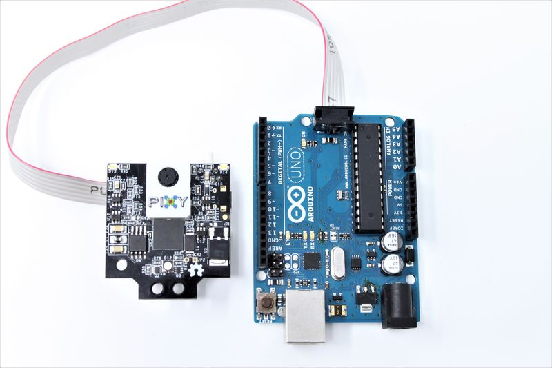

# Pixy2 Camera

Smart vision sensor designed for robotics applications with advanced object detection and line following capabilities at 60 frames per second.

_Pixy2 Camera - Smart vision sensor with Arduino and Raspberry Pi connectivity_

## Overview

Pixy2 is a fast, easy-to-use vision sensor that can learn to detect objects you teach it, just by pressing a button. It's smaller, faster, and more capable than the original Pixy camera, specifically designed for robotics applications where speed and simplicity are crucial.

## Key Features

### Performance

- **60 frames per second** processing speed
- **Smaller and faster** than original Pixy
- **Real-time processing** for fast-moving robots
- **Low latency** object detection and tracking

### Vision Capabilities

- **Object Detection**: Learn and detect custom objects
- **Line Following**: Advanced line detection algorithms
- **Intersection Detection**: Recognizes line intersections
- **Road Sign Recognition**: Detects custom "road signs" for robot commands
- **Color-based Tracking**: Robust color signature detection

## Technical Specifications

### Image Processing

- **Resolution**: Optimized for real-time robotics applications
- **Frame Rate**: 60 FPS continuous processing
- **Detection Speed**: Real-time object and line detection
- **Learning Mode**: One-button object teaching
- **Multiple Object Tracking**: Can track multiple objects simultaneously

### Communication Interfaces

- **SPI**: High-speed serial communication
- **I2C**: Standard two-wire interface
- **UART**: Asynchronous serial communication
- **USB**: Direct computer connection
- **Simple Protocol**: Easy-to-understand data format

### I/O Connector Pinout

**10-pin IDC Connector (2x5 pins):**

| Pin | Signal                     | Description                                          |
| --- | -------------------------- | ---------------------------------------------------- |
| 1   | SPI MISO / UART RX / GPIO0 | SPI Master In Slave Out / UART Receive / Digital I/O |
| 2   | VCC                        | 5V Power Input                                       |
| 3   | SPI SCK                    | SPI Clock                                            |
| 4   | SPI MOSI / UART TX         | SPI Master Out Slave In / UART Transmit              |
| 5   | I2C SCL                    | I2C Clock Line                                       |
| 6   | GND                        | Ground                                               |
| 7   | SPI SS                     | SPI Slave Select (optional)                          |
| 8   | DAC OUT                    | Analog Output (0-3.3V)                               |
| 9   | I2C SDA                    | I2C Data Line                                        |
| 10  | SERVO                      | Servo Control Output                                 |

**Notes:**

- All digital pins are 3.3V output, 5V tolerant input
- Pin functions depend on selected interface mode
- Default interface is Arduino ICSP SPI (pins 1, 3, 4)

## Connectivity

### Direct Arduino Connection

- **Special Cable Included**: No need for jumper wires
- **Plug-and-Play**: Direct connection to Arduino boards
- **Arduino Library**: Pre-built software library available
- **Example Code**: Ready-to-use sketches provided

### Raspberry Pi Support

- **USB Connection**: Standard USB cable included
- **Python Library**: Full Python support
- **Linux Compatible**: Works with Raspberry Pi OS
- **Cross-platform**: Compatible with various Linux distributions

### Universal Compatibility

- **Multiple Interfaces**: SPI, I2C, UART, USB options
- **5V and 3.3V Logic**: Compatible with both voltage levels
- **Simple Commands**: Easy integration with any microcontroller
- **Minimal Wiring**: Reduced complexity for quick prototyping

## Software and Programming

### Ease of Use

- **Simplified Programming**: Only sends relevant data
- **Filtered Output**: Receives only detected object information
- **Coordinate System**: X-Y coordinates, size, and unique ID
- **Reduced Processing**: Microcontroller handles only decision-making

### Development Support

- **Arduino Libraries**: Pre-built functions and examples
- **Raspberry Pi Libraries**: Python modules available
- **Documentation**: Comprehensive wiki and tutorials
- **Community Support**: Active forums and user community

### Open Source

- **Open Hardware**: Complete hardware design files available
- **Open Software**: Source code freely available
- **Open Firmware**: Customizable firmware
- **Extensible**: Can be modified for specific applications

## Applications

### Robotics

- **Line Following Robots**: Advanced line detection with intersection handling
- **Object Sorting**: Color-based object identification and sorting
- **Navigation**: Visual landmark recognition
- **Autonomous Vehicles**: Simple computer vision for robot cars
- **Pet Robots**: Object recognition for interactive behaviors

### Educational Projects

- **STEM Learning**: Computer vision concepts made accessible
- **Programming Education**: Simple API for learning robotics
- **Competition Robots**: Fast performance for robotics competitions
- **Maker Projects**: Easy integration into DIY projects

### Industrial Applications

- **Quality Control**: Simple object inspection systems
- **Sorting Systems**: Color-based part sorting
- **Position Detection**: Object location and orientation
- **Automation**: Vision-guided assembly systems

## Advanced Features

### Line Following Algorithms

- **Vector-based Detection**: More robust than simple line following
- **Intersection Recognition**: Handles complex path layouts
- **Road Sign Detection**: Custom markers for robot commands
- **Branch Detection**: Recognizes path splits and merges

### Object Detection

- **Color Signatures**: Learns complex color patterns
- **Shape Recognition**: Basic shape detection capabilities
- **Multiple Objects**: Simultaneous tracking of different objects
- **Lighting Adaptation**: Robust performance in varying light conditions

## Physical Specifications

### Form Factor

- **Compact Design**: Smaller than original Pixy
- **Lightweight**: Suitable for small robots
- **Mounting Options**: Standard mounting holes
- **Camera Module**: Integrated lens and sensor

### Power Requirements

- **Low Power**: Efficient operation for battery-powered robots
- **5V Operation**: Standard logic voltage
- **USB Powered**: Can be powered via USB connection
- **External Power**: Accepts external power supply

## Getting Started

### Quick Setup

1. **Connect**: Use included cable for Arduino or USB for Raspberry Pi
2. **Install Software**: Download PixyMon configuration software
3. **Teach Objects**: Press button to learn object signatures
4. **Program**: Use provided libraries and examples
5. **Deploy**: Run your robot with real-time vision

### Learning Process

- **One-Button Teaching**: Simply press button while showing object
- **Multiple Signatures**: Can learn several different objects
- **Signature Management**: Easy to add, remove, or modify learned objects
- **Visual Feedback**: LED indicators show detection status

## Support and Resources

### Documentation

- **Comprehensive Wiki**: Detailed documentation online
- **Video Tutorials**: Step-by-step video guides
- **Example Projects**: Ready-to-build project ideas
- **API Reference**: Complete programming interface documentation

### Community

- **Active Forums**: User community support
- **GitHub Repository**: Source code and examples
- **Regular Updates**: Ongoing firmware and software improvements
- **Email Support**: Direct technical support available

## Storage Information

- **Location**: Cabinet 3, Bin 27
- **Quantity**: 2 units
- **Condition**: New, unused
- **Packaging**: Original retail packaging with cables
- **Accessories**: Includes Arduino connection cable and USB cable
