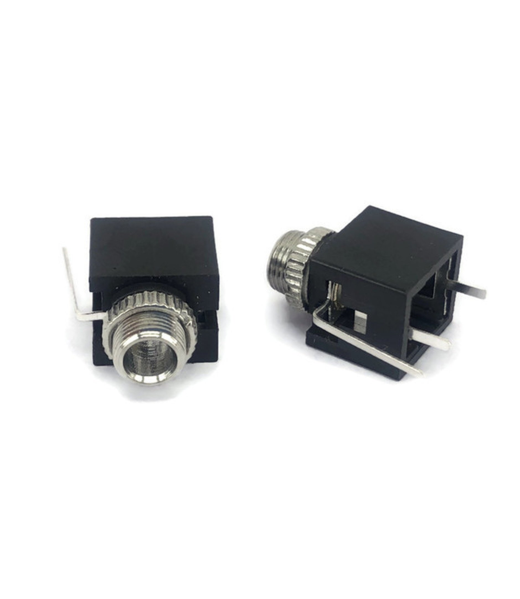

# PJ-3001F 3.5mm Mono Phone Jack (Thonkiconn)

## Overview

Standard 3.5mm mono phone jack connector, widely known in the Eurorack modular synthesizer community as "Thonkiconn" jacks. These PCB-mount jacks feature switching contacts and are the de facto standard for CV/Gate connections in modular synthesizers, as well as general audio applications requiring compact mono connections.

## Location

**Cabinet-7, Bin 9** - Thonkiconn Jacks

## Images



## Specifications

### Physical Specifications
- **Connector Type**: 3.5mm (1/8") mono phone jack
- **Mounting**: PCB mount, through-hole
- **Body Material**: Black plastic housing
- **Contact Material**: Nickel-plated brass
- **Switching**: Normally closed switching contact
- **Panel Thickness**: Suitable for standard PCB and panel mounting
- **Thread**: M7 x 0.75 threading

### Electrical Specifications
- **Voltage Rating**: 30V DC (typical)
- **Current Rating**: 1A (typical)
- **Power Rating**: 30W maximum
- **Contact Resistance**: <30mΩ
- **Insulation Resistance**: >1000MΩ
- **Operating Temperature**: -25°C to +85°C
- **Insertion Force**: 10-40N

### Mechanical Specifications
- **Mating Cycles**: 5,000+ insertions
- **Retention Force**: 10N minimum
- **Panel Cutout**: 6mm diameter
- **PCB Hole**: 1.0mm diameter for pins
- **Overall Length**: ~13mm from panel surface

## Pin Configuration

### Contact Layout
The jack has multiple contacts for different functions:

```
Tip (T) ---- Signal/Hot
Sleeve (S) -- Ground/Return
Switch (SW) - Normalling/Switching contact
```

### Pin Functions
- **Tip (T)**: Main signal contact (hot/positive)
- **Sleeve (S)**: Ground/return contact (shield/negative)
- **Switch (SW)**: Normally closed switching contact for normalling
- **Additional Pins**: Some variants have multiple switch contacts

### Normalling Operation
- **No Plug Inserted**: Switch contact closed to normalling point
- **Plug Inserted**: Switch contact opens, breaking normalling connection
- **Signal Path**: Tip and sleeve carry the audio/CV signal

## Applications

### Eurorack Modular Synthesizers
- **CV Inputs/Outputs**: Control voltage connections between modules
- **Gate Inputs/Outputs**: Trigger and gate signal routing
- **Audio Inputs/Outputs**: Audio signal patching between modules
- **Normalling**: Internal signal routing when no patch cable connected

### Audio Equipment
- **Headphone Outputs**: Mono headphone connections
- **Line Inputs/Outputs**: Unbalanced audio connections
- **Instrument Inputs**: Guitar, bass, and other instrument connections
- **Effects Loops**: Send/return connections in audio processors

### DIY Electronics
- **Arduino Audio Projects**: Simple audio input/output connections
- **Breadboard Prototyping**: Temporary audio connections
- **Test Equipment**: Signal injection and monitoring points
- **Educational Projects**: Audio circuit demonstrations

### Professional Audio
- **Patch Bays**: Signal routing and normalling applications
- **Mixing Consoles**: Auxiliary sends and returns
- **Recording Equipment**: Direct input connections
- **Live Sound**: Monitor and effects connections

## Circuit Examples

### Basic Audio Input (Arduino)
```cpp
const int audioPin = A0;
const int outputPin = 9;

void setup() {
  pinMode(audioPin, INPUT);
  pinMode(outputPin, OUTPUT);
  Serial.begin(9600);
}

void loop() {
  int audioValue = analogRead(audioPin);
  int outputValue = map(audioValue, 0, 1023, 0, 255);
  
  analogWrite(outputPin, outputValue);
  
  Serial.print("Audio Level: ");
  Serial.println(audioValue);
  
  delay(10);
}
```

### CV Input with Normalling
```cpp
const int cvPin = A1;
const int normalPin = A2;
const int outputPin = 10;

void setup() {
  pinMode(cvPin, INPUT);
  pinMode(normalPin, INPUT);
  pinMode(outputPin, OUTPUT);
}

void loop() {
  int cvValue = analogRead(cvPin);
  int normalValue = analogRead(normalPin);
  
  // Use CV input if present, otherwise use normal value
  int controlValue = (cvValue > 10) ? cvValue : normalValue;
  
  int pwmValue = map(controlValue, 0, 1023, 0, 255);
  analogWrite(outputPin, pwmValue);
  
  delay(1);
}
```

### Simple Audio Mixer
```cpp
const int input1Pin = A0;
const int input2Pin = A1;
const int outputPin = 9;

void setup() {
  pinMode(input1Pin, INPUT);
  pinMode(input2Pin, INPUT);
  pinMode(outputPin, OUTPUT);
}

void loop() {
  int input1 = analogRead(input1Pin);
  int input2 = analogRead(input2Pin);
  
  // Simple mixing (average)
  int mixed = (input1 + input2) / 2;
  int output = map(mixed, 0, 1023, 0, 255);
  
  analogWrite(outputPin, output);
  
  delay(1);
}
```

## PCB Design Considerations

### Footprint
- **Panel Hole**: 6mm diameter for jack body
- **PCB Holes**: 1.0mm diameter for pins
- **Pin Spacing**: Standard spacing for PJ-3001F footprint
- **Keep-out Area**: Allow clearance around jack body

### Layout Guidelines
- **Ground Plane**: Connect sleeve to ground plane
- **Signal Routing**: Keep tip connections short and direct
- **Decoupling**: Add capacitors for AC coupling if needed
- **ESD Protection**: Consider TVS diodes for exposed inputs

### Mechanical Design
- **Panel Thickness**: Ensure proper threading engagement
- **Nut Torque**: Don't over-tighten mounting nut
- **Strain Relief**: Consider cable management for permanent installations
- **Accessibility**: Allow easy access for plugging/unplugging

## Installation

### PCB Mounting
1. **Drill Holes**: Create appropriate holes for pins and body
2. **Insert Jack**: Place jack from component side
3. **Solder Pins**: Solder all connections from solder side
4. **Mount to Panel**: Secure with mounting nut from front
5. **Test Connections**: Verify continuity and switching operation

### Panel Preparation
1. **Mark Location**: Mark center point for jack placement
2. **Drill Hole**: 6mm diameter hole for jack body
3. **Deburr**: Remove sharp edges from hole
4. **Test Fit**: Ensure jack fits properly before final assembly

### Wiring
1. **Identify Pins**: Use multimeter to identify tip, sleeve, and switch
2. **Solder Connections**: Use appropriate gauge wire for application
3. **Strain Relief**: Secure wires to prevent stress on solder joints
4. **Test Operation**: Verify proper switching and signal continuity

## Troubleshooting

### Common Issues
- **No Signal**: Check solder joints and pin identification
- **Intermittent Connection**: Clean contacts or replace jack
- **Mechanical Failure**: Check mounting nut tightness
- **Switching Problems**: Verify switch contact wiring

### Testing Procedures
- **Continuity Test**: Check tip-to-tip and sleeve-to-sleeve continuity
- **Switch Test**: Verify switching operation with plug insertion
- **Insulation Test**: Check isolation between contacts
- **Mechanical Test**: Verify smooth plug insertion/removal

## Sourcing Information

### Supplier
- **Tayda Electronics**: Primary supplier
- **Part Number**: PJ-3001F
- **Price**: $0.184 per piece (18.4 cents)
- **URL**: https://www.taydaelectronics.com/pj-3001f-3-5-mm-mono-phone-jack.html

### Alternative Sources
- **Thonk**: Original "Thonkiconn" branding supplier
- **Mouser**: Various manufacturers available
- **DigiKey**: Professional-grade alternatives
- **Modular Addict**: Eurorack-specific suppliers
- **Love My Switches**: Specialized connector suppliers

### Specifications to Match
- **3.5mm mono configuration**
- **PCB mount with switching contacts**
- **M7 x 0.75 threading**
- **Standard pin spacing**
- **Normalling capability**

## Eurorack Context

### Why "Thonkiconn"?
- **Thonk**: UK-based supplier popular in DIY Eurorack community
- **Standard**: These jacks became the de facto standard for Eurorack
- **Compatibility**: Ensures compatibility across different module manufacturers
- **Cost-Effective**: Good balance of quality and price for DIY builders

### Eurorack Applications
- **CV Connections**: ±5V or ±10V control voltage signals
- **Gate Signals**: 0V/+5V or 0V/+10V trigger signals
- **Audio Signals**: ±5V or ±10V audio range
- **Clock Signals**: Timing and synchronization between modules

### Normalling in Eurorack
- **Internal Routing**: Connect internal signals when no patch cable present
- **Mult Functionality**: Create multiple outputs from single source
- **Default Connections**: Provide sensible defaults for module operation
- **Flexible Patching**: Override defaults with external connections

## Storage and Handling

### Storage Recommendations
- **Dry Environment**: Prevent corrosion of contacts
- **Anti-Static**: Use anti-static packaging if needed
- **Organization**: Keep with other audio connectors
- **Temperature**: Room temperature storage

### Handling Tips
- **Gentle Installation**: Don't force into PCB holes
- **Proper Tools**: Use appropriate soldering iron temperature
- **Clean Contacts**: Keep contacts clean for reliable operation
- **Avoid Over-Tightening**: Don't over-torque mounting nuts

## Tags

connectors, jacks, audio, 3.5mm, mono, thonkiconn, eurorack, cv-gate, pcb-mount, switching, normalling #cabinet-7 #status-available

## Notes

These PJ-3001F jacks are essential components for Eurorack modular synthesizer builds and general audio applications. The "Thonkiconn" designation comes from their popularity in the DIY Eurorack community, where they became the standard choice for CV/Gate connections. The switching contacts enable normalling functionality, allowing modules to have internal signal routing that can be overridden by external patch cables. Store in Cabinet-7, Bin 9 for easy access during modular synth builds and audio projects. The low cost and reliable operation make them ideal for both prototyping and production use in electronic music equipment.
