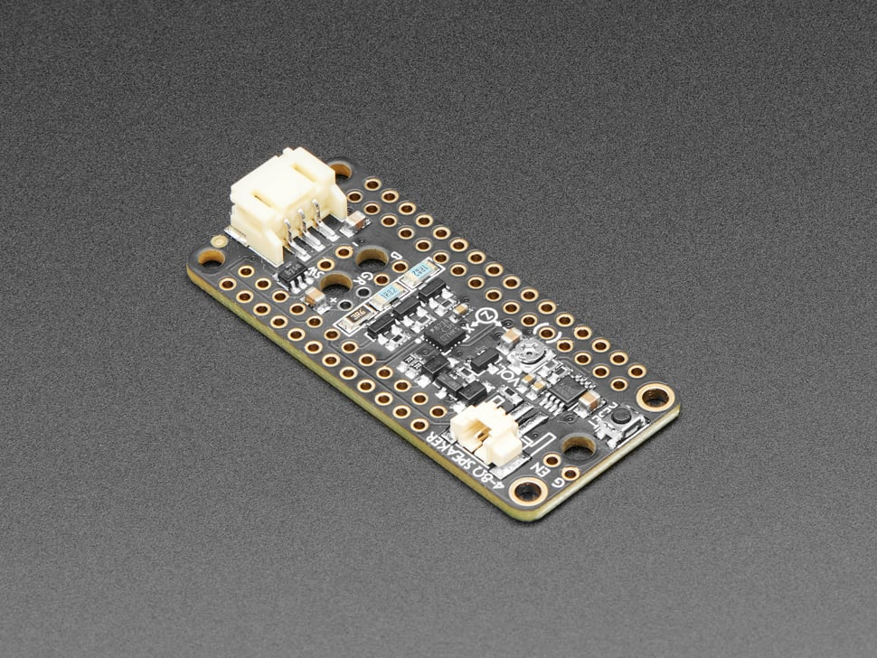

# Adafruit Prop-Maker FeatherWing

## Details

- **Location**: Cabinet-1, Bin 16
- **Category**: FeatherWings
- **Type**: Prop Making Module
- **Functions**: NeoPixel Driver, RGB LED Driver, Accelerometer, Audio Amplifier
- **Interface**: I2C, PWM, Analog Audio
- **Quantity**: 2
- **Product URL**: https://www.adafruit.com/product/3988

## Description

The Adafruit Prop-Maker FeatherWing unlocks the prop-maker inside all of us, with tons of features packed in to make sabers & swords, props, toys, cosplay pieces, and more. Perfect for adding special effects to your projects!

## Specifications

- **Interface**: I2C (accelerometer), PWM (RGB LED), Analog Audio
- **Voltage**: 3.3V-5V (auto-switching)
- **Connectors**: 3-pin JST PH for NeoPixels, STEMMA QT
- **Dimensions**: 50.8mm x 22.8mm x 7.2mm (2.0" x 0.9" x 0.3")
- **Weight**: 4.8g (0.2oz)
- **Current Draw**: <1mA in low power mode

## Image

## Features

- **Snap-in NeoPixel Port**: 3-pin JST connector with level shifter for clean signals
- **3W RGB LED Drivers**: 3 high current MOSFETs for powerful RGB LEDs
- **Triple-Axis Accelerometer**: LIS3DH with tap detection for motion sensing
- **Class D Audio Amplifier**: Drive 8Ω 1W or 4Ω 3W speakers
- **Low Power Mode**: Pin-controlled power system for sleep/off modes
- **External Switch Support**: Breakouts for enable pin and mode button

## Compatibility

- **Best with**: Feather M0 Express, M4 Express, ESP32 series
- **Limited support**: Feather 32u4, 328p (no analog audio, limited PWM)
- **Partial support**: nRF52, ESP8266 (PWM but no analog audio)

## Libraries & Resources

- **Arduino Library**: Adafruit LIS3DH, Adafruit NeoPixel
- **CircuitPython Library**: adafruit_lis3dh, neopixel
- **Documentation**: https://learn.adafruit.com/adafruit-prop-maker-featherwing
- **Example Projects**: Lightsaber, Time Tracking Cube, MUNNY Lamp

## Applications

- Lightsabers and prop weapons
- Cosplay accessories with sound and light effects
- Interactive toys and games
- Motion-activated decorations
- Sound-reactive LED projects

## Tags

featherwing, prop-maker, neopixel, accelerometer, audio, rgb-led, adafruit
