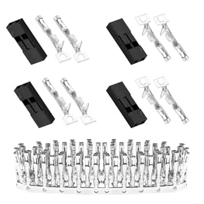

# Pzsmocn 2-Pin Female Dupont Connectors

## Details

- **Location**: Cabinet-5, Bin 4, Section B
- **Category**: Electrical Connectors
- **Brand**: Pzsmocn
- **Part Number**: B096DR3QML
- **Package**: Dupont Female Housing
- **Quantity**: 50 sets (150 pieces total)
- **Status**: Available
- **Price Range**: $8.99 (pack of 50 sets)
- **Product URL**: https://a.co/d/fTM7AK5

## Description

Pzsmocn 2-Pin Female Dupont Connectors are high-quality 2.54mm pitch connector housings designed for breadboard prototyping, Arduino projects, and custom cable assemblies. Each set includes female housing and crimp pins for creating reliable electrical connections. These connectors are essential for electronics prototyping, allowing easy connection and disconnection of wires in development projects.

## Specifications

### Electrical Characteristics

- **Operating Voltage**: 250V AC
- **Current Rating**: 3A per contact
- **Power Rating**: 750W
- **Wire Gauge Range**: 26-30 AWG
- **Wire Types**: Solid and stranded conductors
- **Contact Resistance**: <20mΩ
- **Insulation Resistance**: >1000MΩ

### Physical Characteristics

- **Pitch**: 2.54mm (0.1 inch)
- **Pin Count**: 2
- **Housing Material**: Black polypropylene (PP)
- **Contact Material**: Copper alloy with tin plating
- **Operating Temperature**: -25°C to +85°C
- **Mating Cycles**: >100 cycles

### Package Contents

- 50 pieces 2-pin female housing
- 100 pieces crimp pins
- PP material storage box

## Image

## Applications

Common use cases and applications for these 2-pin Dupont connectors:

- Arduino and microcontroller projects
- Breadboard prototyping and development
- Sensor connections (power and signal)
- LED strip connections
- Custom cable assemblies
- Raspberry Pi GPIO connections
- 3D printer wiring harnesses
- Robot control systems
- Educational electronics projects

## Technical Notes

Important technical considerations and usage tips:

- Requires proper crimping tool for reliable connections
- Ensure wire is fully inserted into crimp pin before crimping
- Housing accepts standard 2.54mm male headers
- Compatible with breadboard and perfboard layouts
- Crimp pins should be crimped on both wire and insulation
- Use appropriate wire gauge for current requirements
- Storage box keeps components organized and protected
- Can be used with both solid and stranded wire

## Compatibility

These connectors are compatible with:

- Standard 2.54mm pitch male headers
- Arduino Uno, Nano, Mega pin headers
- Raspberry Pi GPIO pins
- Breadboard male headers
- Perfboard and stripboard layouts
- Standard jumper wires
- Servo motor connectors
- Sensor breakout boards

## Tags

pzsmocn, dupont, connectors, breadboard, arduino, female, 2-pin, crimp #cabinet-5 #bin-4 #section-b #status-available

## Notes

These 2-pin Dupont connectors are essential for any electronics prototyping toolkit. The 2.54mm pitch matches standard breadboard and Arduino spacing, making them perfect for development projects. The included storage box keeps the small components organized. Quality is good for the price point, though a proper crimping tool is recommended for best results. The black housing provides a professional appearance for finished projects.
