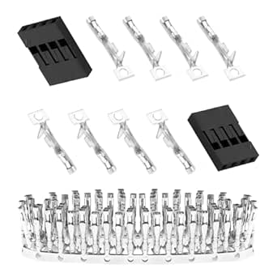

# Pzsmocn 4-Pin Female Dupont Connectors

## Details

- **Location**: Cabinet-5, Bin 4, Section A
- **Category**: Electrical Connectors
- **Brand**: Pzsmocn
- **Part Number**: B096DFPXVX
- **Package**: Dupont Female Housing
- **Quantity**: 50 sets (250 pieces total)
- **Status**: Available
- **Price Range**: $10.99 (pack of 50 sets)
- **Product URL**: https://a.co/d/07Zs9S7

## Description

Pzsmocn 4-Pin Female Dupont Connectors are high-quality 2.54mm pitch connector housings designed for breadboard prototyping, Arduino projects, and custom cable assemblies. Each set includes female housing and crimp pins for creating reliable electrical connections. These 4-pin connectors are perfect for applications requiring multiple signal lines such as I2C, SPI, or sensor modules with power, ground, and multiple data lines.

## Specifications

### Electrical Characteristics

- **Operating Voltage**: 250V AC
- **Current Rating**: 3A per contact
- **Power Rating**: 750W
- **Wire Gauge Range**: 26-30 AWG
- **Wire Types**: Solid and stranded conductors
- **Contact Resistance**: <20mΩ
- **Insulation Resistance**: >1000MΩ

### Physical Characteristics

- **Pitch**: 2.54mm (0.1 inch)
- **Pin Count**: 4
- **Housing Material**: Black polypropylene (PP)
- **Contact Material**: Copper alloy with tin plating
- **Operating Temperature**: -25°C to +85°C
- **Mating Cycles**: >100 cycles

### Package Contents

- 50 pieces 4-pin female housing
- 200 pieces crimp pins
- PP material storage box

## Image

## Applications

Common use cases and applications for these 4-pin Dupont connectors:

- I2C sensor modules (VCC, GND, SDA, SCL)
- SPI device connections (VCC, GND, MOSI, MISO)
- UART serial connections (VCC, GND, TX, RX)
- Stepper motor driver connections
- OLED and LCD display modules
- Arduino shield connections
- Raspberry Pi HAT connections
- Multi-channel sensor arrays
- RGB LED strip controllers
- Custom 4-wire cable assemblies

## Technical Notes

Important technical considerations and usage tips:

- Requires proper crimping tool for reliable connections
- Ensure wire is fully inserted into crimp pin before crimping
- Housing accepts standard 2.54mm male headers
- Compatible with breadboard and perfboard layouts
- Crimp pins should be crimped on both wire and insulation
- Use appropriate wire gauge for current requirements
- Storage box keeps components organized and protected
- Can be used with both solid and stranded wire
- 4-pin configuration ideal for power + dual data lines

## Compatibility

These connectors are compatible with:

- Standard 2.54mm pitch 4-pin male headers
- Arduino Uno, Nano, Mega pin headers
- Raspberry Pi GPIO pins
- Breadboard male headers
- Perfboard and stripboard layouts
- Standard 4-wire jumper cables
- I2C and SPI sensor modules
- Display module connectors
- Stepper motor driver boards

## Common Pinouts

Typical 4-pin configurations:

- **I2C Devices**: VCC, GND, SDA, SCL
- **SPI Devices**: VCC, GND, MOSI, MISO
- **UART Serial**: VCC, GND, TX, RX
- **RGB LED**: VCC, R, G, B
- **Stepper Motor**: A+, A-, B+, B-

## Tags

pzsmocn, dupont, connectors, breadboard, arduino, female, 4-pin, crimp, i2c, spi #cabinet-5 #bin-4 #section-a #status-available

## Notes

These 4-pin Dupont connectors are extremely versatile for electronics projects requiring multiple connections. The 4-pin configuration is perfect for I2C sensors, SPI devices, and other modules that need power plus multiple data lines. The 2.54mm pitch matches standard Arduino and breadboard spacing. Quality is good for the price point, and the included storage box keeps the small components organized. Essential for any serious electronics prototyping work.
