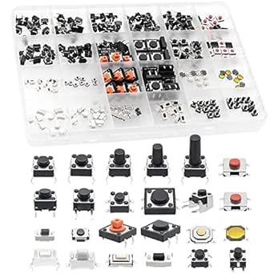

# QTEATAK Micro Momentary Tactile Switch Assortment

## Details

- **Location**: Cabinet-5, Bins 13 and 14
- **Category**: Switches & Controls
- **Brand**: QTEATAK
- **Part Number**: B0BFWK5N8V
- **Model**: 240 Pcs 24 Value Micro Momentary Tactile Switch Kit
- **Package**: Mixed Assortment Kit
- **Quantity**: Multiple types spread between bins 13 and 14
- **Status**: Available
- **Price Range**: $14.99 (240-piece kit)
- **Product URL**: https://a.co/d/bSShHIM

## Description

The QTEATAK 240-piece tactile switch assortment kit contains 24 different values of micro momentary tactile push button switches. This comprehensive collection provides a wide variety of switch types, sizes, and configurations commonly needed for electronics repair, prototyping, and project development. The switches range from tiny micro switches for compact devices to larger tactile switches for user interfaces, making this kit an essential resource for any electronics workbench.

## Kit Contents

### Switch Varieties (24 Different Types)

The assortment typically includes switches with various characteristics:

**By Size:**
- **Micro switches**: 3x3mm, 4x4mm, 5x5mm
- **Standard switches**: 6x6mm, 8x8mm, 10x10mm, 12x12mm
- **Larger switches**: 15x15mm and specialty sizes

**By Height:**
- **Low profile**: 1.5mm to 3mm actuator height
- **Standard height**: 4mm to 7mm actuator height
- **Tall switches**: 8mm to 15mm actuator height

**By Configuration:**
- **2-pin switches**: Simple SPST momentary contact
- **4-pin switches**: SPST with redundant contacts for reliability
- **SMD switches**: Surface mount for modern PCB designs
- **Through-hole switches**: Traditional PCB mounting

## Specifications

### Typical Electrical Characteristics

- **Operating Voltage**: 12V DC (varies by switch type)
- **Contact Current**: 50mA (varies by switch type)
- **Contact Resistance**: <100 milliohms
- **Insulation Resistance**: >100 MΩ
- **Operating Life**: 100,000 to 1,000,000 cycles (varies by type)
- **Contact Type**: Momentary (normally open)

### Physical Characteristics

- **Actuation Force**: 100gf to 500gf (varies by switch type)
- **Travel Distance**: 0.1mm to 0.5mm (varies by switch type)
- **Operating Temperature**: -25°C to +85°C
- **Storage Temperature**: -40°C to +100°C

## Image

## Applications

Common use cases for this switch assortment:

- **Electronics Repair**: Replacement switches for broken devices
- **Prototyping**: Various switch options for breadboard and PCB prototypes
- **Arduino Projects**: User input buttons for microcontroller projects
- **Remote Controls**: Repair of TV remotes, garage door openers, key fobs
- **Gaming Controllers**: Replacement switches for gaming devices
- **Industrial Controls**: Repair of control panels and operator interfaces
- **Consumer Electronics**: Repair of appliances, toys, and gadgets
- **Educational Projects**: Teaching electronics and switch principles
- **Hobby Electronics**: General purpose switching for various projects
- **Test Equipment**: Manual controls and trigger switches

## Switch Types by Application

### Micro Switches (3-6mm)
- **Perfect for**: Remote controls, key fobs, compact devices
- **Characteristics**: Low profile, light actuation force
- **Common uses**: TV remotes, car key fobs, small electronics

### Standard Switches (6-12mm)
- **Perfect for**: Arduino projects, general prototyping
- **Characteristics**: Good tactile feedback, reliable operation
- **Common uses**: User interfaces, control panels, breadboard projects

### Larger Switches (12-15mm)
- **Perfect for**: Industrial controls, heavy-duty applications
- **Characteristics**: High actuation force, robust construction
- **Common uses**: Equipment controls, test instruments, professional devices

## Technical Notes

Important considerations for tactile switch selection:

- **Size matching**: Ensure switch dimensions match the original or PCB footprint
- **Actuation force**: Choose appropriate force for the application
- **Height clearance**: Consider actuator height in enclosure design
- **Contact configuration**: 2-pin vs 4-pin based on reliability requirements
- **Mounting type**: Through-hole vs SMD based on PCB design
- **Environmental**: Consider operating temperature and humidity requirements

## Repair Applications

### Common Repair Scenarios
- **TV Remotes**: Replace worn or sticky buttons
- **Game Controllers**: Fix unresponsive gaming buttons
- **Car Key Fobs**: Repair non-working remote buttons
- **Appliance Controls**: Fix microwave, washing machine buttons
- **Computer Peripherals**: Repair mouse buttons, keyboard switches
- **Audio Equipment**: Fix volume controls, function buttons

### Repair Tips
- Identify original switch specifications before replacement
- Test switch operation before final installation
- Use appropriate soldering techniques for small components
- Consider switch orientation and pin configuration
- Verify proper actuation force for user experience

## Storage and Organization

### Kit Organization
- Switches typically organized by size or type
- Individual compartments or bags for each switch type
- Clear labeling for easy identification
- Protective packaging to prevent damage

### Inventory Management
- Track usage to identify commonly needed types
- Reorder specific switch types as needed
- Maintain variety for different repair scenarios
- Document successful repairs for future reference

## Safety Considerations

- **Voltage Limits**: Observe maximum voltage ratings for each switch type
- **Current Limits**: Do not exceed current ratings to prevent contact damage
- **ESD Protection**: Use proper ESD precautions when handling
- **Soldering**: Use appropriate temperature and techniques for small components
- **Testing**: Verify switch operation before final assembly

## Tags

qteatak, tactile-switch, momentary, micro, assortment, 24-value, pcb-mount, arduino, repair #cabinet-5 #bin-13 #bin-14 #status-available

## Notes

This QTEATAK tactile switch assortment is an invaluable resource for electronics repair and prototyping. The 24 different switch types provide solutions for most common switching needs, from tiny remote control buttons to larger user interface switches. The variety ensures you'll have the right switch for most repair scenarios, making it an essential kit for any electronics workbench. The quality construction and reasonable price make this kit excellent value for both hobbyists and professionals. Having this assortment spread across bins 13 and 14 provides easy access to the most commonly needed switch types.
