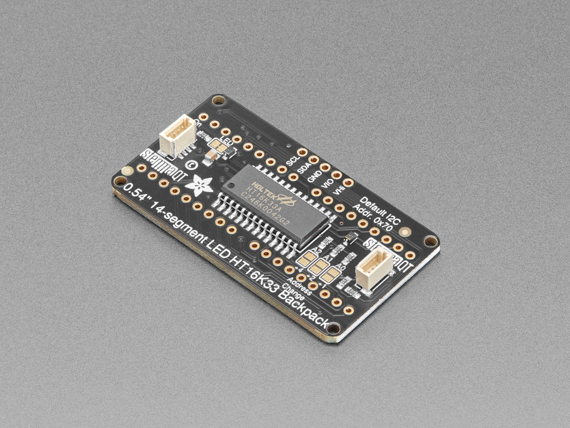

# Quad Alphanumeric Display - White 0.54"

## Description

Quad Alphanumeric Display - White 0.54" Digits w/ I2C Backpack - STEMMA QT / Qwiic compatible for easy connection.

## Image

## Tags

#led-display #alphanumeric #quad #white #i2c #stemma-qt #qwiic #adafruit
