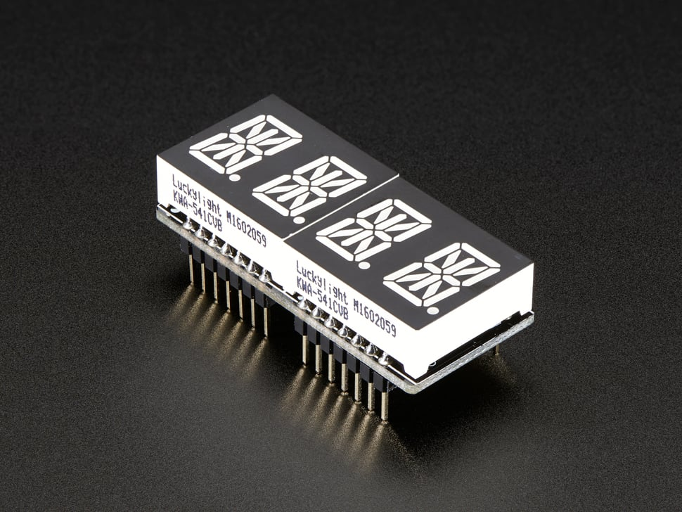

# Adafruit 0.54" Quad Alphanumeric FeatherWing Display - Red

## Details

- **Location**: Cabinet-1, Bin 23
- **Category**: FeatherWings
- **Type**: Quad 14-Segment Alphanumeric Display FeatherWing
- **Color**: Red
- **Characters**: 4 digits (0.54" height each)
- **Form Factor**: Feather-compatible wing
- **Quantity**: 5
- **Product URL**: https://www.adafruit.com/product/3130

## Description

Quad alphanumeric FeatherWing display with four red 0.54" 14-segment LED digits and integrated HT16K33 I2C driver. Designed to work with any Feather board, this wing makes it easy to add a bright, readable 4-character display for letters, numbers, and symbols. Perfect for clocks, status displays, and data readouts.

## Specifications

- **Part Number**: 3130
- **Display Type**: 4x 14-segment alphanumeric LEDs
- **Digit Height**: 0.54 inch (13.7mm)
- **Color**: Red
- **Driver**: HT16K33 I2C LED driver
- **Interface**: I2C (address 0x70-0x77, selectable)
- **Form Factor**: Feather-compatible wing
- **Voltage**: 3.3V - 5V
- **Viewing Distance**: Up to 23 feet (7 meters)
- **Common Cathode**: LED display configuration

## Dimensions

- **FeatherWing Board**: 51mm x 23mm x 4.2mm (2.0" x 0.9" x 0.165")
- **Display Module**: 21mm x 25mm x 7mm (0.8" x 1" x 0.3")
- **Total Weight**: ~9.3g (wing + display)

## Image

## Features

- **Feather Compatible**: Works with any and all Feather boards
- **I2C Control**: Simple 2-wire interface, shares I2C pins
- **High Brightness**: Visible from up to 23 feet away
- **Full Alphanumeric**: Display A-Z, 0-9, and special characters
- **Address Selection**: Jumpers for multiple displays (0x70-0x77)
- **Minimal Pin Usage**: Only uses I2C pins, leaves others free
- **Arduino & CircuitPython**: Extensive library support

## Kit Contents

- 1x Adafruit 4-Digit 14-Segment Alphanumeric Display FeatherWing
- 2x 0.54" Ultra-bright dual alphanumeric red displays
- 2x 16-pin headers

## Applications

- Digital clocks and timers
- Status displays for Feather projects
- Data logging readouts
- Message displays
- Industrial monitoring
- Educational projects
- Maker projects requiring text display
- Portable device interfaces

## Interface

- **Communication**: I2C (TWI)
- **Address Range**: 0x70-0x77 (configurable via jumpers)
- **Voltage**: 3.3V or 5V compatible
- **Pin Usage**: Only I2C pins (SDA/SCL)
- **Libraries**: Arduino, CircuitPython
- **Multiplexing**: Handled by HT16K33 chip

## Compatibility

- **All Feather Boards**: ESP32, M0, M4, RP2040, etc.
- **Stackable**: Can be used with other FeatherWings
- **I2C Sharing**: Multiple devices can share the I2C bus
- **Cross-Platform**: Works with Arduino IDE and CircuitPython

## Notes

- Requires minimal soldering to attach displays and headers
- HT16K33 chip handles all LED multiplexing automatically
- Can display full alphabet, numbers, and many special characters
- Excellent for projects requiring readable text at distance
- Leaves most Feather pins available for other uses
- Multiple wings can be addressed on same I2C bus

## Tags

featherwing, led-display, alphanumeric, red, 14-segment, ht16k33, i2c, adafruit
