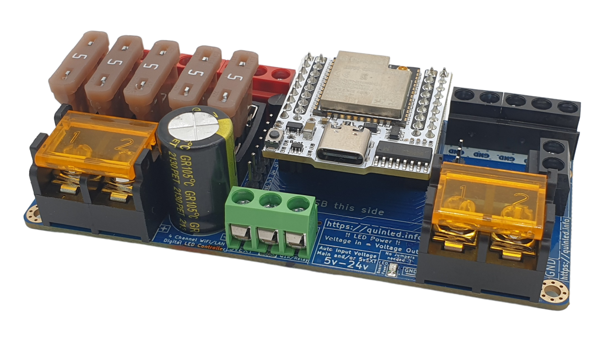

# QuinLED Dig-Quad v3 Digital LED Controller

## Details

- **Location**: Cabinet 4, Bin 11
- **Category**: LED Controllers
- **Brand**: QuinLED/DrZzs
- **Part Number**: DIG-QUAD-V3
- **Package**: Assembled Board
- **Quantity**: 2
- **Status**: Available
- **Price Range**: $43.00 - $52.00
- **Product URL**: https://www.drzzs.com/shop/digquad/

## Description

Professional-grade ESP32-powered WiFi-connected digital LED controller capable of driving 4 independent channels of addressable LED strips. Pre-flashed with WLED firmware and fully assembled for immediate use. Features auto-voltage detection (5V-24V), built-in level shifters, fused outputs, and extensive GPIO expansion for sensors, buttons, and displays.

## Image



## Specifications

### Core Features
- **Microcontroller**: QuinLED-ESP32 (custom ESP32 module)
- **WiFi**: 802.11 b/g/n with choice of antenna options
- **Firmware**: WLED 0.12+ pre-installed
- **Channels**: 4 independent LED output channels
- **Power Input**: Auto 5V-24V detection (no jumpers required)
- **Level Shifting**: Built-in 5.1V level shifters for all channels

### Power System
- **Input Voltage**: 5V-24V DC auto-detection
- **Custom DC-DC**: Onboard voltage regulation circuit
- **5vEXT Output**: Auto-selected 5V external power
- **Fuse Protection**: 5 fuses total (channels 1&2 share, 3&4 share)
- **Power Injection**: 7 positive/negative output terminals

### LED Compatibility
- **Clockless**: WS2812B, SK6812, WS2813, WS2815
- **Clocked**: APA102, SK9822, LPD8806 (single strip mode)
- **Voltage**: 5V and 12V LED strips supported
- **Data Rate**: High-speed data transmission with level shifting

## Pinout/Connection Information

### Power Connections
- **VIN+/VIN-**: Main power input (5V-24V DC)
- **5vEXT**: External 5V power output (2 pin headers)
- **LED+/LED-**: Fused power outputs for LED strips

### LED Output Channels
- **LED1**: Channel 1 data output (GPIO16)
- **LED2**: Channel 2 data output (GPIO3)
- **LED3**: Channel 3 data output (GPIO1)
- **LED4**: Channel 4 data output (GPIO4)
- **CLK**: Clock output for clocked LED strips (GPIO14)

### GPIO Expansion
- **GPIO2**: General purpose I/O
- **GPIO5**: General purpose I/O
- **GPIO12**: General purpose I/O
- **GPIO13**: General purpose I/O
- **GPIO15**: General purpose I/O
- **GPIO21**: I2C SDA
- **GPIO22**: I2C SCL
- **A0**: Analog input (audio reactive capability)

### Connection Diagram
```
Power Input:
VIN+ (5V-24V) --> Positive power supply
VIN- (GND)    --> Negative/ground

LED Strips:
LED1/2/3/4    --> Data pins to LED strips
LED+/LED-     --> Power injection points
CLK           --> Clock for clocked strips

GPIO Expansion:
GPIO pins     --> Buttons, sensors, displays
I2C (21/22)   --> OLED displays, sensors
A0            --> Audio input for reactive effects
```

## Circuit Integration Notes

### WLED Integration
- **Pre-configured**: Ships with WLED firmware pre-installed
- **Web Interface**: Full web-based configuration and control
- **Effects**: Hundreds of built-in LED effects and patterns
- **Segments**: Multiple segments per channel for complex displays
- **Sync**: Multi-device synchronization capabilities

### Home Automation
- **WiFi Control**: Direct WiFi connectivity for smart home integration
- **API**: RESTful API for custom control applications
- **MQTT**: MQTT support for Home Assistant, OpenHAB integration
- **Alexa/Google**: Voice control compatibility
- **Mobile Apps**: WLED mobile app support

### Expansion Capabilities
- **Sensors**: Temperature, motion, light sensors via GPIO
- **Displays**: OLED/LCD displays via I2C interface
- **Audio Reactive**: Microphone input via A0 for music-reactive effects
- **Buttons**: Physical control buttons via GPIO pins
- **Relays**: Control external devices via GPIO outputs

## Technical Specifications

### Performance Parameters
- **LED Count**: Up to 2048 LEDs total (configurable per channel)
- **Refresh Rate**: High-speed refresh for smooth animations
- **Color Depth**: 24-bit RGB, 32-bit RGBW support
- **Effects**: 100+ built-in effects with customization
- **Memory**: Sufficient for complex effect storage

### Environmental Specifications
- **Operating Temperature**: 0°C to 50°C
- **Storage Temperature**: -20°C to 70°C
- **Humidity**: 10% to 90% RH (non-condensing)
- **Enclosure**: Requires external enclosure for outdoor use

### Electrical Characteristics
- **Input Current**: Varies with LED load
- **Logic Voltage**: 3.3V (ESP32 native)
- **Output Voltage**: 5.1V level-shifted data signals
- **Fuse Ratings**: Individual channel protection
- **ESD Protection**: Built-in protection circuits

## Applications

### Architectural Lighting
- **Building Outlines**: Permanent architectural accent lighting
- **Landscape Lighting**: Garden and pathway illumination
- **Sign Lighting**: Commercial and residential signage
- **Holiday Displays**: Seasonal and decorative lighting

### Entertainment Lighting
- **Stage Lighting**: Performance and event lighting
- **DJ/Club Lighting**: Music-reactive dance floor effects
- **Home Theater**: Ambient lighting for media rooms
- **Gaming Setups**: RGB lighting for gaming environments

### Art Installations
- **Interactive Art**: Sensor-responsive art pieces
- **Kinetic Sculptures**: Moving light installations
- **Public Art**: Large-scale LED art projects
- **Museum Displays**: Educational and exhibit lighting

## Troubleshooting

### Common Issues
1. **No WiFi Connection**: Check antenna connection and WiFi credentials
2. **LEDs Not Responding**: Verify power supply voltage and connections
3. **Flickering**: Check data line integrity and power injection
4. **Overheating**: Ensure adequate ventilation and proper fusing

### Configuration Tips
- **WLED Setup**: Access web interface at device IP address
- **LED Configuration**: Set correct LED type and count in WLED
- **Power Planning**: Calculate total power requirements for LED strips
- **Grounding**: Ensure proper grounding for long LED runs

### Performance Optimization
- **Power Injection**: Use multiple power injection points for long strips
- **Data Integrity**: Keep data lines short and use proper cables
- **WiFi Signal**: Position for strong WiFi signal strength
- **Heat Management**: Use enclosures with adequate ventilation

## Compatibility Notes

### LED Strip Compatibility
- **WS2812B**: Full 4-channel support with individual control
- **SK6812**: RGBW support with white channel control
- **APA102**: High-speed clocked strips (single channel mode)
- **12V Strips**: Compatible with 12V WS2813, WS2815 strips

### Software Compatibility
- **WLED**: Native support with all features
- **Home Assistant**: Direct integration via WLED component
- **OpenHAB**: MQTT and HTTP API integration
- **Custom Software**: ESP32 Arduino IDE compatibility

### Hardware Integration
- **Enclosures**: Compatible with standard project boxes
- **Mounting**: Standard PCB mounting holes
- **Connectors**: Terminal blocks for easy wiring
- **Expansion**: Header pins for GPIO access

## Notes

The QuinLED Dig-Quad represents the pinnacle of DIY LED controller design, offering professional features in an accessible package. The pre-installed WLED firmware provides immediate functionality while maintaining full customization capabilities.

**Version 3 Improvements**: Enhanced power handling, auto-voltage detection, and the custom QuinLED-ESP32 module make this the most reliable and feature-rich version yet.

**Power Planning**: Always calculate total LED power requirements and use appropriate power supplies. The auto-voltage detection eliminates configuration errors but proper power sizing remains critical.

The extensive GPIO expansion makes this controller suitable for complex installations requiring sensors, displays, and interactive elements beyond basic LED control.

## Related Components

- [[addressable-led-strips]] - Compatible LED strips and components
- [[power-supplies-led]] - Appropriate power supplies for LED installations
- [[esp32-modules]] - Related ESP32 development boards
- [[wled-accessories]] - Sensors, displays, and expansion modules
