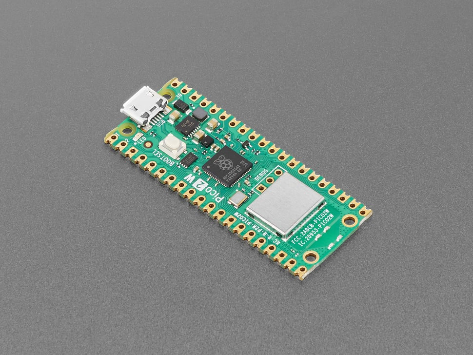

# Raspberry Pi Pico 2W

## Details

- **Location**: Cabinet-1, Bin 32
- **Category**: Microcontroller Boards
- **Type**: RP2350 Development Board with WiFi & Bluetooth (Pico Form Factor)
- **Microcontroller**: RP2350 (Dual ARM Cortex-M33 or RISC-V Hazard3 @ 150MHz)
- **Brand**: Raspberry Pi Foundation
- **Part Number**: 6087
- **Quantity**: 3
- **Product URL**: https://www.adafruit.com/product/6087

## Description

The Raspberry Pi Pico 2W is the Foundation's latest wireless microcontroller board, built on the new RP2350 chip. It features dual-architecture capability (ARM Cortex-M33 or RISC-V Hazard3), WiFi, Bluetooth LE/Classic, and significant performance improvements over the original Pico while maintaining full pin compatibility.

## Specifications

- **Microcontroller**: RP2350 dual-core @ 150MHz (ARM Cortex-M33 or RISC-V Hazard3)
- **Memory**: 520KB on-chip SRAM, 4MB on-board QSPI Flash
- **WiFi**: 802.11n single-band 2.4GHz with WPA3 support
- **Bluetooth**: Bluetooth LE and Bluetooth Classic via Infineon CYW43439
- **GPIO Pins**: 26 multi-purpose pins
- **ADC**: 4x 12-bit analog inputs
- **PWM**: 24 PWM channels
- **Peripherals**: 2x UART, 2x SPI, 2x I2C, USB 1.1 controller
- **PIO**: 3 blocks with 4 state machines each (12 total)
- **Power**: 1.8-5.5V DC input
- **Operating Temperature**: -20°C to +85°C

## Dimensions

- **Board Size**: 21mm x 51mm (0.83" x 2.0")
- **Weight**: ~3g
- **Form Factor**: Standard Pico compatible

## Image



## Features

- **Dual Architecture**: Choose between ARM Cortex-M33 or RISC-V Hazard3 cores
- **Enhanced Performance**: 2x faster than RP2040, with FPU on M33 cores
- **Expanded Memory**: 2x SRAM (520KB) and 2x Flash (4MB) vs original Pico
- **Wireless Connectivity**: WiFi 802.11n and Bluetooth LE/Classic
- **Security Features**: ARM TrustZone, signed boot, hardware TRNG, SHA-256 acceleration
- **Advanced Peripherals**: HSTX for high-speed transmission, additional PIO block
- **Pin Compatibility**: Fully compatible with original Pico and accessories
- **Soft Access Point**: Support up to 4 WiFi clients
- **Programming Options**: C/C++, CircuitPython, MicroPython, Arduino IDE

## Wireless Capabilities

- **WiFi**: 802.11n 2.4GHz with WPA3 security
- **Access Point Mode**: Support up to 4 connected clients
- **Bluetooth LE**: Low energy wireless communication
- **Bluetooth Classic**: Traditional Bluetooth connectivity
- **Antenna**: On-board antenna (licensed from ABRACON/ProAnt)

## Security Features

- ARM TrustZone for Cortex-M security architecture
- Signed boot capability
- 8KB antifuse OTP for secure key storage
- Hardware True Random Number Generator (TRNG)
- SHA-256 hardware acceleration
- Fast glitch detection

## Pinout Diagram

### Official Raspberry Pi Pico 2W Pinout


## Basic Wiring Examples

### LED Blink Circuit

```
Pico 2W Pin GP25 → Built-in LED (no external wiring needed)
OR
Pico 2W Pin GP2 → LED Anode (long leg)
LED Cathode (short leg) → 220Ω Resistor → Pico 2W GND

Note: Pin GP25 controls built-in LED
```

### Button Input Circuit

```
Pico 2W 3V3 → 10kΩ Pull-up Resistor → Pico 2W Pin GP15
Pico 2W Pin GP15 → Button → Pico 2W GND

Code: Pin(15, Pin.IN, Pin.PULL_UP).value() returns 1 when not pressed, 0 when pressed
```

### I2C Device Connection

```
I2C Device VCC → Pico 2W 3V3
I2C Device GND → Pico 2W GND
I2C Device SDA → Pico 2W Pin GP4 (I2C0 SDA)
I2C Device SCL → Pico 2W Pin GP5 (I2C0 SCL)

Alternative I2C: Pin GP2 (SDA1), Pin GP3 (SCL1)
```

### SPI Device Connection

```
SPI Device VCC → Pico 2W 3V3
SPI Device GND → Pico 2W GND
SPI Device SCK → Pico 2W Pin GP18 (SPI0 SCK)
SPI Device MOSI → Pico 2W Pin GP19 (SPI0 TX)
SPI Device MISO → Pico 2W Pin GP16 (SPI0 RX)
SPI Device CS → Pico 2W Pin GP17 (SPI0 CSn)
```

### Analog Sensor Reading

```
Sensor Output → Pico 2W Pin GP26, GP27, GP28, or GP29 (ADC0-3)
Sensor VCC → Pico 2W 3V3
Sensor GND → Pico 2W GND

Code: ADC(0).read_u16() returns 0-65535 (0-3.3V)
```

### UART Communication

```
Device TX → Pico 2W Pin GP1 (UART0 RX)
Device RX → Pico 2W Pin GP0 (UART0 TX)
Device VCC → Pico 2W 3V3
Device GND → Pico 2W GND

Alternative UART: Pin GP4 (TX1), Pin GP5 (RX1)
```

### Battery Power Connection

```
LiPo Battery + → Pico 2W VSYS
LiPo Battery - → Pico 2W GND
Battery voltage monitoring → Pico 2W Pin GP29 (ADC3)

Note: VSYS accepts 1.8V-5.5V input
```

## Programming Setup Guide

### MicroPython Setup (Recommended)

1. Download MicroPython UF2 from micropython.org
2. Hold BOOTSEL button while connecting USB
3. Drag UF2 file to RPI-RP2 drive
4. Board reboots with MicroPython
5. Use Thonny IDE or terminal for programming

### CircuitPython Setup

1. Download CircuitPython UF2 from circuitpython.org
2. Hold BOOTSEL button while connecting USB
3. Drag UF2 file to RPI-RP2 drive
4. Board reboots as CIRCUITPY drive
5. Edit code.py to program

### Arduino IDE Setup

1. Install Arduino IDE
2. Add RP2040 board package URL in preferences
3. Install "Raspberry Pi Pico/RP2040" boards
4. Select "Raspberry Pi Pico 2" from Tools → Board
5. Hold BOOTSEL for first upload

## Programming Examples

### MicroPython - WiFi Connection

```python
import network
import time

# Connect to WiFi
wlan = network.WLAN(network.STA_IF)
wlan.active(True)
wlan.connect('YOUR_SSID', 'YOUR_PASSWORD')

# Wait for connection
while not wlan.isconnected():
    print('Connecting to WiFi...')
    time.sleep(1)

print('Connected to WiFi')
print('IP address:', wlan.ifconfig()[0])
```

### MicroPython - HTTP Request

```python
import network
import urequests
import time

# Connect to WiFi (use code from above)
wlan = network.WLAN(network.STA_IF)
wlan.active(True)
wlan.connect('YOUR_SSID', 'YOUR_PASSWORD')

while not wlan.isconnected():
    time.sleep(1)

print('Connected to WiFi')

# Make HTTP request
try:
    response = urequests.get('http://httpbin.org/json')
    print('Response:', response.json())
    response.close()
except Exception as e:
    print('Error:', e)
```

### MicroPython - Bluetooth LE Beacon

```python
import bluetooth
import struct
import time
from machine import Pin

# Initialize Bluetooth
ble = bluetooth.BLE()
ble.active(True)

# LED for status indication
led = Pin(25, Pin.OUT)

def ble_advertise():
    # Create advertising data
    name = "Pico2W-Beacon"
    payload = struct.pack('<B', len(name) + 1) + struct.pack('<B', 0x09) + name.encode()

    # Start advertising
    ble.gap_advertise(100, payload)
    print("Advertising as:", name)

# Start advertising
ble_advertise()

while True:
    led.toggle()
    time.sleep(1)
```

### MicroPython - Web Server

```python
import network
import socket
import time
from machine import Pin

# Setup WiFi
wlan = network.WLAN(network.STA_IF)
wlan.active(True)
wlan.connect('YOUR_SSID', 'YOUR_PASSWORD')

while not wlan.isconnected():
    time.sleep(1)

print('Connected to WiFi')
print('IP address:', wlan.ifconfig()[0])

# Setup LED
led = Pin(25, Pin.OUT)

# Create socket
addr = socket.getaddrinfo('0.0.0.0', 80)[0][-1]
s = socket.socket()
s.bind(addr)
s.listen(1)

print('Listening on', addr)

# Web server loop
while True:
    cl, addr = s.accept()
    print('Client connected from', addr)

    request = cl.recv(1024)
    request = str(request)

    # Parse request
    if 'GET /led/on' in request:
        led.on()
        response = "LED ON"
    elif 'GET /led/off' in request:
        led.off()
        response = "LED OFF"
    else:
        response = """
        <html>
        <body>
        <h1>Pico 2W Web Server</h1>
        <p><a href="/led/on">Turn LED ON</a></p>
        <p><a href="/led/off">Turn LED OFF</a></p>
        </body>
        </html>
        """

    # Send response
    cl.send('HTTP/1.0 200 OK\r\nContent-type: text/html\r\n\r\n')
    cl.send(response)
    cl.close()
```

## Important Notes

### Power Considerations

- **3.3V Logic**: All GPIO pins are 3.3V logic level
- **USB Power**: Powered via USB with automatic switching
- **Battery Power**: VSYS accepts 1.8V-5.5V input
- **Current Limit**: 600mA peak from onboard regulator
- **Power Monitoring**: Battery voltage available on ADC3

### WiFi Performance

- **2.4GHz Only**: Single-band 802.11n wireless
- **WPA3 Support**: Modern security protocols
- **Range**: Typical indoor range 30-50 meters
- **Antenna**: Onboard PCB antenna (keep clear of metal)
- **Power Consumption**: ~80mA during active WiFi transmission

### Bluetooth Capabilities

- **Bluetooth 5.2**: LE and Classic support
- **Central/Peripheral**: Both roles supported
- **Range**: Typical 10-30 meters depending on power class
- **Concurrent**: Can run WiFi and Bluetooth simultaneously

### Programming Considerations

- **Dual Architecture**: Choose ARM Cortex-M33 or RISC-V Hazard3
- **Memory**: 520KB SRAM, 4MB Flash
- **PIO Blocks**: 3 blocks with 4 state machines each
- **Wireless Libraries**: Built-in support for networking protocols

## Applications

- **IoT Projects**: WiFi and Bluetooth connectivity for smart home devices
- **Wireless Sensor Networks**: Remote monitoring and data collection
- **Edge Computing**: Local AI/ML processing with wireless communication
- **Robotics**: Wireless control and telemetry for autonomous systems
- **Educational Projects**: Learning embedded systems with modern connectivity
- **Prototyping**: Rapid development of connected devices
- **Industrial Automation**: Wireless monitoring and control systems
- **Wearable Technology**: Bluetooth-enabled fitness and health devices

## Programming Support

- **CircuitPython/MicroPython**: Enhanced support with 4MB Flash
- **Arduino IDE**: Full Arduino compatibility
- **C/C++ SDK**: Official Raspberry Pi SDK
- **RISC-V Development**: Affordable entry into RISC-V programming

## Tags

microcontroller, rp2350, pico, raspberry-pi, wifi, bluetooth-le, bluetooth-classic, circuitpython, micropython, arduino, dual-architecture, wireless, iot

## Notes

**Important**: This board uses the A2 version of RP2350 affected by erratum E9, which impacts some GPIO and PIO uses including high-impedance inputs and internal pulldowns. Use 8.2K or smaller resistors for pulldowns if required. The Pico 2W represents a major upgrade from the original Pico with 2x performance, 2x memory, wireless connectivity, and security features while maintaining full compatibility.
