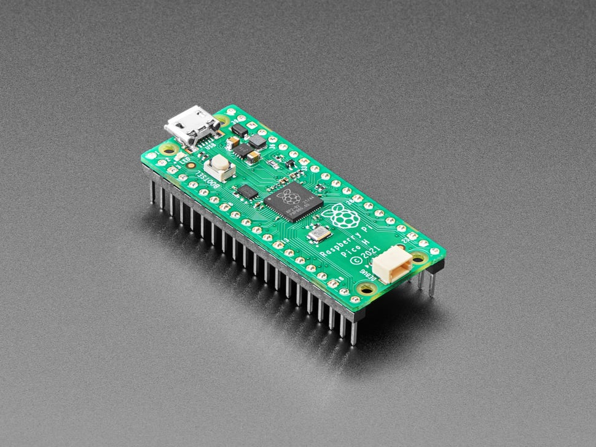

# Raspberry Pi Pico H - Pico with Headers Soldered

## Details

- **Location**: Cabinet-1, Bin 32
- **Category**: Microcontroller Boards
- **Type**: RP2040 Development Board with Pre-Soldered Headers (Pico Form Factor)
- **Microcontroller**: RP2040 (Dual ARM Cortex-M0+ @ 133MHz)
- **Brand**: Raspberry Pi Foundation
- **Part Number**: 5525
- **Quantity**: 1
- **Product URL**: https://www.adafruit.com/product/5525

## Description

The Raspberry Pi Pico H is identical to the classic Pico but comes with pre-soldered headers and a new 3-pin debug connector. This makes it perfect for breadboard prototyping and development without requiring any soldering. The RP2040 microcontroller provides powerful dual-core performance at an affordable price.

## Specifications

- **Microcontroller**: RP2040 dual-core ARM Cortex-M0+ @ 133MHz
- **Memory**: 264KB on-chip SRAM, 2MB on-board QSPI Flash
- **GPIO Pins**: 26 total (25 user-accessible + 1 LED)
- **ADC**: 3x 12-bit analog inputs (4th ADC used internally)
- **PWM**: 16 PWM channels
- **Peripherals**: 2x UART, 2x SPI, 2x I2C, USB 1.1 controller
- **PIO**: 2 blocks with 4 state machines each (8 total)
- **Power**: 1.8-5.5V input via USB or VSYS pin
- **Logic Level**: 3.3V (not 5V tolerant)

## Dimensions

- **Board Size**: 21mm x 51mm (0.83" x 2.0")
- **Weight**: ~3g
- **Form Factor**: Standard Pico compatible

## Image

## Features

- **Pre-Soldered Headers**: Ready for breadboard use without soldering
- **3-Pin Debug Connector**: JST-SH connector for advanced debugging
- **Dual-Core Performance**: Two ARM Cortex-M0+ cores for multitasking
- **PIO State Machines**: Create custom hardware peripherals in software
- **UF2 Bootloader**: Drag-and-drop programming via USB mass storage
- **Single Green LED**: Connected to GPIO 25 for status indication
- **BOOTSEL Button**: Enter bootloader mode for firmware updates
- **Breadboard Friendly**: Standard 0.1" (2.54mm) pin spacing
- **Low Power**: Various power-saving modes available

## Programming Support

- **CircuitPython**: Full support with extensive library ecosystem
- **MicroPython**: Official Raspberry Pi Foundation support
- **Arduino IDE**: Philhower Arduino core recommended
- **C/C++ SDK**: Official Raspberry Pi Pico SDK
- **UF2 Bootloader**: Simple drag-and-drop firmware installation

## PIO (Programmable I/O) Capabilities

- Custom hardware peripherals created in software
- Perfect timing for protocols like NeoPixels, I2S, VGA
- 8 state machines total (2 blocks × 4 machines each)
- Can handle complex serial protocols without CPU intervention
- Runtime programmable in MicroPython and CircuitPython

## Power Options

- **USB Power**: 5V via micro-USB connector
- **External Power**: 1.8-5.5V via VSYS pin
- **3.3V Output**: 3.3V regulator provides up to 300mA
- **Low Power Modes**: SLEEP and DORMANT modes for battery operation

## Debug Features

- **3-Pin Debug Connector**: JST-SH connector for SWD debugging
- **SWD Pins**: SWCLK and SWDIO accessible via debug connector
- **Reset Pin**: Hardware reset capability
- **Serial Debug**: UART output for debugging

## Tags

microcontroller, rp2040, pico, raspberry-pi, headers-soldered, debug-connector, circuitpython, micropython, arduino, pio, dual-core

## Notes

The Pico H is perfect for breadboard prototyping since the headers are already soldered. The 3-pin debug connector provides professional debugging capabilities. The RP2040's PIO system is unique and powerful for creating custom peripherals. Not 5V tolerant - all GPIO pins are 3.3V logic only. The UF2 bootloader makes programming incredibly simple - just hold BOOTSEL while plugging in USB to enter bootloader mode.
