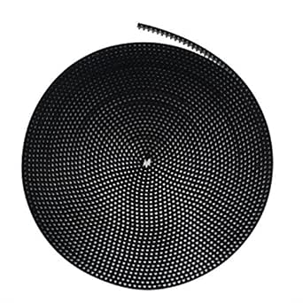

# SCStyle GT2 2mm Pitch 6mm Wide Timing Belt (5+ meters)

## Details

- **Location**: Cabinet 4, Bin 14
- **Category**: Mechanical Components
- **Brand**: SCStyle
- **Part Number**: GT2-5M-6MM
- **Package**: 5+ meters continuous length
- **Quantity**: 5+ meters
- **Status**: Available
- **Price Range**: $8.00 - $12.00
- **Product URL**: https://a.co/d/fMQNBaa

## Description

High-quality GT2 timing belt designed for precision motion control in 3D printers, CNC machines, and other automated systems. Features 2mm tooth pitch and 6mm width for reliable power transmission with minimal backlash. Made from durable rubber with fiberglass reinforcement for long service life and consistent performance.

## Image



## Specifications

### Belt Characteristics
- **Type**: GT2 (Gates Tooth Profile 2)
- **Pitch**: 2mm (center-to-center tooth spacing)
- **Width**: 6mm
- **Length**: 5+ meters (continuous, open-ended)
- **Material**: Rubber with fiberglass reinforcement
- **Color**: Black

### Mechanical Properties
- **Tensile Strength**: High tensile strength fiberglass cords
- **Flexibility**: Excellent flexibility for small pulley diameters
- **Backlash**: Minimal backlash for precise positioning
- **Temperature Range**: -30°C to +80°C operating temperature
- **Durability**: Long service life under normal operating conditions

### Tooth Profile
- **Profile**: GT2 (rounded tooth profile)
- **Tooth Height**: 0.75mm
- **Tooth Angle**: 40° included angle
- **Land Width**: 0.254mm minimum
- **Pitch Line**: Centered on tooth profile

## Pinout/Connection Information

### Pulley Compatibility
- **GT2 Pulleys**: Designed specifically for GT2 timing pulleys
- **Tooth Count**: Compatible with 16T, 20T, 36T, 60T GT2 pulleys
- **Bore Sizes**: Works with 5mm, 8mm, and other standard bore pulleys
- **Flange Types**: Compatible with flanged and non-flanged pulleys

### Installation Guidelines
```
Belt Installation:
1. Route belt around drive and driven pulleys
2. Ensure proper tension (not too tight, not too loose)
3. Check alignment of pulleys
4. Verify smooth operation through full rotation
5. Secure belt ends if creating closed loop
```

### Tension Requirements
- **Initial Tension**: Moderate tension to prevent slipping
- **Operating Tension**: Maintain consistent tension during operation
- **Over-tensioning**: Avoid excessive tension that causes premature wear
- **Under-tensioning**: Prevent loose belt that causes skipping

## Circuit Integration Notes

### 3D Printer Applications
- **X/Y Axis Drive**: Primary motion control for print head positioning
- **CoreXY Systems**: Dual belt configuration for X/Y movement
- **Belt Tensioning**: Proper tensioning critical for print quality
- **Maintenance**: Regular inspection for wear and proper tension

### CNC Machine Integration
- **Linear Motion**: Precise linear positioning for cutting operations
- **High Precision**: Minimal backlash for accurate machining
- **Speed Control**: Smooth operation at various speeds
- **Load Capacity**: Suitable for moderate load applications

### General Automation
- **Conveyor Systems**: Material handling and transport applications
- **Robotic Systems**: Joint actuation and positioning mechanisms
- **Packaging Equipment**: Automated packaging and sorting systems
- **Industrial Automation**: Various motion control applications

## Technical Specifications

### Performance Parameters
- **Maximum Speed**: Suitable for high-speed applications
- **Load Capacity**: Moderate load carrying capability
- **Positioning Accuracy**: High precision with minimal backlash
- **Repeatability**: Consistent performance over many cycles
- **Noise Level**: Quiet operation compared to chain drives

### Environmental Specifications
- **Operating Temperature**: -30°C to +80°C
- **Storage Temperature**: -40°C to +85°C
- **Humidity**: Resistant to moderate humidity levels
- **Chemical Resistance**: Good resistance to oils and greases
- **UV Resistance**: Limited UV resistance (indoor use recommended)

### Dimensional Tolerances
- **Pitch Accuracy**: ±0.02mm pitch tolerance
- **Width Tolerance**: ±0.1mm width tolerance
- **Thickness Tolerance**: ±0.05mm thickness tolerance
- **Straightness**: Minimal bow or twist in belt

## Applications

### 3D Printing
- **FDM Printers**: X/Y axis motion control in Cartesian printers
- **CoreXY Printers**: Dual belt systems for improved speed and accuracy
- **Delta Printers**: Radial motion control in some delta configurations
- **Large Format Printers**: Extended length capability for large machines

### CNC Machining
- **CNC Routers**: X/Y axis drive for routing operations
- **Laser Cutters**: Precise positioning for cutting and engraving
- **Plasma Cutters**: Motion control for automated cutting systems
- **Pick and Place**: Component placement in electronics assembly

### Automation Systems
- **Linear Actuators**: Converting rotary to linear motion
- **Conveyor Systems**: Material transport and handling
- **Packaging Machines**: Automated packaging and labeling
- **Sorting Systems**: Automated sorting and distribution

## Troubleshooting

### Common Issues
1. **Belt Slipping**: Check tension and pulley condition
2. **Tooth Jumping**: Verify proper pulley alignment and tension
3. **Premature Wear**: Check for over-tensioning or contamination
4. **Noise**: Inspect for proper lubrication and alignment

### Maintenance Procedures
- **Regular Inspection**: Check for wear, cracks, or damage
- **Tension Adjustment**: Maintain proper belt tension
- **Cleaning**: Keep belt and pulleys clean of debris
- **Lubrication**: Light lubrication of pulleys if required

### Installation Tips
- **Proper Routing**: Ensure correct belt path around pulleys
- **Alignment**: Verify pulley alignment to prevent edge wear
- **Tensioning**: Use proper tensioning techniques and tools
- **Break-in Period**: Allow for initial settling of new belts

## Compatibility Notes

### 3D Printer Compatibility
- **Prusa i3**: Compatible with MK2, MK3 series printers
- **Ender Series**: Suitable for Ender 3, Ender 5 modifications
- **CoreXY Designs**: Ideal for CoreXY and H-Bot configurations
- **Custom Builds**: Adaptable to various custom printer designs

### CNC Machine Compatibility
- **Hobby CNC**: Suitable for small to medium hobby machines
- **Router Tables**: Compatible with CNC router applications
- **Laser Engravers**: Appropriate for CO2 and diode laser systems
- **3D Carving**: Motion control for 3D carving applications

### Pulley Systems
- **Standard GT2**: Compatible with all standard GT2 pulleys
- **Bore Sizes**: Works with 3mm, 5mm, 8mm bore pulleys
- **Tooth Counts**: Suitable for 16T to 60T pulley configurations
- **Materials**: Compatible with aluminum, steel, and plastic pulleys

## Notes

This GT2 timing belt represents excellent value for precision motion control applications. The 2mm pitch provides good resolution while the 6mm width offers adequate strength for most 3D printing and light CNC applications.

**Quality Considerations**: SCStyle belts offer good quality at competitive prices, suitable for hobbyist and semi-professional applications. The fiberglass reinforcement provides durability while maintaining flexibility.

**Length Advantage**: Having 5+ meters of continuous belt allows for custom length cutting and multiple projects from a single purchase. Store remaining belt in a cool, dry location away from direct sunlight.

**Installation Note**: When creating closed loops, ensure clean, straight cuts and consider using belt clamps or mechanical fasteners for joining ends in critical applications.

## Related Components

- [[bcd-mechanical-numeric-selector-switches]] - Other components in same bin
- [[gt2-timing-pulleys]] - Compatible timing pulleys
- [[3d-printer-parts]] - Related 3D printer components
- [[cnc-machine-parts]] - CNC machine motion control components
