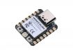

# Seeed Studio XIAO ESP32C3

## Details

- **Location**: Cabinet-1, Bin 26
- **Category**: Microcontroller Boards
- **Type**: RISC-V Development Board with Wi-Fi & BLE
- **Microcontroller**: ESP32-C3
- **Brand**: Seeed Studio
- **Part Number**: 113991054
- **Quantity**: 7
- **Product URL**: https://www.seeedstudio.com/Seeed-XIAO-ESP32C3-p-5431.html

## Description

Ultra-compact RISC-V microcontroller development board featuring the ESP32-C3 with built-in Wi-Fi and Bluetooth Low Energy. Part of the XIAO series, this tiny board packs powerful wireless connectivity and low-power capabilities into a thumb-sized form factor perfect for IoT applications.

## Specifications

- **Part Number**: 113991054
- **Microcontroller**: ESP32-C3
- **Architecture**: 32-bit RISC-V single-core
- **Clock Speed**: 160MHz
- **Operating Voltage**: 3.3V
- **Input Voltage**: 5V (via USB-C) or 3.3V
- **Flash Memory**: 4MB
- **SRAM**: 400KB
- **Dimensions**: 21.0mm x 17.5mm x 3.5mm
- **Weight**: ~2.5g

## Image

## Features

- **RISC-V Architecture**: Open-source instruction set architecture
- **Dual Wireless**: Wi-Fi 802.11 b/g/n + Bluetooth 5.0 LE
- **Ultra-Low Power**: Deep sleep current as low as 43μA
- **USB-C Connector**: Modern connector for programming and power
- **Battery Management**: Built-in battery charging circuit
- **Compact Size**: Smallest ESP32-C3 development board
- **Arduino Compatible**: Full Arduino IDE support

## Pin Configuration

- **Digital I/O**: 11 pins
- **Analog Inputs**: 4 pins (A0-A3, 12-bit resolution)
- **PWM**: All digital pins support PWM
- **I2C**: SDA (D4), SCL (D5)
- **SPI**: MOSI (D10), MISO (D9), SCK (D8), CS (D7)
- **UART**: TX (D6), RX (D7)
- **Special**: D0 (A0), D1 (A1), D2 (A2), D3 (A3)

## Power Specifications

- **Operating Voltage**: 3.3V
- **Input Voltage**: 5V (USB-C) or 3.3V (VCC)
- **Current Consumption**:
  - Active: ~40mA (Wi-Fi TX)
  - Light Sleep: ~1.8mA
  - Deep Sleep: ~43μA
- **Battery Charging**: Built-in Li-Po charging circuit
- **Power Management**: Multiple sleep modes

## Wireless Capabilities

### Wi-Fi
- **Standards**: 802.11 b/g/n (2.4GHz)
- **Modes**: Station, SoftAP, Station+SoftAP
- **Security**: WEP, WPA, WPA2, WPA3
- **Range**: Typical indoor Wi-Fi range

### Bluetooth
- **Version**: Bluetooth 5.0 LE
- **Protocols**: BLE, Bluetooth Mesh
- **Range**: Up to 10m (Class 2)
- **Power**: Ultra-low power BLE

## Applications

- IoT sensor nodes
- Wearable devices
- Smart home controllers
- Battery-powered projects
- TinyML applications
- Wireless sensor networks
- BLE beacons
- Edge AI devices

## Programming

- **Arduino IDE**: Full support with ESP32 board package
- **ESP-IDF**: Native Espressif development framework
- **MicroPython**: CircuitPython support
- **PlatformIO**: Professional development environment
- **TinyML**: Machine learning on microcontrollers

## XIAO Ecosystem

- **Form Factor**: Compatible with all XIAO accessories
- **Expansion Boards**: Grove Base, Expansion Board
- **Shields**: Various XIAO-compatible shields available
- **Community**: Large XIAO developer community

## Advantages

- **RISC-V**: Open-source architecture, future-proof
- **Dual Connectivity**: Wi-Fi + BLE in tiny package
- **Ultra-Low Power**: Excellent for battery applications
- **Cost Effective**: Great price-to-performance ratio
- **Easy Development**: Arduino IDE compatibility
- **Rich Ecosystem**: XIAO accessories and community

## Notes

- Smallest ESP32-C3 development board available
- RISC-V architecture offers open-source advantages
- Built-in battery charging makes it perfect for portable projects
- Ultra-low power consumption ideal for IoT applications
- Compatible with XIAO ecosystem of accessories
- Excellent for learning RISC-V architecture
- Perfect for TinyML and edge AI projects

## Tags

microcontroller, risc-v, esp32c3, wifi, ble, xiao, seeed, ultra-low-power, tinyml
