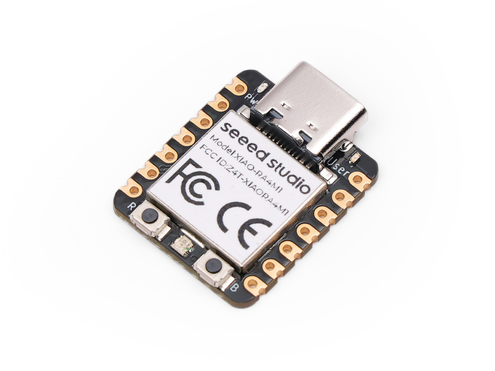

# Seeed Studio XIAO RA4M1

## Details

- **Location**: Cabinet-1, Bin 28
- **Category**: Microcontroller Boards
- **Type**: ARM Cortex-M4 Development Board
- **Microcontroller**: Renesas RA4M1 (R7FA4M1AB3CNE)
- **Brand**: Seeed Technology Co., Ltd
- **Part Number**: 102010551
- **Quantity**: 2
- **Product URL**: https://www.seeedstudio.com/Seeed-XIAO-RA4M1-p-5943.html
- **Wiki**: https://wiki.seeedstudio.com/getting_started_xiao_ra4m1/

## Description

Thumb-sized ARM Cortex-M4 development board featuring the Renesas RA4M1 microcontroller — the same 32-bit MCU used in the Arduino Uno R4. Packed into the classic XIAO form factor, it offers a 14-bit ADC, 12-bit DAC, CAN BUS, hardware AES encryption, onboard LiPo charging, and 19 GPIO pins (including 8 rear pads). An excellent choice for battery-powered IoT nodes, automotive peripherals, and projects requiring the XIAO ecosystem of shields and accessories.

## Image

## Specifications

- **Part Number**: 102010551
- **Microcontroller**: Renesas RA4M1 (R7FA4M1AB3CNE)
- **Architecture**: 32-bit ARM Cortex-M4 with FPU
- **Clock Speed**: 48MHz
- **Operating Voltage**: 3.3V
- **Input Voltage**: 5V (via USB-C) or 3.3V
- **Flash Memory**: 256KB
- **SRAM**: 32KB
- **EEPROM**: 8KB
- **Dimensions**: 21.0mm x 17.8mm
- **Working Temperature**: -20°C to 70°C

## Features

- **ARM Cortex-M4 with FPU**: Powerful 32-bit processor with hardware floating-point
- **Arduino Uno R4 Compatible**: Shares the same RA4M1 MCU as the Arduino Uno R4
- **USB-C Connector**: Modern connector for programming and power
- **CAN BUS**: Hardware CAN bus interface for automotive and industrial applications
- **Hardware Encryption**: AES-128/256 hardware acceleration
- **14-bit ADC**: High-resolution analog input
- **12-bit DAC**: True analog output
- **Onboard LiPo Charging**: Built-in lithium battery charge management
- **Ultra Low Power**: 45μA deep sleep current
- **RGB LED**: Onboard RGB LED plus user and power LEDs

## Pin Configuration

- **Total GPIO**: 19 pins (11 standard + 8 rear pads)
- **Digital I/O**: 19 pins
- **Analog Inputs**: 6 pins (14-bit resolution)
- **Analog Output (DAC)**: D0 / P014 (12-bit resolution) — not shown on official pinout diagram
- **PWM**: All digital pins support PWM
- **I2C**: 2 channels
- **SPI**: 2 channels
- **UART**: 2 channels
- **CAN BUS**: 1 channel

## Power Specifications

- **Operating Voltage**: 3.3V
- **Input Voltage**: 5V (USB-C) or 3.3V (VCC)
- **Current Consumption**:
  - Typical: ~42.6μA
  - Deep Sleep: ~45μA minimum
- **Battery**: Onboard LiPo charge management circuit
- **Power Management**: Multiple sleep modes available

## Connectivity

### USB
- **Type**: USB-C connector
- **Speed**: Full-speed USB 2.0
- **Functions**: Programming, power, serial communication

### CAN BUS
- **Standard**: CAN 2.0A/B compatible
- **Use Cases**: Automotive, industrial, multi-node networks

## Applications

- Battery-powered IoT sensor nodes
- Wearable devices
- Automotive peripherals (CAN BUS)
- Arduino Uno R4 compatible projects
- High-precision analog data acquisition
- Audio/signal processing (FPU + DAC)
- Interactive art projects
- Embedded systems prototyping

## Programming

- **Arduino IDE**: Full support (same MCU as Arduino Uno R4)
- **MicroPython**: Compatible with MicroPython
- **PlatformIO**: Cross-platform development support

## XIAO Ecosystem

- **Form Factor**: Compatible with all XIAO accessories and shields
- **Expansion Boards**: Grove Base, Expansion Board
- **Shields**: Various XIAO-compatible shields
- **Community**: Large XIAO developer community

## Notes

- Same RA4M1 MCU as the Arduino Uno R4 — existing Uno R4 libraries are often compatible
- 8 additional GPIO pads on the rear for more complex layouts
- Hardware AES encryption makes it suitable for secure IoT applications
- CAN BUS support is rare at this price point and form factor
- Onboard LiPo charging simplifies battery-powered designs

## Tags

microcontroller, arm, cortex-m4, ra4m1, renesas, usb, xiao, seeed, arduino, can-bus, fpu
