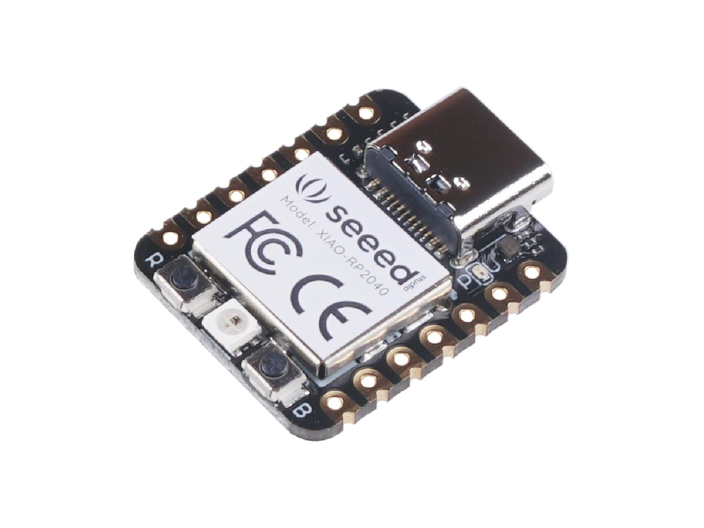
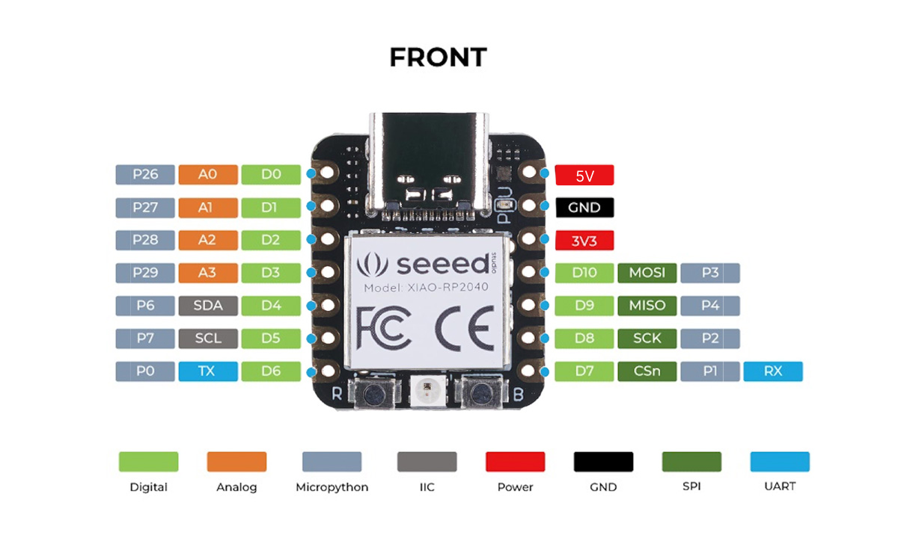

# Seeed Studio XIAO RP2040

## Details

- **Location**: Cabinet-1, Bin 32
- **Category**: Microcontroller Boards
- **Type**: RP2040 Development Board (XIAO Form Factor)
- **Microcontroller**: RP2040 (Dual ARM Cortex-M0+ @ 133MHz)
- **Brand**: Seeed Studio
- **Part Number**: 102010428
- **Quantity**: 1
- **Product URL**: https://wiki.seeedstudio.com/XIAO-RP2040/

## Description

The Seeed Studio XIAO RP2040 is as small as the Seeed Studio XIAO SAMD21 but more powerful. It carries the powerful dual-core RP2040 processor with flexible clock running up to 133 MHz. Despite its tiny thumb-sized form factor (21x17.8mm), it packs 264KB of SRAM and 2MB of on-board Flash memory, making it perfect for wearable devices and small projects.

## Specifications

- **Microcontroller**: Dual-core ARM Cortex M0+ processor up to 133MHz
- **Logic/Power**: 3.3V (5V tolerant via VIN pin)
- **Memory**: 264KB SRAM, 2MB Flash memory
- **GPIO Pins**: 14 total (11 digital, 4 analog)
- **ADC**: 4x 12-bit ADC channels
- **Peripherals**: 1x I2C, 1x SPI, 1x UART, 1x SWD
- **PWM**: 11 PWM pins
- **USB**: USB Type C connector with native USB support
- **Special Features**: Built-in RGB LED, Boot/Reset buttons

## Dimensions

- **Board Size**: 21mm x 17.8mm x 3.5mm (0.8" x 0.7" x 0.1")
- **Weight**: ~3g
- **Form Factor**: XIAO family compatible

## Image



## Features

- Powerful dual-core RP2040 processor up to 133MHz
- Rich on-chip resources with 264KB SRAM and 2MB Flash
- Flexible compatibility: Arduino, CircuitPython, MicroPython
- Breadboard-friendly & SMD design with no back components
- Thumb-sized form factor perfect for wearables
- Multiple interfaces: 11 digital pins, 4 analog pins, 11 PWM pins
- Compatible with XIAO expansion boards
- Built-in programmable RGB LED (reversed logic)
- UF2 bootloader support for easy programming

## Pinout Diagram



## Basic Wiring Examples

### LED Blink Circuit

```
XIAO Pin D0 → LED Anode (long leg)
LED Cathode (short leg) → 220Ω Resistor → XIAO GND

Note: Built-in RGB LED available (reversed logic - LOW = ON)
```

### Button Input Circuit

```
XIAO 3V3 → 10kΩ Pull-up Resistor → XIAO Pin D1
XIAO Pin D1 → Button → XIAO GND

Code: digitalRead(D1) returns HIGH when not pressed, LOW when pressed
```

### I2C Device Connection

```
I2C Device VCC → XIAO 3V3
I2C Device GND → XIAO GND
I2C Device SDA → XIAO Pin D4 (SDA)
I2C Device SCL → XIAO Pin D5 (SCL)

Note: Built-in pull-up resistors included
```

### SPI Device Connection

```
SPI Device VCC → XIAO 3V3
SPI Device GND → XIAO GND
SPI Device SCK → XIAO Pin D8 (SCK)
SPI Device MOSI → XIAO Pin D10 (MOSI)
SPI Device MISO → XIAO Pin D9 (MISO)
SPI Device CS → XIAO Pin D7 (CS)
```

### Analog Sensor Reading

```
Sensor Output → XIAO Pin A0, A1, A2, or A3
Sensor VCC → XIAO 3V3
Sensor GND → XIAO GND

Code: analogRead(A0) returns 0-65535 (0-3.3V)
```

### UART Communication

```
Device TX → XIAO Pin D7 (RX)
Device RX → XIAO Pin D6 (TX)
Device VCC → XIAO 3V3
Device GND → XIAO GND

Code: Serial1.begin(9600) for UART communication
```

## Programming Setup Guide

### CircuitPython Setup (Recommended)

1. Download CircuitPython UF2 from circuitpython.org
2. Hold BOOT button while connecting USB-C
3. Drag UF2 file to RPI-RP2 drive
4. Board reboots as CIRCUITPY drive
5. Edit code.py to program

### Arduino IDE Setup

1. Install Arduino IDE 2.0+
2. Add RP2040 board package URL in preferences
3. Install "Raspberry Pi Pico/RP2040" boards
4. Select "Seeed XIAO RP2040" from Tools → Board
5. Hold BOOT while connecting for first upload

### MicroPython Setup

1. Download MicroPython UF2 from micropython.org
2. Hold BOOT button while connecting USB-C
3. Drag UF2 file to RPI-RP2 drive
4. Use Thonny IDE or terminal for programming

## Programming Examples

### CircuitPython RGB LED Example

```python
import board
import digitalio
import time

# RGB LED pins (reversed logic - LOW = ON)
led_r = digitalio.DigitalInOut(board.LED_RED)
led_g = digitalio.DigitalInOut(board.LED_GREEN)
led_b = digitalio.DigitalInOut(board.LED_BLUE)

led_r.direction = digitalio.Direction.OUTPUT
led_g.direction = digitalio.Direction.OUTPUT
led_b.direction = digitalio.Direction.OUTPUT

while True:
    # Red
    led_r.value = False  # ON
    led_g.value = True   # OFF
    led_b.value = True   # OFF
    time.sleep(1)

    # Green
    led_r.value = True   # OFF
    led_g.value = False  # ON
    led_b.value = True   # OFF
    time.sleep(1)

    # Blue
    led_r.value = True   # OFF
    led_g.value = True   # OFF
    led_b.value = False  # ON
    time.sleep(1)
```

### Arduino RGB LED Example

```cpp
#define LED_RED 17
#define LED_GREEN 16
#define LED_BLUE 25

void setup() {
  pinMode(LED_RED, OUTPUT);
  pinMode(LED_GREEN, OUTPUT);
  pinMode(LED_BLUE, OUTPUT);

  // Turn off all LEDs (HIGH = OFF for XIAO)
  digitalWrite(LED_RED, HIGH);
  digitalWrite(LED_GREEN, HIGH);
  digitalWrite(LED_BLUE, HIGH);
}

void loop() {
  // Red
  digitalWrite(LED_RED, LOW);   // ON
  digitalWrite(LED_GREEN, HIGH); // OFF
  digitalWrite(LED_BLUE, HIGH);  // OFF
  delay(1000);

  // Green
  digitalWrite(LED_RED, HIGH);   // OFF
  digitalWrite(LED_GREEN, LOW);  // ON
  digitalWrite(LED_BLUE, HIGH);  // OFF
  delay(1000);

  // Blue
  digitalWrite(LED_RED, HIGH);   // OFF
  digitalWrite(LED_GREEN, HIGH); // OFF
  digitalWrite(LED_BLUE, LOW);   // ON
  delay(1000);
}
```

### CircuitPython I2C Scanner

```python
import board
import busio

i2c = busio.I2C(board.SCL, board.SDA)

while not i2c.try_lock():
    pass

print("I2C addresses found:", [hex(device_address)
      for device_address in i2c.scan()])

i2c.unlock()
```

### Arduino Analog Reading

```cpp
void setup() {
  Serial.begin(115200);
  while (!Serial);
  Serial.println("XIAO RP2040 Analog Reading");
}

void loop() {
  // Read all 4 analog pins
  for (int i = 0; i < 4; i++) {
    int analogValue = analogRead(A0 + i);
    float voltage = analogValue * (3.3 / 65535.0);

    Serial.print("A");
    Serial.print(i);
    Serial.print(": ");
    Serial.print(analogValue);
    Serial.print(" (");
    Serial.print(voltage, 2);
    Serial.print("V)  ");
  }
  Serial.println();
  delay(1000);
}
```

## Important Notes

### Power Considerations

- **3.3V Logic**: All GPIO pins are 3.3V logic level
- **USB-C Power**: Can be powered via USB-C or 3V3/5V pins
- **Current Limit**: 600mA peak from onboard regulator
- **Battery Power**: Supports battery power (disconnect USB when using battery)

### Pin Limitations and Features

- **ADC Pins**: A0, A1, A2, A3 can be used for analog input (12-bit)
- **PWM**: 11 pins support PWM output
- **I2C**: One I2C peripheral (pins D4/D5)
- **SPI**: One SPI peripheral (pins D8/D9/D10)
- **UART**: One UART peripheral (pins D6/D7)

### Special Features

- **RGB LED**: Built-in programmable RGB LED (reversed logic)
- **BOOT Button**: Hold for bootloader mode
- **Reset Button**: Single press to reset
- **Compact Size**: 21mm x 17.8mm - perfect for wearables
- **XIAO Compatible**: Works with XIAO expansion boards

### Bootloader Mode

To enter bootloader mode:

1. Hold BOOT button
2. Connect USB-C cable
3. Release BOOT button
4. Board appears as RPI-RP2 drive

### Reset

To reset the board:

1. Press RESET button once while connected
2. Board will restart current program

## Tags

microcontroller, rp2040, xiao, seeed, usb-c, circuitpython, micropython, arduino, compact, breadboard-friendly

## Notes

Perfect for wearable devices and small projects requiring powerful processing in a tiny form factor. Compatible with the entire XIAO ecosystem of expansion boards. The built-in RGB LED uses reversed logic (pull low to enable). Supports multiple programming environments including Arduino IDE, CircuitPython, and MicroPython. Easy bootloader mode access by holding B button while connecting USB.
