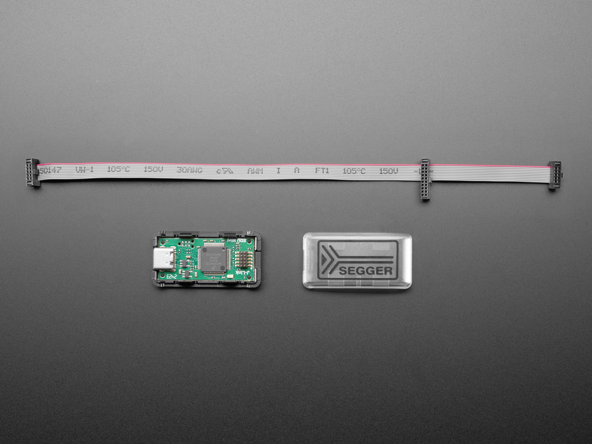

# SEGGER J-Link EDU Mini

## Description

SEGGER J-Link EDU Mini - JTAG/SWD Debugger for educational use. Compact debugging probe for ARM Cortex microcontrollers.

## Image

## Tags

#segger #jlink #jtag #swd #debugger #adafruit
