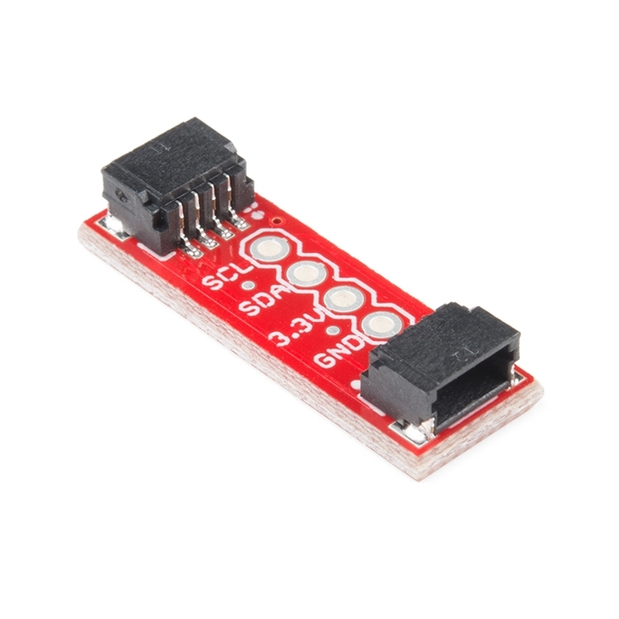

# SparkFun Qwiic Adapter

## Details

- **Location**: Cabinet-3, Bin 4
- **Category**: Connector Boards
- **Type**: I2C to Qwiic Adapter
- **Brand**: SparkFun Electronics
- **Part Number**: DEV-14495
- **Quantity**: 4
- **Product URL**: https://www.sparkfun.com/products/14495
- **DigiKey URL**: https://www.digikey.com/en/products/detail/sparkfun-electronics/14495/7942483

## Description

The SparkFun Qwiic Adapter provides the perfect means to make any old I2C board into a Qwiic-enabled board. This adapter breaks out the I2C pins from the Qwiic connectors to pins that you can easily solder with your favorite I2C-enabled device.

The Qwiic Adapter has two Qwiic connection ports, all on the same I2C bus. Four plated through holes are broken out for SCL, SDA, 3.3V and GND. These pins can be used to convert an old I2C-enabled device into a Qwiic-enabled board.

## Specifications

- **Voltage**: 3.3V
- **Interface**: I2C, Qwiic
- **Connectors**: 2x Qwiic JST connectors, 4x through-hole pins
- **Dimensions**: 15.24mm x 15.24mm (0.6" x 0.6")
- **Pins**: SCL, SDA, 3.3V, GND
- **Platform**: Qwiic Connect System
- **Packaging**: Bulk

## Image

## Features

- **Dual Qwiic Ports**: Two Qwiic connection ports on the same I2C bus
- **Through-hole Breakout**: Four plated through holes for easy soldering
- **Standard I2C**: Compatible with any I2C device
- **Compact Design**: Small 0.6" x 0.6" form factor
- **Qwiic Ecosystem**: Part of SparkFun's Qwiic Connect System
- **Polarized Connections**: Can't hook it up wrong with Qwiic connectors

## Applications

- **Legacy I2C Conversion**: Convert old I2C boards to Qwiic-enabled
- **Prototyping**: Easy breadboard to Qwiic connections
- **System Integration**: Bridge between different I2C connection types
- **Educational Projects**: Learn about I2C and Qwiic systems
- **Rapid Development**: Quick connections for sensor networks

## Qwiic Connect System

The SparkFun Qwiic Connect System is an ecosystem of I2C sensors, actuators, shields and cables that make prototyping faster and less prone to error. All Qwiic-enabled boards use a common 1mm pitch, 4-pin JST connector. This reduces the amount of required PCB space, and polarized connections mean you can't hook it up wrong.

## Documentation

- **Schematic**: [PDF](https://cdn.sparkfun.com/assets/2/4/7/e/6/SparkFun_Qwiic_Adapter.pdf)
- **Hookup Guide**: [Tutorial](https://learn.sparkfun.com/tutorials/qwiic-adapter-hookup-guide)
- **Eagle Files**: Available on GitHub
- **GitHub Repository**: [SparkFun Qwiic Adapter](https://github.com/sparkfun/Qwiic_Adapter)

## Tags

qwiic, i2c, adapter, breakout, connector, sparkfun, jst, prototyping

## Notes

Perfect for converting legacy I2C devices to work with the modern Qwiic ecosystem. The small form factor and dual connectors make it ideal for daisy-chaining multiple I2C devices in a clean, organized manner.
