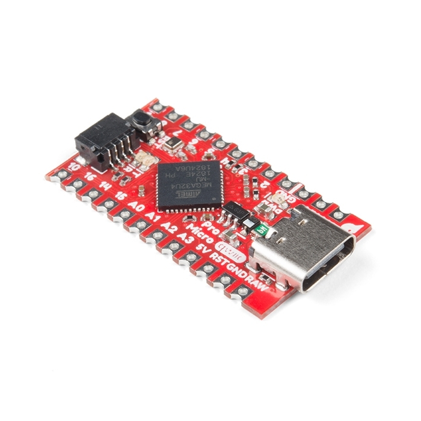

# SparkFun Qwiic Pro Micro - USB-C (ATmega32U4)

## Details

- **Location**: Cabinet-1, Bin 25
- **Category**: Microcontroller Boards
- **Type**: Arduino-Compatible Microcontroller with Qwiic
- **Microcontroller**: ATmega32U4
- **Brand**: SparkFun
- **Part Number**: DEV-15795
- **Quantity**: 3
- **Product URL**: https://www.sparkfun.com/sparkfun-qwiic-pro-micro-usb-c-atmega32u4.html

## Description

Arduino-compatible microcontroller board featuring the ATmega32U4 with built-in USB functionality, Qwiic connector, USB-C, reset button, and castellated pads. This tiny board provides full Arduino functionality in a compact form factor perfect for embedded projects and custom keyboards.

## Specifications

- **Part Number**: DEV-15795
- **Microcontroller**: ATmega32U4
- **Architecture**: 8-bit AVR
- **Clock Speed**: 16MHz
- **Operating Voltage**: 5V
- **Input Voltage**: 6VDC max (via RAW pin)
- **Voltage Regulator**: AP2112 3.3V regulator
- **Flash Memory**: 32KB (4KB used by bootloader)
- **SRAM**: 2.5KB
- **EEPROM**: 1KB
- **Dimensions**: 33.0mm x 17.8mm (1.3" x 0.7")
- **Weight**: ~5g

## Image

## Features

- **USB-C Connector**: Modern USB-C for programming and power
- **Qwiic Connector**: I2C ecosystem compatibility
- **Reset Button**: Easy reset and bootloader access
- **Castellated Pads**: Low-profile mounting for custom assemblies
- **Arduino Compatible**: Full Arduino IDE support
- **Native USB**: Built-in USB HID capability
- **Compact Design**: Smallest Arduino-compatible with full USB

## Pin Configuration

- **Digital I/O**: 12 pins total
- **PWM Pins**: 5 pins (D3, D5, D6, D9, D10)
- **Analog Inputs**: 9 pins (A0-A9, 10-bit resolution)
- **Hardware Serial**: RX (D0), TX (D1)
- **I2C**: SDA (D2), SCL (D3) + Qwiic connector
- **SPI**: MOSI (D16), MISO (D14), SCK (D15)
- **Special**: D4 (A6), D6 (A7), D8 (A8), D9 (A9), D10 (A10)

## Power Specifications

- **Operating Voltage**: 5V
- **Logic Level**: 5V
- **Input Voltage**: 6VDC max (RAW pin)
- **USB Power**: 5V via USB-C
- **Current**: ~25mA (active), ~6mA (idle)
- **Regulator**: AP2112 3.3V (500mA max)

## Applications

- Custom mechanical keyboards
- USB HID devices (mouse, keyboard, joystick)
- Embedded projects requiring USB
- Qwiic sensor networks
- Wearable electronics
- IoT edge devices
- Educational projects
- Prototyping platforms

## Programming

- **Arduino IDE**: Full support with SparkFun board package
- **Bootloader**: Caterina bootloader (Arduino Leonardo compatible)
- **USB Programming**: No external programmer needed
- **Libraries**: All standard Arduino libraries
- **HID Support**: Native USB HID functionality

## Connectivity

- **USB-C**: Programming, power, and serial communication
- **Qwiic**: I2C connector for sensor ecosystem
- **Castellated Pads**: Surface-mount friendly edges
- **Through-hole**: Standard 0.1" pitch headers

## Advantages over Original Pro Micro

- **USB-C**: Modern, reversible connector
- **Qwiic Connector**: Easy I2C device integration
- **Reset Button**: No more shorting pins for reset
- **Castellated Pads**: Better for custom PCB integration
- **Improved Layout**: Optimized component placement

## Notes

- Compatible with Arduino Leonardo code and libraries
- Requires SparkFun Arduino board package for Arduino IDE
- USB-C provides both power and programming interface
- Qwiic connector uses 3.3V logic (level shifted from 5V)
- Castellated pads allow surface-mount installation
- Perfect for projects requiring native USB functionality
- Excellent choice for custom keyboard builds

## Tags

microcontroller, arduino-compatible, qwiic, usb-c, atmega32u4, sparkfun, castellated
