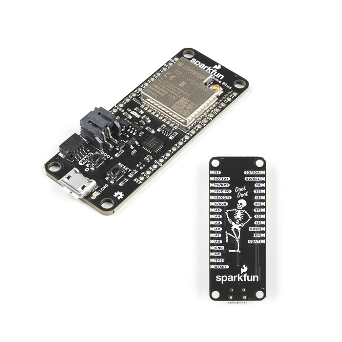

# SparkFun Thing Plus SkeleBoard - ESP32 WROOM (U.FL)

## Details

- **Location**: Cabinet-1, Bin 31
- **Category**: Development Boards
- **Type**: ESP32 Development Board (Thing Plus Form Factor)
- **Microcontroller**: ESP32-D0WDQ6 (Dual Xtensa LX6 @ 240MHz)
- **Brand**: SparkFun
- **Part Number**: WRL-18581
- **Quantity**: 1
- **Status**: Discontinued (Limited Edition SkeleBoard)
- **Product URL**: https://www.sparkfun.com/sparkfun-thing-plus-skeleboard-esp32-wroom-u-fl.html

## Description

The SparkFun Thing Plus SkeleBoard was a limited edition version of the ESP32 Thing Plus featuring a matte black PCB with a skeleton design in white silk. This special edition board included all the functionality of the standard Thing Plus with a unique aesthetic design and came with a 2.4GHz U.FL PCB antenna.

## Specifications

- **Microcontroller**: ESP32-D0WDQ6 dual-core Xtensa LX6 @ up to 240MHz
- **Memory**: 520KB internal SRAM, 16MB Flash storage
- **WiFi**: Integrated 802.11 BGN transceiver
- **Bluetooth**: Dual-mode (Classic and BLE)
- **GPIO Pins**: 21 total
- **ADC**: 8x analog inputs
- **Touch**: 8-electrode capacitive touch support
- **Peripherals**: I2C, SPI, UART, I2S interfaces
- **USB**: USB-C connector with auto-reset
- **Power**: 2.3-3.6V operating range, built-in LiPo charging
- **Antenna**: U.FL connector with included PCB antenna

## Dimensions

- **Board Size**: 58.4mm x 22.9mm (2.30" x 0.90")
- **Weight**: ~12g
- **Form Factor**: Thing Plus compatible

## Image

## Features

- **Limited Edition Design**: Matte black PCB with skeleton artwork
- **Qwiic Connectivity**: Built-in Qwiic connector for easy I2C expansion
- **Feather Compatible**: Pin-compatible with Adafruit Feather ecosystem
- **Battery Support**: JST connector and built-in LiPo charging
- **External Antenna**: U.FL connector with included 2.4GHz PCB antenna
- **Hardware Encryption**: AES, SHA2, ECC, RSA-4096 acceleration
- **Low Power**: 2.5µA deep sleep current
- **"DOOT" Button**: Special boot button design reference

## Special Edition Features

- **SkeleBoard Design**: Unique skeleton artwork in white silkscreen
- **Matte Black PCB**: Premium matte black finish
- **Included Antenna**: 2.4GHz U.FL PCB antenna included
- **Limited Production**: No longer manufactured
- **Collector's Item**: Special edition with unique aesthetic

## Connectivity

- **WiFi**: 802.11b/g/n with integrated antenna support
- **Bluetooth Classic**: Traditional Bluetooth connectivity
- **Bluetooth LE**: Low energy wireless communication
- **Qwiic**: I2C connector system for easy sensor integration

## Programming Support

- **Arduino IDE**: Full Arduino support with ESP32 core
- **ESP-IDF**: Official Espressif development framework
- **CircuitPython**: Limited support available
- **MicroPython**: Community support

## Power Management

- **Input Voltage**: 2.3-3.6V operating range
- **USB Power**: USB-C connector for power and programming
- **Battery**: JST connector for LiPo battery
- **Charging**: Built-in battery charging circuit
- **Low Power**: Multiple sleep modes for battery operation

## Tags

microcontroller, esp32, thing-plus, skeleboard, wifi, bluetooth-le, bluetooth-classic, battery-charging, sparkfun, qwiic, u-fl, limited-edition, discontinued

## Notes

**DISCONTINUED** - This was a limited edition SkeleBoard version that is no longer manufactured. The board is functionally identical to the standard Thing Plus ESP32 WROOM (U.FL) but features unique skeleton artwork and matte black PCB. Includes a 2.4GHz U.FL PCB antenna. The "DOOT" boot button was a popular design reference. Perfect for IoT projects requiring WiFi/Bluetooth connectivity with external antenna capability.
