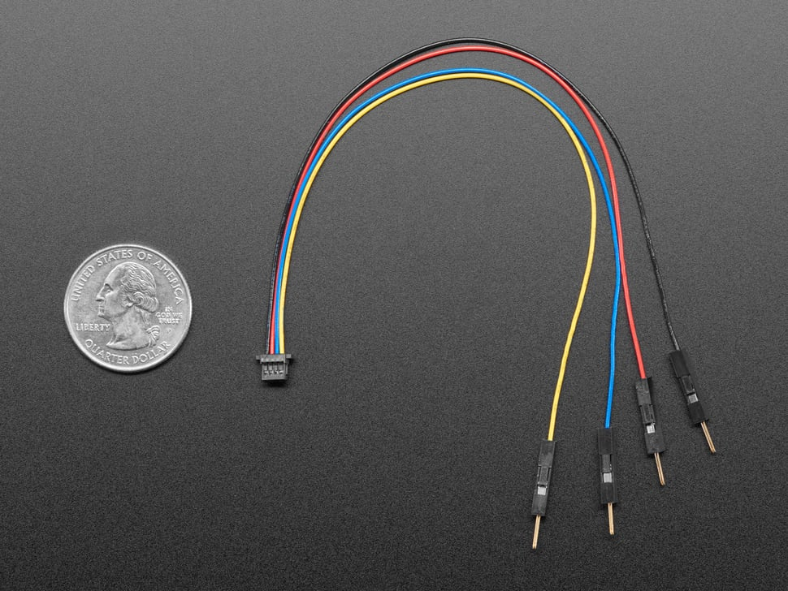

# STEMMA QT / Qwiic Cables Collection

## Details

- **Location**: Cabinet-3, Bins 2 and 5
- **Category**: Cables and Connectors
- **Type**: I2C Connection Cables
- **Brand**: Adafruit Industries
- **Quantity**: 15+ cables (various types)
- **Cable Length**: 150mm (6 inches)

## Description

Collection of STEMMA QT / Qwiic compatible cables for easy I2C connections. These cables use the JST SH 4-pin connector system with 1mm pitch, providing a reliable and compact connection method for I2C devices. All cables are 150mm long and follow the standard STEMMA QT / Qwiic color coding.

## Cable Types

### STEMMA QT to Male Headers (Product ID: 4209)
- **Connector A**: JST SH 4-pin female
- **Connector B**: Premium male headers (0.1" pitch)
- **Use Case**: Connect Qwiic devices to breadboards or boards with female headers
- **Location**: Cabinet-3, Bin 2
- **Quantity**: 5+

### STEMMA QT to Female Sockets (Product ID: 4397)
- **Connector A**: JST SH 4-pin female
- **Connector B**: Premium female sockets (0.1" pitch)
- **Use Case**: Connect Qwiic devices to boards with male pin headers
- **Location**: Cabinet-3, Bin 5
- **Quantity**: 5+

### STEMMA QT Extension Cables
- **Connector A**: JST SH 4-pin female
- **Connector B**: JST SH 4-pin female
- **Use Case**: Extend connections between Qwiic devices
- **Location**: Cabinet-3, Bin 2
- **Quantity**: 5+

## Specifications

- **Voltage**: 3.3V DC
- **Interface**: I2C (SDA, SCL)
- **Connector Type**: JST SH 4-pin (1mm pitch)
- **Cable Length**: 150mm (6 inches)
- **Wire Gauge**: 28 AWG
- **Connector Features**: Polarized, latching connectors

## Image

## Wire Color Coding

Standard STEMMA QT / Qwiic color scheme:
- **Red**: 3.3V DC Power
- **Black**: Ground (GND)
- **Blue**: I2C SDA (Serial Data)
- **Yellow**: I2C SCL (Serial Clock)

## Features

- **Polarized Connectors**: Can't connect backwards
- **Latching Design**: Secure connections that won't come loose
- **Compact Size**: 1mm pitch saves PCB space
- **Premium Quality**: Gold-plated contacts for reliable connections
- **Flexible Cable**: Easy routing and installation
- **Standard Compatibility**: Works with all STEMMA QT and Qwiic devices

## Applications

- **Sensor Networks**: Connect multiple I2C sensors
- **Prototyping**: Quick breadboard connections
- **System Integration**: Bridge different connector types
- **Educational Projects**: Easy connections for learning
- **Rapid Development**: Fast prototyping without soldering
- **Daisy Chaining**: Connect multiple devices on same I2C bus

## STEMMA QT / Qwiic Ecosystem

The STEMMA QT system (Adafruit) and Qwiic system (SparkFun) are cross-compatible I2C connector ecosystems that make prototyping faster and more reliable. Key benefits:

- **No Soldering Required**: Plug-and-play connections
- **Standardized Pinout**: Consistent across all devices
- **Daisy Chainable**: Multiple devices on same bus
- **3.3V Standard**: Safe for modern microcontrollers
- **Extensive Ecosystem**: Hundreds of compatible sensors and boards

## Compatible Devices

- **Microcontrollers**: Arduino, Raspberry Pi, ESP32, CircuitPython boards
- **Sensors**: Temperature, humidity, pressure, motion, light sensors
- **Displays**: OLED, LCD, E-ink displays
- **Actuators**: Motor drivers, servo controllers
- **Breakout Boards**: Various I2C peripherals

## Documentation

- **STEMMA QT Guide**: [Adafruit Learn](https://learn.adafruit.com/introducing-adafruit-stemma-qt)
- **Qwiic System**: [SparkFun Qwiic](https://www.sparkfun.com/qwiic)
- **Product Pages**: 
  - [4209 - Male Headers](https://www.adafruit.com/product/4209)
  - [4397 - Female Sockets](https://www.adafruit.com/product/4397)

## Tags

stemma-qt, qwiic, i2c, cables, jst-sh, breadboard, prototyping, adafruit

## Notes

These cables are essential for working with the STEMMA QT / Qwiic ecosystem. The variety of connector types allows for flexible system design and easy integration with different development platforms. Perfect for rapid prototyping and educational projects where reliable I2C connections are needed.
