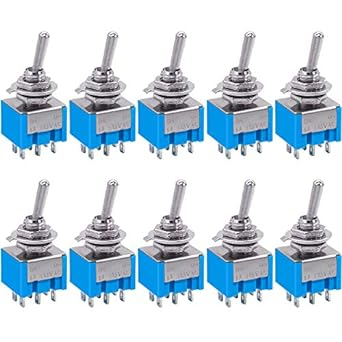

# Taiss MTS-202 DPDT Toggle Switches

## Details

- **Location**: Cabinet-5, Bin 11
- **Category**: Switches & Controls
- **Brand**: Taiss
- **Part Number**: B0799KM8T6
- **Model**: MTS-202
- **Package**: Panel Mount Toggle Switch
- **Quantity**: 30 switches (from 10-piece packs)
- **Status**: Available
- **Price Range**: $8.66 (pack of 10)
- **Product URL**: https://a.co/d/8iIpvid

## Description

Taiss MTS-202 toggle switches are DPDT (Double Pole, Double Throw) switches with 6 terminals in a 2-position ON/ON configuration. These mini toggle switches are ideal for applications requiring dual circuit switching, such as guitar electronics, audio equipment, and general control applications. The compact size and reliable construction make them suitable for both hobby and professional projects.

## Specifications

### Electrical Characteristics

- **AC Voltage Rating**: 125V AC
- **Current Rating**: 6A
- **Power Rating**: 750W
- **Contact Configuration**: DPDT (Double Pole, Double Throw)
- **Switch Positions**: 2 (ON/ON)
- **Contact Resistance**: <50 milliohms
- **Insulation Resistance**: >100 MΩ
- **Dielectric Strength**: 1500V AC (1 minute)

### Physical Characteristics

- **Body Size**: 13mm x 12.8mm x 10mm (L×W×T)
- **Total Height**: 33mm (1.3 inches)
- **Mounting Hole**: 5.8mm (0.23 inches) diameter
- **Terminal Type**: Solder lugs (6 terminals)
- **Housing Material**: Plastic and metal construction
- **Operating Temperature**: -25°C to +85°C
- **Mechanical Life**: >50,000 cycles

### Switch Operation

- **Position 1 (UP)**: Pole 1 to Terminal 1, Pole 2 to Terminal 4
- **Position 2 (DOWN)**: Pole 1 to Terminal 3, Pole 2 to Terminal 6
- **Actuation Force**: 2-4 lbs typical
- **Switch Type**: Latching (maintains position)

## Image



## Applications

Common use cases and applications for these DPDT toggle switches:

- **Guitar Electronics**: Pickup switching, coil tapping, series/parallel wiring
- **Audio Equipment**: Signal routing, channel selection, effect switching
- **Electronics Projects**: Dual circuit control, polarity switching
- **Control Panels**: Equipment mode selection, function switching
- **Power Switching**: Dual power source selection, backup switching
- **Motor Control**: Direction control, speed selection
- **Test Equipment**: Signal routing, measurement switching
- **Amplifiers**: Input selection, gain switching, tone control
- **Radio Equipment**: Antenna switching, band selection
- **Lighting Control**: Multi-way switching, scene selection

## Wiring Configuration

### Terminal Layout (6-Pin DPDT)
```
Terminal 1    Terminal 4
    |             |
Terminal 2    Terminal 5  (Common/Pole terminals)
    |             |
Terminal 3    Terminal 6
```

### Common Wiring Examples
- **Guitar Pickup Switching**: Common = pickup output, positions = different pickup combinations
- **Audio Signal Routing**: Common = input signal, positions = different output destinations
- **Polarity Switching**: Common = power input, positions = normal/reversed polarity
- **Dual Circuit Control**: Independent switching of two separate circuits

## Technical Notes

Important technical considerations and usage tips:

- DPDT configuration allows independent switching of two circuits
- ON/ON operation means no center-off position
- Suitable for both AC and DC applications within ratings
- Solder lug terminals provide secure connections
- Compact size ideal for space-constrained applications
- Professional appearance suitable for front panel mounting
- Quality construction ensures reliable operation

## Installation

- Drill 5.8mm (0.23") hole in panel
- Insert switch through hole from front
- Secure with included nut and washers from rear
- Solder wires to appropriate terminals based on application
- Test switch operation before final installation
- Label switch positions if needed for user interface

## Safety Considerations

- **Voltage Rating**: Never exceed 125V AC or equivalent DC
- **Current Rating**: Do not exceed 6A per pole
- **Proper Wiring**: Ensure correct terminal connections for intended operation
- **Panel Mounting**: Secure mounting prevents mechanical stress on terminals
- **Wire Gauge**: Use appropriate wire gauge for current load

## Guitar Electronics Applications

These switches are particularly popular in guitar modifications:

- **Pickup Selection**: Switch between different pickup combinations
- **Coil Tapping**: Switch between humbucker and single-coil modes
- **Series/Parallel**: Change pickup wiring configuration
- **Phase Switching**: Reverse pickup phase for tonal variations
- **Kill Switch**: Momentary signal interruption (with modification)

## Tags

taiss, mts-202, dpdt-switch, 6-pin, on-on, 2-position, panel-mount #cabinet-5 #bin-11 #status-available

## Notes

These Taiss MTS-202 DPDT switches are excellent for applications requiring dual circuit switching. The 6-terminal configuration provides maximum flexibility for complex switching applications. Popular in guitar electronics for pickup switching and audio equipment for signal routing. The compact size and reliable construction make them suitable for both hobby and professional applications. Quality solder lugs ensure secure connections, and the professional appearance makes them suitable for front panel mounting.
