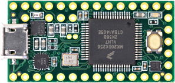

# Teensy 3.2 Development Board

## Details

- **Location**: Cabinet-1, Bin 28
- **Category**: Microcontroller Boards
- **Type**: ARM Cortex-M4 Development Board
- **Microcontroller**: MK20DX256VLH7
- **Brand**: PJRC
- **Part Number**: TEENSY32
- **Quantity**: 1
- **Product URL**: https://www.pjrc.com/store/teensy32.html

## Description

Compact and powerful 32-bit ARM Cortex-M4 microcontroller development board featuring the MK20DX256VLH7 processor. Known for excellent audio processing capabilities, extensive I/O options, and robust software ecosystem. Popular choice for audio projects, LED control, and embedded applications requiring high performance in a small form factor.

## Specifications

- **Part Number**: TEENSY32
- **Microcontroller**: MK20DX256VLH7 (Freescale Kinetis)
- **Architecture**: 32-bit ARM Cortex-M4 with DSP instructions
- **Clock Speed**: 72MHz (adjustable)
- **Operating Voltage**: 3.3V
- **Input Voltage**: 5V (via USB) or 3.3V-5.5V (via VIN)
- **Flash Memory**: 256KB
- **RAM**: 64KB
- **EEPROM**: 2KB (emulated)
- **Dimensions**: 35.6mm x 17.8mm x 3.2mm
- **Weight**: ~7g

## Image



## Features

- **ARM Cortex-M4**: High-performance 32-bit processor with DSP extensions
- **USB Native**: Built-in USB device support (12 Mbit/sec)
- **Rich I/O**: 34 digital I/O pins, 21 analog inputs, 1 analog output
- **Audio Capabilities**: I2S digital audio, built-in DAC, optimized audio library
- **Communication**: 3x UART, 2x I2C, 1x SPI, 1x CAN bus
- **PWM**: 12 pins with PWM capability
- **Timers**: Multiple hardware timers and interval timers
- **Real-Time Clock**: Built-in RTC with optional battery backup
- **DMA**: 16-channel DMA controller for high-performance transfers

## Pin Configuration

- **Digital I/O**: 34 pins total (24 easily accessible on breadboard)
- **Analog Inputs**: 21 pins (A0-A20, 10-16 bit resolution)
- **Analog Output**: 1 pin (A14, 12-bit DAC)
- **PWM**: 12 pins (3, 4, 5, 6, 9, 10, 20, 21, 22, 23, 25, 32)
- **Touch Sensing**: 12 pins with capacitive touch capability
- **Communication Pins**:
  - UART: Serial1 (pins 0,1), Serial2 (pins 9,10), Serial3 (pins 7,8)
  - I2C: Wire (pins 18,19), Wire1 (pins 29,30)
  - SPI: (pins 11,12,13,14)
  - CAN: (pins 3,4)
  - I2S: (pins 9,11,13,22,23)

## Programming & Software

- **Arduino IDE**: Full support with Teensyduino add-on
- **USB Types**: Serial, MIDI, Keyboard, Mouse, Joystick, Audio, Raw HID
- **Libraries**: Extensive optimized library collection
- **Audio Library**: Visual design tool for audio processing
- **Bootloader**: Separate chip prevents corruption
- **Programming**: USB-based, no external programmer needed

## Audio Capabilities

- **I2S Digital Audio**: Simultaneous input/output, up to 4 channels
- **Built-in DAC**: 12-bit analog output on pin A14
- **Audio Library**: Real-time audio processing with visual design tool
- **S/PDIF**: Digital audio output capability
- **Audio Shield**: Compatible with Teensy Audio Shield

## Power & Timing

- **Power Consumption**: Low power modes available
- **USB Power**: 5V via USB, regulated to 3.3V
- **External Power**: 3.3V-5.5V via VIN pin
- **Crystal**: 16MHz with PLL for system clock
- **RTC**: 32.768kHz crystal support for real-time clock

## Applications

- **Audio Processing**: Digital effects, synthesizers, audio analysis
- **LED Control**: NeoPixel/WS2812B strips, LED matrices
- **MIDI Controllers**: USB MIDI devices, musical instruments
- **Data Logging**: High-speed data acquisition
- **Motor Control**: PWM motor control, servo control
- **Communication**: CAN bus, multiple serial protocols
- **Embedded Systems**: Real-time control applications

## Advantages

- **High Performance**: 72MHz ARM Cortex-M4 with DSP instructions
- **Audio Optimized**: Excellent for audio applications
- **Rich Connectivity**: Multiple communication protocols
- **Mature Ecosystem**: Extensive libraries and community support
- **Small Form Factor**: Compact design for space-constrained projects
- **USB Flexibility**: Multiple USB device types supported

## Pinout Diagrams

### Official PJRC Pinout Cards


## Basic Wiring Examples

### LED Blink Circuit

```
Teensy Pin 13 → Built-in LED (no external wiring needed)
OR
Teensy Pin 2 → LED Anode (long leg)
LED Cathode (short leg) → 220Ω Resistor → Teensy GND

Note: Pin 13 has built-in orange LED
```

### Button Input Circuit

```
Teensy 3.3V → 10kΩ Pull-up Resistor → Teensy Pin 0
Teensy Pin 0 → Button → Teensy GND

Code: digitalRead(0) returns HIGH when not pressed, LOW when pressed
```

### I2C Device Connection

```
I2C Device VCC → Teensy 3.3V
I2C Device GND → Teensy GND
I2C Device SDA → Teensy Pin 18 (SDA)
I2C Device SCL → Teensy Pin 19 (SCL)

Note: Built-in pull-up resistors included
Alternative I2C: Pin 29 (SCL1), Pin 30 (SDA1)
```

### SPI Device Connection

```
SPI Device VCC → Teensy 3.3V
SPI Device GND → Teensy GND
SPI Device SCK → Teensy Pin 13 (SCK)
SPI Device MOSI → Teensy Pin 11 (MOSI)
SPI Device MISO → Teensy Pin 12 (MISO)
SPI Device CS → Teensy Pin 10 (CS)
```

### Analog Sensor Reading

```
Sensor Output → Teensy Pin A0-A20 (21 analog inputs available)
Sensor VCC → Teensy 3.3V
Sensor GND → Teensy GND

Code: analogRead(A0) returns 0-1023 (default 10-bit)
Can be configured up to 16-bit resolution
```

### Audio Output (DAC)

```
Audio Output → Teensy Pin A14 (DAC)
Connect to amplifier input or headphone circuit
Output range: 0-3.3V analog

Note: True 12-bit DAC, not PWM
```

### Serial Communication

```
Device 1 (Serial1):
  Device TX → Teensy Pin 0 (RX1)
  Device RX → Teensy Pin 1 (TX1)

Device 2 (Serial2):
  Device TX → Teensy Pin 9 (RX2)
  Device RX → Teensy Pin 10 (TX2)

Device 3 (Serial3):
  Device TX → Teensy Pin 7 (RX3)
  Device RX → Teensy Pin 8 (TX3)

All serial ports independent, can run simultaneously
```

## Programming Setup Guide

### Arduino IDE + Teensyduino Setup

1. Download and install Arduino IDE
2. Download Teensyduino installer from PJRC.com
3. Run Teensyduino installer (adds Teensy support to Arduino)
4. Select "Teensy 3.2/3.1" from Tools → Board
5. Connect Teensy via USB
6. Upload code (automatic programming mode entry)

### PlatformIO Setup

1. Install PlatformIO IDE
2. Create new project with "Teensy 3.2" board
3. Use framework = "arduino" in platformio.ini
4. Build and upload via PlatformIO

## Programming Examples

### Arduino Basic LED Blink

```cpp
void setup() {
  pinMode(13, OUTPUT);  // Built-in LED
}

void loop() {
  digitalWrite(13, HIGH);
  delay(1000);
  digitalWrite(13, LOW);
  delay(1000);
}
```

### Arduino Serial Communication

```cpp
void setup() {
  Serial.begin(9600);   // USB Serial
  Serial1.begin(9600);  // Hardware Serial1
  Serial2.begin(9600);  // Hardware Serial2
  Serial3.begin(9600);  // Hardware Serial3
}

void loop() {
  // Echo data between USB and Serial1
  if (Serial.available()) {
    Serial1.write(Serial.read());
  }
  if (Serial1.available()) {
    Serial.write(Serial1.read());
  }
}
```

### Arduino Analog Reading (High Resolution)

```cpp
void setup() {
  Serial.begin(9600);
  analogReadResolution(16);  // Use 16-bit resolution
}

void loop() {
  int sensorValue = analogRead(A0);
  float voltage = sensorValue * (3.3 / 65535.0);  // Convert to voltage

  Serial.print("16-bit value: ");
  Serial.print(sensorValue);
  Serial.print(", Voltage: ");
  Serial.println(voltage, 4);

  delay(100);
}
```

## Important Notes

### Power Considerations

- **3.3V Logic**: All GPIO pins are 3.3V logic level
- **5V Tolerant**: Digital pins can accept 5V input signals
- **USB Power**: Powered via USB (5V) with onboard 3.3V regulator
- **External Power**: Can use 3.3V-5.5V on VIN pin
- **Current Limit**: 250mA maximum from 3.3V pin

### Pin Capabilities

- **Digital I/O**: 34 pins total (24 breadboard-friendly)
- **Analog Input**: 21 pins (A0-A20) with up to 16-bit resolution
- **Analog Output**: 1 true DAC pin (A14) with 12-bit resolution
- **PWM**: 12 pins with hardware PWM
- **Touch Sensing**: 12 pins with capacitive touch capability

### Special Features

- **Audio Processing**: Optimized for audio applications with Audio Library
- **High-Speed USB**: Native USB device support
- **Multiple Serial**: 3 independent hardware serial ports
- **CAN Bus**: Built-in CAN controller (requires external transceiver)
- **Real-Time Clock**: With optional crystal and battery backup

### Programming Considerations

- **Automatic Programming**: Teensy Loader handles programming automatically
- **Recovery Mode**: Physical button for recovery from bad code
- **Fast Compilation**: Optimized toolchain for quick development
- **Rich Libraries**: Extensive library ecosystem from PJRC

## Notes

- Discontinued product - no longer in production
- Recommended to migrate to Teensy 4.0/4.1 for new projects
- 5V tolerant inputs for easy interfacing
- Breadboard friendly with 0.1" pin spacing
- Optional headers included but not pre-soldered
