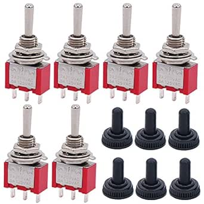

# Twidec MTS-123-MZ Momentary Toggle Switches

## Details

- **Location**: Cabinet-5, Bin 9
- **Category**: Switches & Controls
- **Brand**: Twidec
- **Part Number**: B07VHCB1Q4
- **Model**: MTS-123-MZ
- **Package**: Panel Mount Momentary Switch
- **Quantity**: 6 switches (from 6-piece pack)
- **Status**: Available
- **Price Range**: $9.99 (pack of 6)
- **Product URL**: https://a.co/d/d0yU4Bg

## Description

Twidec MTS-123-MZ are mini momentary toggle switches with SPDT (Single Pole, Double Throw) configuration in a (ON)-Off-(ON) arrangement. These compact switches feature a spring-return mechanism that automatically returns to the center OFF position when released. Each switch includes a waterproof cap for protection in harsh environments, making them ideal for automotive, marine, and outdoor applications.

## Specifications

### Electrical Characteristics

- **AC Voltage Rating**: 250V AC (2A) / 125V AC (5A)
- **Contact Configuration**: SPDT (Single Pole, Double Throw)
- **Switch Positions**: 3 - (ON)-Off-(ON) momentary
- **Contact Resistance**: <50 milliohms
- **Insulation Resistance**: >100 MΩ
- **Dielectric Strength**: 1500V AC (1 minute)

### Physical Characteristics

- **Overall Size**: 13mm x 7mm x 32mm (L×W×T)
- **Mounting Hole**: 6mm (0.23 inches) diameter
- **Terminal Type**: Screw terminals (3-pin)
- **Housing Material**: Plastic and metal construction
- **Actuator**: Mini toggle lever
- **Operating Temperature**: -25°C to +85°C
- **Mechanical Life**: >50,000 cycles

### Switch Operation

- **Position 1 (UP)**: Momentary ON - Center terminal connected to bottom terminal
- **Position 2 (CENTER)**: OFF - All terminals isolated (spring return position)
- **Position 3 (DOWN)**: Momentary ON - Center terminal connected to top terminal
- **Actuation Force**: 2-4 lbs typical
- **Return Mechanism**: Spring-loaded automatic return to center

## Image

## Applications

Common use cases and applications for these momentary toggle switches:

- **Automotive Controls**: Window controls, seat adjustments, mirror positioning
- **Marine Applications**: Winch controls, trim tab adjustments, bilge pump controls
- **Electronics Projects**: Manual pulse generation, temporary circuit activation
- **Control Panels**: Jog controls, manual overrides, test functions
- **Robotics**: Manual positioning controls, emergency stops, mode selection
- **Audio Equipment**: Momentary mute, channel selection, effect triggers
- **Industrial Controls**: Manual valve controls, conveyor jog, equipment testing
- **Model Railways**: Turnout controls, signal activation, accessory control
- **Test Equipment**: Manual trigger switches, calibration controls
- **Security Systems**: Panic buttons, manual alarm triggers

## Wiring Configuration

### Terminal Identification
- **Terminal 1 (Top)**: First momentary output
- **Terminal 2 (Center)**: Common input/output
- **Terminal 3 (Bottom)**: Second momentary output

### Common Wiring Examples
- **Motor Jog Control**: Center = motor common, Top/Bottom = forward/reverse momentary
- **Pulse Generation**: Center = signal input, Top/Bottom = different pulse outputs
- **Manual Override**: Center = control input, Top/Bottom = override functions

## Technical Notes

Important technical considerations and usage tips:

- Momentary operation means switch returns to center OFF position automatically
- Ideal for applications requiring spring-return operation
- Waterproof caps provide protection in harsh environments
- Compact size suitable for space-constrained applications
- Screw terminals provide secure wire connections
- Mini form factor perfect for handheld controllers
- Spring mechanism provides tactile feedback

## Installation

- Drill 6mm (0.23") hole in panel
- Insert switch through hole from front
- Secure with included hex nuts and washers from rear
- Connect wires to screw terminals as needed
- Install waterproof cap if environmental protection needed
- Test momentary operation before final installation

## Safety Considerations

- **Voltage Rating**: Never exceed 250V AC or equivalent DC
- **Current Rating**: Do not exceed 2A at 250V AC or 5A at 125V AC
- **Momentary Operation**: Ensure circuit design accounts for spring-return behavior
- **Environmental**: Use waterproof caps in wet or dusty conditions
- **Wire Gauge**: Use appropriate wire gauge for current load

## Included Accessories

Each switch comes with:
- 2 hex nuts for panel mounting
- 1 flat washer
- 1 locking washer
- 1 waterproof cap for environmental protection

## Tags

twidec, mts-123, momentary-switch, spdt, on-off-on, 3-position, waterproof #cabinet-5 #bin-9 #status-available

## Notes

These Twidec MTS-123-MZ momentary switches are perfect for applications requiring spring-return operation. The compact size and waterproof caps make them ideal for automotive, marine, and outdoor use. The momentary operation provides safety benefits in many applications by automatically returning to the OFF position when released. The included mounting hardware and waterproof caps add value to the package. Quality construction and reliable spring mechanism make them suitable for both hobby and professional applications.
