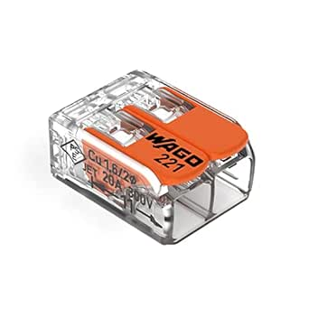

# WAGO 221-412 2-Conductor Compact Splicing Connectors

## Details

- **Location**: Cabinet-5, Bin 1
- **Category**: Electrical Connectors
- **Brand**: WAGO
- **Part Number**: 221-412
- **Package**: Compact Lever-Nut
- **Quantity**: 30
- **Status**: Available
- **Price Range**: $28-30 (pack of 100)
- **Product URL**: https://a.co/d/2Be7dj3

## Description

WAGO 221-412 LEVER-NUTS are 2-conductor compact splicing connectors that provide a superior alternative to traditional wire nuts. These connectors feature an innovative lever-operated design that allows for tool-free wire connections and disconnections. The transparent housing allows visual verification of proper wire insertion, and the compact design saves space in electrical boxes and junction applications.

## Specifications

### Electrical Characteristics

- **Operating Voltage**: 450V AC
- **Current Rating**: 20A
- **Power Rating**: 4000W
- **Wire Gauge Range**: 24-12 AWG
- **Wire Types**: Solid, stranded, and flexible conductors

### Physical Characteristics

- **Package**: Compact Lever-Nut
- **Dimensions**: 0.52 x 0.52 x 0.33 inches
- **Weight**: 0.6 ounces (per connector)
- **Operating Temperature**: -35°C to +85°C
- **Housing Material**: Transparent plastic
- **Contact Material**: Copper alloy

### Key Features

- Tool-free lever operation for easy wire insertion and removal
- Transparent housing for visual connection verification
- Accepts different wire types and gauges in same connector
- Reusable - wires can be easily removed and reconnected
- UL, CSA, and VDE certified for safety
- Compact design saves space in electrical boxes

## Image

## Applications

Common use cases and applications for these connectors:

- Residential electrical wiring connections
- Light fixture installations
- Junction box wire splicing
- Electrical panel connections
- Automotive wiring applications
- Low voltage DC connections
- LED strip and lighting connections
- Home automation wiring

## Technical Notes

Important technical considerations and usage tips:

- Always ensure wires are fully inserted until they contact the back of the connector
- Verify connection by gently tugging on wires after lever is closed
- Use appropriate wire gauge for the application and current requirements
- Transparent housing allows visual inspection of connection quality
- Lever must be fully closed to ensure proper electrical connection
- Can mix solid and stranded wires in the same connector
- Superior to wire nuts for connections with different wire gauges

## Tags

wago, lever-nuts, splicing-connectors, electrical-connectors, wire-nuts, tool-free #cabinet-5 #bin-1 #status-available

## Notes

These WAGO 221-412 connectors are a significant improvement over traditional wire nuts, especially when working with different wire gauges or types. The lever operation makes connections much faster and more reliable than twist-on wire nuts. The transparent housing provides confidence in connection quality, and the ability to easily disconnect and reconnect wires makes troubleshooting and modifications much easier. Highly recommended for both professional and DIY electrical work.
