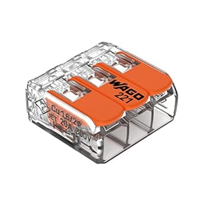

# WAGO 221-413 3-Conductor Compact Splicing Connectors

## Details

- **Location**: Cabinet-5, Bin 2
- **Category**: Electrical Connectors
- **Brand**: WAGO
- **Part Number**: 221-413
- **Package**: Compact Lever-Nut
- **Quantity**: 30
- **Status**: Available
- **Price Range**: $20-22 (pack of 50)
- **Product URL**: https://a.co/d/eYpmSw1

## Description

WAGO 221-413 LEVER-NUTS are 3-conductor compact splicing connectors that provide a superior alternative to traditional wire nuts for applications requiring three wire connections. These connectors feature an innovative lever-operated design that allows for tool-free wire connections and disconnections. The transparent housing allows visual verification of proper wire insertion, and the compact design saves space in electrical boxes and junction applications. Perfect for connecting hot, neutral, and ground wires or other 3-wire configurations.

## Specifications

### Electrical Characteristics

- **Operating Voltage**: 450V AC
- **Current Rating**: 20A
- **Power Rating**: 4000W
- **Wire Gauge Range**: 24-12 AWG
- **Wire Types**: Solid, stranded, and flexible conductors
- **Conductor Count**: 3

### Physical Characteristics

- **Package**: Compact Lever-Nut
- **Dimensions**: 0.52 x 0.52 x 0.33 inches
- **Weight**: 0.6 ounces (per connector)
- **Operating Temperature**: -35°C to +85°C
- **Housing Material**: Transparent plastic
- **Contact Material**: Copper alloy

### Key Features

- Tool-free lever operation for easy wire insertion and removal
- Transparent housing for visual connection verification
- Accepts different wire types and gauges in same connector
- Reusable - wires can be easily removed and reconnected
- UL, CSA, and VDE certified for safety
- Compact design saves space in electrical boxes
- 3-conductor design for complex wiring applications

## Image

## Applications

Common use cases and applications for these 3-conductor connectors:

- Residential electrical wiring with hot, neutral, and ground
- Light fixture installations with 3-wire configurations
- Junction box wire splicing for multiple circuits
- Electrical panel connections requiring 3 conductors
- Automotive wiring applications with 3-wire harnesses
- Low voltage DC connections with power, ground, and signal
- LED strip and lighting connections with control wires
- Home automation wiring with power and data lines

## Technical Notes

Important technical considerations and usage tips:

- Always ensure all three wires are fully inserted until they contact the back of the connector
- Verify connections by gently tugging on wires after all levers are closed
- Use appropriate wire gauge for the application and current requirements
- Transparent housing allows visual inspection of all three connection points
- All three levers must be fully closed to ensure proper electrical connections
- Can mix solid and stranded wires in the same connector
- Superior to wire nuts for 3-wire connections with different wire gauges
- Ideal for applications where frequent disconnection/reconnection is needed

## Tags

wago, lever-nuts, splicing-connectors, electrical-connectors, wire-nuts, tool-free, 3-conductor #cabinet-5 #bin-2 #status-available

## Notes

These WAGO 221-413 3-conductor connectors are essential for electrical work requiring three wire connections. They eliminate the complexity and unreliability of trying to twist three wires together with traditional wire nuts. The individual lever operation for each conductor ensures secure connections regardless of wire gauge differences. The transparent housing provides confidence that all three connections are properly made, and the ability to easily disconnect and reconnect individual wires makes troubleshooting and modifications much easier. Highly recommended for any electrical work involving 3-wire configurations.
