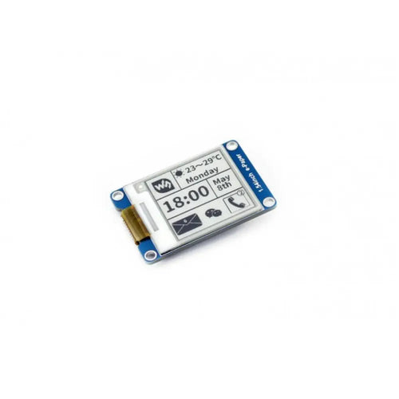

# Waveshare 1.54" e-Paper Module 200x200

## Details

- **Location**: Cabinet-1, Bin 34
- **Category**: LCD & Display
- **Part Number**: Waveshare 12955 (RB-Wav-119)
- **Size**: 1.54" diagonal (27.6mm × 27.6mm display area)
- **Resolution**: 200 × 200 pixels
- **Colors**: Black & White (2-level grayscale)
- **Voltage**: 3.3V operating voltage
- **Interface**: SPI (3-wire or 4-wire)
- **Quantity**: 1
- **Product URL**: https://www.robotshop.com/products/154-e-paper-module-200x200

## Description

This 1.54" e-Paper Module features a 200×200 pixel resolution display with excellent readability under direct sunlight and ultra-low power consumption. The e-paper technology provides a paper-like visual experience with no backlight required and the ability to maintain displayed content indefinitely without power.

The module uses an embedded controller and communicates via SPI interface, supporting both full and partial refresh modes. Due to its advantages like ultra-low power consumption, wide viewing angle, and great visibility under sunlight, it's ideal for applications such as shelf labels, industrial instruments, IoT displays, and battery-powered projects.

## Specifications

- **Display Technology**: E-Paper (Electronic Paper)
- **Resolution**: 200 × 200 pixels
- **Dot Pitch**: 0.138 × 0.138mm
- **Display Size**: 27.6mm × 27.6mm
- **Module Size**: 48mm × 33mm
- **Operating Voltage**: 3.3V
- **Interface**: 3-wire SPI, 4-wire SPI
- **Display Colors**: Black, White (2-level grayscale)
- **Refresh Power**: 26.4mW (typical)
- **Standby Power**: <0.017mW
- **Viewing Angle**: >170°
- **Weight**: 0.024 kg

## Interface Pinout

- **VCC**: 3.3V power supply
- **GND**: Ground
- **DIN**: SPI MOSI pin (data input)
- **CLK**: SPI SCK pin (clock)
- **CS**: SPI chip selection (active low)
- **DC**: Data/Command selection (high for data, low for command)
- **RST**: External reset (active low)
- **BUSY**: Busy status output (active low)

## Image

## Key Features

- **No Backlight Required**: Perfect readability in bright sunlight
- **Ultra-Low Power**: Maintains display content without power
- **Wide Viewing Angle**: >170° viewing angle
- **SPI Interface**: Easy integration with microcontrollers
- **Partial Refresh Support**: Update only changed portions of display
- **Long Content Retention**: Displays last content indefinitely without power

## Applications

- IoT sensor displays and status indicators
- Battery-powered weather stations
- Electronic shelf labels and price tags
- Industrial instrument displays
- Smart home control panels
- Wearable device displays
- E-book readers and digital signage
- Solar-powered outdoor displays

## Development Resources

- Comes with development resources and manual
- Compatible with Arduino, Raspberry Pi, and other microcontrollers
- Sample code and libraries available from Waveshare
- Supports both Arduino IDE and Python programming

## What's Included

- 1× 1.54" e-Paper Module
- 2× XH2.54 20cm 8-pin cables

## Technical Notes

- Requires 3.3V logic level (use level shifters for 5V systems)
- Refresh time varies depending on temperature and content
- Partial refresh reduces flicker and power consumption
- Full refresh recommended periodically to prevent ghosting
- Operating temperature affects refresh speed and quality

## Tags

epaper, eink, display, waveshare, spi, low-power, sunlight-readable, iot, battery-powered
