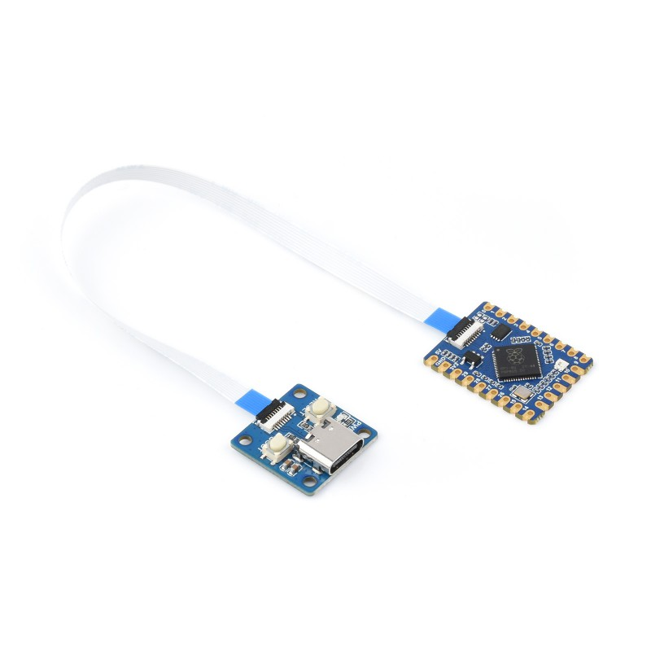

# Waveshare RP2040-Tiny

## Details

- **Location**: Cabinet-1, Bin 32
- **Category**: Microcontroller Boards
- **Type**: RP2040 Development Board (Ultra Compact)
- **Microcontroller**: RP2040 (Dual ARM Cortex-M0+ @ 125MHz)
- **Brand**: Waveshare
- **Part Number**: 24665
- **Quantity**: 4
- **Product URL**: https://www.waveshare.com/rp2040-tiny.htm?sku=24665

## Description

The RP2040-Tiny is an ultra-compact development board based on the Raspberry Pi RP2040 microcontroller. Despite its tiny size, it packs all the essential features needed for embedded development projects. Perfect for space-constrained applications where every millimeter counts.

## Specifications

- **Microcontroller**: RP2040 32-bit Cortex M0+ dual-core @ ~125 MHz
- **Logic/Power**: 3.3V
- **Memory**: 264 KB RAM, 2 MB SPI FLASH
- **Crystal**: 12 MHz for perfect timing
- **GPIO Pins**: 20 total GPIO pins
- **ADC**: 3x 12-bit ADC channels
- **Peripherals**: I2C, SPI, UART interfaces
- **PWM**: 16 PWM outputs
- **USB**: USB Type C connector with native USB support
- **Regulator**: 3.3V voltage regulator
- **Special Features**: Boot/Reset buttons, LED indicator

## Dimensions

- **Board Size**: 21mm x 18mm (0.8" x 0.7")
- **Weight**: ~2g
- **Form Factor**: Ultra compact design

## Image

## Features

- Ultra-compact form factor for space-constrained projects
- All 20 GPIO pins broken out on castellated pads
- USB Type C connector for modern connectivity
- Boot and Reset buttons for easy programming
- UF2 bootloader support for drag-and-drop programming
- Compatible with CircuitPython, MicroPython, and C/C++
- Low power consumption design
- Breadboard and PCB mountable with castellated edges
- Optional USB adapter board available for easier prototyping

## Tags

microcontroller, rp2040, tiny, compact, usb-c, waveshare, circuitpython, micropython, ultra-small

## Notes

Perfect for projects where space is at a premium. The ultra-compact design makes it ideal for wearable electronics, IoT sensors, and embedded applications. The castellated pads allow for direct PCB mounting or breadboard use. Optional adapter board (RP2040-Tiny-Adapter) available for easier prototyping with standard pin headers.
