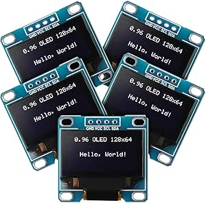

# Weewooday 0.96" I2C OLED Display Module

## Details
- **Location**: Cabinet-1, Bin 21
- **Category**: OLED Displays
- **Type**: I2C OLED Display Module
- **Size**: 0.96 inch diagonal
- **Resolution**: 128x64 pixels
- **Quantity**: 8
- **Product URL**: https://a.co/d/f5LTPiZ

## Description
Weewooday 5 pieces 0.96 inch OLED display module with 128x64 pixel resolution. Features SSD1306 driver chip with I2C interface for easy connection to microcontrollers. Self-illuminated OLED technology provides excellent contrast and visibility with white display color.

## Specifications
- **Display Size**: 0.96 inch diagonal
- **Resolution**: 128x64 pixels
- **Driver IC**: SSD1306
- **Interface**: I2C (SDA, SCL)
- **Display Color**: White
- **Operating Voltage**: 3.3V to 5V
- **Current Consumption**: ~20mA (typical)
- **Power Consumption**: 0.04W normal operation, 0.08W full screen lit
- **Viewing Angle**: >160°
- **Operating Temperature**: -40°C to +85°C
- **Package**: PCB module without pin headers

## Image

## Features
- **Self-Illuminated**: No backlight required, each pixel emits light
- **High Contrast**: Excellent visibility in various lighting conditions
- **Low Power**: Efficient OLED technology with low current consumption
- **Wide Voltage Range**: Compatible with 3.3V and 5V systems
- **I2C Interface**: Simple 2-wire communication (SDA, SCL)
- **Larger Display**: 0.96" vs 0.91" provides more display area
- **Higher Resolution**: 128x64 vs 128x32 for more content
- **No Pin Headers**: Requires soldering of header pins for breadboard use

## Pinout
- **VCC**: Power supply (3.3V to 5V)
- **GND**: Ground
- **SDA**: I2C data line
- **SCL**: I2C clock line

## Applications
- Arduino and microcontroller projects
- Raspberry Pi displays
- IoT device status displays
- Portable instruments
- Data loggers
- Weather stations
- Digital clocks
- Menu systems
- Status indicators
- Wearable electronics

## Compatibility
- **Arduino**: All Arduino boards (Uno, Nano, ESP32, etc.)
- **Raspberry Pi**: All models (requires I2C enable)
- **ESP8266/ESP32**: Native I2C support
- **STM32**: Compatible with HAL I2C libraries
- **Microcontrollers**: Any MCU with I2C capability
- **MMDVM/Pi-Star**: Compatible with digital radio systems

## Libraries & Resources
- **Arduino**: Adafruit SSD1306 library
- **CircuitPython**: adafruit_ssd1306
- **Raspberry Pi**: luma.oled library
- **Documentation**: SSD1306 datasheet available online
- **I2C Address**: Typically 0x3C (may vary from standard 0x3D)

## Interface Requirements
- **Power Supply**: 3.3V or 5V regulated
- **I2C Pullups**: Usually built-in on development boards
- **Pin Headers**: Requires soldering for breadboard connections
- **Current**: Ensure adequate power supply capacity

## Notes
- **No Pin Headers**: Displays come without headers, soldering required
- **I2C Address**: May be 0x3C instead of standard 0x3D - check with scanner
- **Power Consumption**: Lower when fewer pixels are lit
- **Lifespan**: OLED displays may dim over extended continuous use
- **Fragile**: Handle carefully, OLED screens can crack easily
- **Static Sensitive**: Use anti-static precautions during handling
- **Quality Control**: Some units may have manufacturing defects

## Usage Tips
- Solder 4-pin header for easy breadboard prototyping
- Use I2C scanner to verify address before programming
- Start with lower brightness settings to extend display life
- Consider sleep modes for battery-powered applications
- Test each display individually as quality may vary

## Programming Examples
- Display text and graphics
- Real-time sensor data visualization
- Menu navigation systems
- Progress bars and status indicators
- Simple animations and scrolling text

## Comparison with Other OLED Displays
- **vs 0.91" displays**: Larger viewing area, higher resolution
- **vs 128x32 displays**: Double the vertical resolution
- **vs Frienda displays**: Similar functionality, different brand

## Tags
oled-display, i2c, ssd1306, white, 128x64, weewooday, arduino, raspberry-pi
