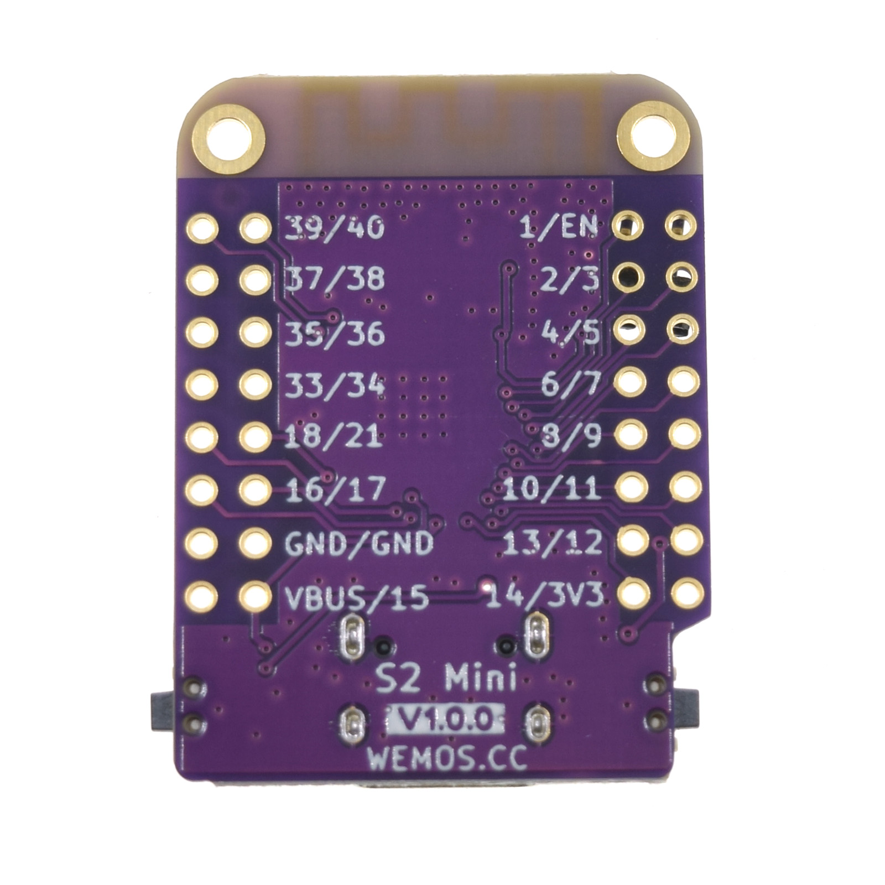

# WEMOS ESP32-S2 Mini Development Board

## Details

- **Location**: Cabinet-1, Bin 27
- **Category**: Microcontroller Boards
- **Type**: WiFi Development Board
- **Microcontroller**: ESP32-S2FN4R2
- **Brand**: WEMOS
- **Model**: S2 Mini
- **Quantity**: 9
- **Product URL**: https://www.aliexpress.com/item/1005003145192016.html
- **Official Documentation**: https://www.wemos.cc/en/latest/s2/s2_mini.html
- **Schematic**: https://www.wemos.cc/en/latest/_static/files/sch_s2_mini_v1.0.0.pdf
- **Datasheet**: https://www.espressif.com/sites/default/files/documentation/esp32-s2_datasheet_en.pdf

## Description

Compact WiFi-enabled development board based on the ESP32-S2FN4R2 chip. Features native USB support, generous memory allocation, and compatibility with LOLIN D1 Mini shields. Perfect for IoT projects requiring WiFi connectivity with USB HID capabilities. Comes pre-loaded with MicroPython firmware.

## Specifications

- **Microcontroller**: ESP32-S2FN4R2
- **Architecture**: Xtensa LX7 32-bit single-core
- **Clock Speed**: 240MHz
- **Operating Voltage**: 3.3V
- **Flash Memory**: 4MB
- **PSRAM**: 2MB
- **Dimensions**: 34.3mm x 25.4mm
- **Weight**: 2.4g

## Images

### Product Photos




### Pinout Diagrams


## Features

- **ESP32-S2FN4R2**: Single-core WiFi microcontroller with native USB
- **Native USB**: Built-in USB support - can act as keyboard/mouse, MIDI device, mass storage
- **Type-C USB**: Modern connector for programming and power
- **Rich Memory**: 4MB Flash + 2MB PSRAM for complex applications
- **27 GPIO Pins**: Extensive I/O capabilities
- **D1 Mini Compatible**: Works with existing LOLIN D1 Mini shields
- **Multiple Programming**: MicroPython, Arduino, CircuitPython, ESP-IDF support
- **Default Firmware**: Ships with MicroPython pre-installed

## Pin Configuration

- **Digital I/O**: 27 GPIO pins
- **Analog Inputs**: 20 pins (12-bit ADC)
- **Analog Outputs**: 2 pins (8-bit DAC)
- **PWM**: All GPIO pins support PWM
- **I2C**: Hardware I2C support
- **SPI**: Hardware SPI support
- **UART**: Hardware UART support
- **USB OTG**: Native USB On-The-Go support

## Detailed Pinout

### Left Side (Top to Bottom)

- **3V3**: 3.3V power output
- **GND**: Ground
- **GPIO1**: Digital I/O, ADC1_CH0, Touch1
- **GPIO2**: Digital I/O, ADC1_CH1, Touch2
- **GPIO3**: Digital I/O, ADC1_CH2, Touch3
- **GPIO4**: Digital I/O, ADC1_CH3, Touch4
- **GPIO5**: Digital I/O, ADC1_CH4, Touch5
- **GPIO6**: Digital I/O, ADC1_CH5, Touch6
- **GPIO7**: Digital I/O, ADC1_CH6, Touch7
- **GPIO8**: Digital I/O, ADC1_CH7, Touch8
- **GPIO9**: Digital I/O, ADC1_CH8, Touch9
- **GPIO10**: Digital I/O, ADC1_CH9, Touch10
- **GPIO11**: Digital I/O, ADC2_CH0, Touch11
- **GPIO12**: Digital I/O, ADC2_CH1, Touch12
- **GPIO13**: Digital I/O, ADC2_CH2, Touch13
- **GPIO14**: Digital I/O, ADC2_CH3, Touch14

### Right Side (Top to Bottom)

- **5V**: 5V power input (from USB)
- **GND**: Ground
- **GPIO15**: Digital I/O, ADC2_CH4, Touch15, XTAL_32K_P
- **GPIO16**: Digital I/O, ADC2_CH5, Touch16, XTAL_32K_N
- **GPIO17**: Digital I/O, ADC2_CH6, Touch17, DAC_1
- **GPIO18**: Digital I/O, ADC2_CH7, Touch18, DAC_2
- **GPIO19**: Digital I/O, ADC2_CH8, Touch19, USB_D-
- **GPIO20**: Digital I/O, ADC2_CH9, Touch20, USB_D+
- **GPIO21**: Digital I/O, RTC_GPIO0
- **GPIO33**: Digital I/O, XTAL_32K_P (if external crystal)
- **GPIO34**: Digital I/O, XTAL_32K_N (if external crystal)
- **GPIO35**: Digital I/O
- **GPIO36**: Digital I/O
- **GPIO37**: Digital I/O
- **GPIO38**: Digital I/O
- **GPIO39**: Digital I/O
- **GPIO40**: Digital I/O
- **GPIO41**: Digital I/O
- **GPIO42**: Digital I/O

### Special Functions

- **GPIO19/GPIO20**: USB D-/D+ (native USB)
- **GPIO17/GPIO18**: DAC outputs (8-bit)
- **GPIO1-GPIO14**: Touch-sensitive pins
- **All GPIO**: PWM capable
- **ADC1**: GPIO1-GPIO10 (12-bit ADC)
- **ADC2**: GPIO11-GPIO20 (12-bit ADC, shared with WiFi)

## Power Specifications

- **Operating Voltage**: 3.3V
- **Input Voltage**: 5V (USB-C) or 3.3V (VCC pin)
- **Current Consumption**:
  - Active (WiFi): ~80-120mA
  - Light Sleep: ~1-2mA
  - Deep Sleep: ~10-20μA
- **Power Supply**: Built-in 3.3V regulator

## Wireless Capabilities

### WiFi

- **Standards**: 802.11 b/g/n (2.4GHz)
- **Modes**: Station, Access Point, Station+AP
- **Security**: WEP, WPA, WPA2, WPA3
- **Range**: Standard WiFi range

## Applications

- IoT sensor nodes with WiFi connectivity
- USB HID devices (keyboard, mouse, MIDI)
- WiFi-enabled automation projects
- MicroPython learning and development
- CircuitPython projects
- Web servers and clients
- MQTT clients and IoT gateways
- Educational microcontroller projects

## Programming

- **MicroPython**: Default firmware, drag-and-drop programming
- **Arduino IDE**: Full support with ESP32 board package
- **CircuitPython**: Native support with USB drive functionality
- **ESP-IDF**: Espressif development framework
- **USB Programming**: No external programmer needed
- **Libraries**: WiFi, HTTP, MQTT, USB HID libraries

## Programming Examples

### Arduino WiFi Example

```cpp
#include <WiFi.h>

const char* ssid = "your-wifi-ssid";
const char* password = "your-wifi-password";

void setup() {
  Serial.begin(115200);
  WiFi.begin(ssid, password);

  while (WiFi.status() != WL_CONNECTED) {
    delay(1000);
    Serial.println("Connecting to WiFi...");
  }

  Serial.println("WiFi connected!");
  Serial.print("IP address: ");
  Serial.println(WiFi.localIP());
}

void loop() {
  // Your code here
}
```

### MicroPython Example

```python
import network
import time

# Connect to WiFi
wlan = network.WLAN(network.STA_IF)
wlan.active(True)
wlan.connect('your-wifi-ssid', 'your-wifi-password')

while not wlan.isconnected():
    print('Connecting to WiFi...')
    time.sleep(1)

print('WiFi connected!')
print('IP address:', wlan.ifconfig()[0])
```

### USB HID Example (Arduino)

```cpp
#include "USB.h"
#include "USBHIDKeyboard.h"

USBHIDKeyboard Keyboard;

void setup() {
  Keyboard.begin();
  USB.begin();
}

void loop() {
  Keyboard.print("Hello from ESP32-S2!");
  delay(5000);
}
```

## D1 Mini Ecosystem

- **Shield Compatible**: Works with LOLIN D1 Mini shields
- **Form Factor**: Standard D1 Mini pinout and dimensions
- **Accessories**: Large ecosystem of compatible shields and sensors
- **Community**: Extensive D1 Mini community support

## Advantages

- **Native USB**: Advanced USB functionality built-in
- **Rich Memory**: 4MB Flash + 2MB PSRAM for complex projects
- **Shield Compatible**: Leverage existing D1 Mini ecosystem
- **Multi-Language**: Support for multiple programming environments
- **Cost Effective**: Excellent price-to-performance ratio
- **Easy Development**: MicroPython pre-installed for quick start

## Hardware Features

- **Type-C USB**: Modern, reversible connector
- **Reset Button**: Convenient program restart
- **Boot Button**: Enter bootloader mode
- **User LED**: Built-in status indicator
- **Antenna**: PCB antenna for WiFi connectivity

## Comparison with Other ESP32-S2 Boards

- **vs Adafruit QT Py ESP32-S2**: Larger size but more GPIO pins and shield compatibility
- **vs ESP32-S2-DevKitC**: More compact, shield-compatible form factor
- **vs ESP32-S3**: Single-core vs dual-core, no Bluetooth but native USB

## Notes

- Single-core ESP32-S2 (not dual-core like ESP32 classic)
- No Bluetooth support (WiFi only)
- Native USB enables advanced interfacing capabilities
- 4MB Flash + 2MB PSRAM allows for complex applications
- Perfect for IoT projects requiring WiFi connectivity
- D1 Mini shield compatibility expands functionality
- MicroPython firmware makes it beginner-friendly
- Excellent for learning ESP32-S2 architecture

## Default Firmware

- **MicroPython**: Pre-installed for immediate use
- **REPL Access**: Interactive Python shell via USB
- **File System**: Access files via USB mass storage
- **WiFi Libraries**: Built-in WiFi connectivity support

## Tags

microcontroller, esp32-s2, wifi, wemos, s2-mini, usb-c, d1-mini-compatible, iot, micropython, circuitpython
