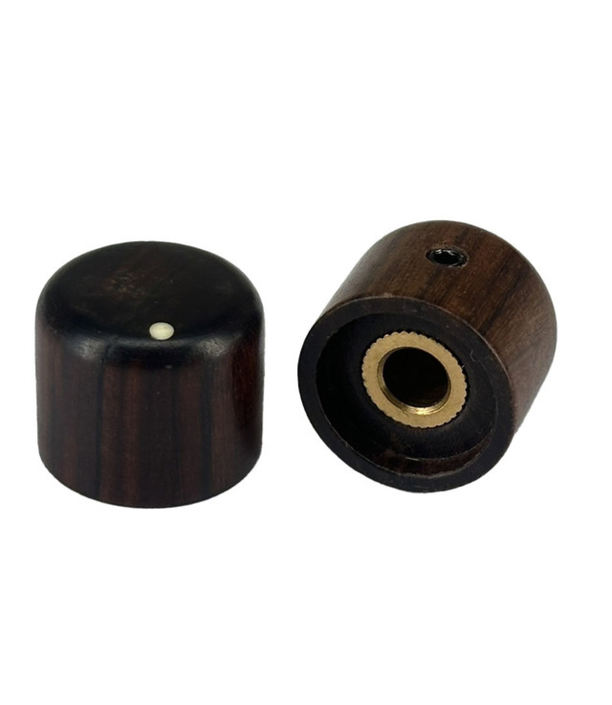

# Wood Ebony Dome Knob 20x17mm Shaft 6.00mm

## Overview

Premium wood ebony dome-style knob crafted for high-end audio equipment and control applications. The 20x17mm dimensions provide excellent grip and control precision, while the natural ebony wood finish offers an elegant, professional appearance. Ideal for vintage audio restorations, premium control panels, and applications where aesthetics are as important as functionality.

## Location

**Cabinet-5, Bin 7, Section A** - Premium Wood Knobs

## Images



## Specifications

### Physical Specifications
- **Body Size**: 20mm diameter x 17mm height
- **Material**: Natural ebony wood
- **Finish**: Smooth, polished ebony finish
- **Shape**: Dome/rounded top profile
- **Shaft Hole**: 6.00mm diameter
- **Mounting**: Set screw or friction fit (depending on design)
- **Weight**: Substantial feel due to wood construction

### Material Properties
- **Wood Type**: Ebony (Diospyros species)
- **Density**: High density hardwood
- **Color**: Deep black to dark brown natural coloration
- **Grain**: Fine, tight grain structure
- **Durability**: Excellent wear resistance
- **Temperature Stability**: Good dimensional stability

### Mechanical Specifications
- **Shaft Compatibility**: 6mm solid or split shaft
- **Rotation**: Smooth, precise control feel
- **Grip**: Natural wood texture provides excellent grip
- **Temperature Range**: 0°C to +60°C (recommended)
- **Humidity Tolerance**: Moderate (avoid extreme moisture)

## Applications

### High-End Audio Equipment
- **Tube Amplifiers**: Volume and tone controls for vintage aesthetics
- **Premium Preamps**: Input selection and level controls
- **Audiophile Equipment**: High-end stereo system controls
- **Vintage Restorations**: Authentic period-correct replacements

### Musical Instruments
- **Guitar Amplifiers**: Premium control knobs for boutique amps
- **Synthesizers**: Parameter controls for vintage-style instruments
- **Mixing Consoles**: Channel controls for professional audio
- **Effects Units**: High-end effects processor controls

### Professional Equipment
- **Recording Equipment**: Studio-grade control interfaces
- **Test Instruments**: Precision measurement equipment
- **Laboratory Equipment**: Scientific instrument controls
- **Industrial Controls**: Premium control panel applications

### Custom Projects
- **DIY Audio**: High-end homebrew audio projects
- **Restoration Projects**: Vintage equipment refurbishment
- **Custom Instruments**: Handcrafted musical instruments
- **Artisan Electronics**: Boutique electronic devices

## Installation

### Shaft Preparation
1. **Measure Shaft**: Verify 6mm shaft diameter
2. **Clean Shaft**: Remove any debris or oxidation
3. **Test Fit**: Check knob fits properly on shaft
4. **Mark Position**: Determine desired knob position

### Mounting Methods

#### Set Screw Mounting
1. **Position Knob**: Place knob at desired position on shaft
2. **Align Set Screw**: Position set screw over shaft flat (if present)
3. **Tighten Gradually**: Use appropriate hex key to tighten set screw
4. **Test Security**: Verify knob doesn't slip under normal use

#### Friction Fit Mounting
1. **Prepare Shaft**: Ensure shaft is clean and proper diameter
2. **Press Fit**: Push knob firmly onto shaft
3. **Check Alignment**: Verify knob is straight and properly seated
4. **Test Operation**: Confirm smooth rotation and secure fit

### Panel Integration
1. **Potentiometer Mounting**: Secure potentiometer in panel
2. **Shaft Length**: Ensure adequate shaft protrusion
3. **Clearance Check**: Verify knob doesn't contact panel or other components
4. **Aesthetic Alignment**: Align multiple knobs for professional appearance

## Design Considerations

### Aesthetic Appeal
- **Natural Beauty**: Ebony wood provides rich, elegant appearance
- **Professional Look**: Suitable for high-end equipment
- **Vintage Character**: Authentic feel for restoration projects
- **Unique Grain**: Each knob has individual wood grain pattern

### Ergonomics
- **Comfortable Grip**: 20mm diameter fits well in hand
- **Dome Shape**: Rounded profile comfortable for fingertip control
- **Natural Texture**: Wood surface provides excellent grip
- **Substantial Feel**: Weight and density provide premium tactile experience

### Environmental Considerations
- **Humidity Sensitivity**: Wood can expand/contract with moisture changes
- **Temperature Stability**: Generally stable within normal operating ranges
- **UV Sensitivity**: Prolonged sun exposure may affect finish
- **Chemical Resistance**: Avoid harsh solvents or cleaners

## Maintenance and Care

### Regular Maintenance
- **Dusting**: Use soft, dry cloth to remove dust
- **Cleaning**: Slightly damp cloth for stubborn dirt (dry immediately)
- **Polishing**: Occasional application of wood polish or wax
- **Inspection**: Check for cracks or loose mounting

### Environmental Protection
- **Humidity Control**: Maintain stable humidity levels
- **Temperature Control**: Avoid extreme temperature changes
- **UV Protection**: Keep away from direct sunlight
- **Chemical Protection**: Avoid contact with solvents or harsh chemicals

### Restoration
- **Light Sanding**: Very fine sandpaper for surface restoration
- **Re-finishing**: Apply appropriate wood finish if needed
- **Crack Repair**: Use wood glue for minor cracks
- **Professional Restoration**: Consider professional refinishing for valuable pieces

## Circuit Integration

### Basic Potentiometer Setup
```
VCC ----[Potentiometer]---- GND
              |
              +---- Signal Output to Amplifier
```

### Audio Volume Control
```cpp
// Arduino code for audio volume control
const int potPin = A0;
const int audioPin = 9;

void setup() {
  pinMode(potPin, INPUT);
  pinMode(audioPin, OUTPUT);
}

void loop() {
  int volume = analogRead(potPin);
  int pwmValue = map(volume, 0, 1023, 0, 255);
  analogWrite(audioPin, pwmValue);
  delay(10);
}
```

### Tone Control Circuit
```
Audio Input ----[Capacitor]----[Potentiometer]---- Audio Output
                                      |
                                    [Resistor]
                                      |
                                     GND
```

## Troubleshooting

### Common Issues
- **Loose Fit**: Check shaft diameter and mounting method
- **Rough Rotation**: Inspect potentiometer condition
- **Cracking**: Examine for wood stress or age-related damage
- **Finish Wear**: Consider refinishing if appearance is important

### Wood-Specific Issues
- **Swelling**: Reduce humidity or improve ventilation
- **Shrinkage**: Increase humidity or relocate equipment
- **Discoloration**: Check for UV exposure or chemical contact
- **Grain Raising**: Light sanding may be needed

## Sourcing Information

### Supplier
- **Tayda Electronics**: Primary supplier
- **Part Number**: A0305
- **Price**: $3.15 per piece
- **URL**: https://www.taydaelectronics.com/wood-ebony-dome-knob-20x17mm-shaft-6-00mm.html

### Alternative Sources
- **Specialty Audio Suppliers**: High-end audio component suppliers
- **Woodworking Suppliers**: Custom wood knob manufacturers
- **Vintage Parts Suppliers**: Restoration-specific suppliers
- **Artisan Craftsmen**: Custom woodworkers

### Specifications to Match
- **6mm shaft hole**
- **Ebony or similar hardwood**
- **Dome/rounded profile**
- **20mm diameter (approximate)**
- **Premium finish quality**

## Storage and Handling

### Storage Recommendations
- **Climate Control**: Stable temperature and humidity
- **Protection**: Avoid crushing or impact damage
- **Organization**: Store separately to prevent scratching
- **Ventilation**: Allow air circulation around stored knobs

### Handling Tips
- **Clean Hands**: Handle with clean, dry hands
- **Gentle Installation**: Don't over-tighten set screws
- **Avoid Chemicals**: Keep away from solvents and cleaners
- **Careful Transport**: Protect from impact during shipping

## Premium Features

### Quality Indicators
- **Grain Pattern**: Consistent, attractive wood grain
- **Finish Quality**: Smooth, even finish without defects
- **Dimensional Accuracy**: Precise shaft hole and overall dimensions
- **Weight**: Substantial feel indicating quality construction

### Value Proposition
- **Aesthetic Appeal**: Premium appearance for high-end applications
- **Durability**: Long-lasting natural material
- **Unique Character**: Each knob has individual wood characteristics
- **Professional Grade**: Suitable for commercial and professional use

## Tags

knobs, controls, hardware, mechanical, wood, ebony, dome, premium, 6mm-shaft, audio, vintage, restoration, high-end #cabinet-5 #status-available

## Notes

These wood ebony dome knobs represent premium control hardware suitable for high-end audio equipment and restoration projects. The natural ebony wood provides both aesthetic appeal and functional durability, making them ideal for applications where appearance is as important as performance. The 6mm shaft compatibility ensures broad compatibility with standard potentiometers. Store in Cabinet-5, Bin 7, Section A for easy access during premium builds and restoration projects. The higher price point reflects the quality materials and craftsmanship involved in their construction.
