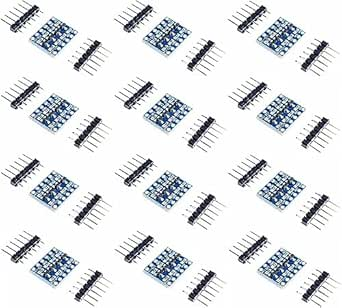

# WWZMDiB Logic Level Shifter Converter Modules

## Details

- **Location**: Cabinet-5, Bin 21, Section B
- **Category**: Interface & Communication
- **Brand**: WWZMDiB
- **Part Number**: B0CCF6TCSJ
- **Model**: 12 Pcs Logic Level Shifter Converter Module
- **Package**: PCB Module
- **Quantity**: 20 modules
- **Status**: Available
- **Price Range**: $6.99 (12-piece pack)
- **Product URL**: https://a.co/d/d8f2FYW

## Description

WWZMDiB Logic Level Shifter Converter Modules provide bidirectional level conversion between 3.3V and 5V voltage domains. These essential interface modules ensure safe communication between devices operating at different logic levels, preventing damage to sensitive 3.3V components when interfacing with 5V systems. Each module features 4 channels of bidirectional level shifting, making them perfect for multi-signal interfaces like I2C, SPI, and UART communications.

## Specifications

### Electrical Characteristics

- **Input Voltage Range**: 3.3V and 5V logic levels
- **Output Voltage**: Automatically converts between 3.3V and 5V
- **Channel Count**: 4 bidirectional channels per module
- **Logic Compatibility**: TTL and CMOS logic levels
- **Propagation Delay**: <10ns typical
- **Maximum Frequency**: Up to 10MHz (depending on load)
- **Supply Current**: <1mA per module
- **Operating Temperature**: -40°C to +85°C

### Physical Characteristics

- **Form Factor**: Small PCB module
- **Pin Count**: 8 pins (4 per voltage domain)
- **Pin Spacing**: 2.54mm (0.1") standard spacing
- **Mounting**: Breadboard and PCB compatible
- **Dimensions**: Compact design for space-constrained applications

## Image

## Applications

Common use cases for logic level shifters:

- **Arduino to Raspberry Pi**: Interface 5V Arduino with 3.3V Raspberry Pi GPIO
- **Sensor Interfacing**: Connect 3.3V sensors to 5V microcontrollers
- **Mixed Voltage Systems**: Bridge different voltage domains in complex systems
- **I2C Communication**: Enable I2C communication between different voltage devices
- **SPI Interfacing**: Safe SPI communication across voltage domains
- **UART Communication**: Serial communication between different voltage systems
- **ESP32/ESP8266 Projects**: Interface 3.3V ESP modules with 5V peripherals
- **Legacy System Integration**: Connect modern 3.3V devices to older 5V systems

## Protocol Support

### I2C (IIC) Communication
- **Bidirectional**: Supports both SDA and SCL lines
- **Pull-up Compatibility**: Works with external pull-up resistors
- **Multi-master**: Supports multi-master I2C configurations
- **Clock Stretching**: Compatible with clock stretching devices
- **Speed**: Supports standard (100kHz) and fast (400kHz) I2C modes

### SPI Communication
- **4-Wire SPI**: MOSI, MISO, SCK, and CS signal conversion
- **Master/Slave**: Works in both master and slave configurations
- **Clock Speeds**: Supports SPI clock frequencies up to 10MHz
- **Multiple Slaves**: Enable multiple SPI slave devices
- **Full Duplex**: Simultaneous bidirectional data transfer

### UART Communication
- **TX/RX Lines**: Converts UART transmit and receive signals
- **Baud Rates**: Supports all standard UART baud rates
- **Flow Control**: Compatible with RTS/CTS flow control
- **RS232 Interface**: Can be used with RS232 level converters
- **Debugging**: Essential for serial debugging across voltage domains

### 1-Wire Communication
- **Single Wire**: Converts 1-Wire communication signals
- **Dallas Devices**: Compatible with Dallas/Maxim 1-Wire devices
- **Temperature Sensors**: Interface DS18B20 and similar sensors
- **Parasitic Power**: Supports parasitic power mode devices

## Circuit Operation

### Bidirectional Level Shifting
- **Automatic Direction**: No direction control pins required
- **MOSFET-Based**: Uses MOSFET transistors for level conversion
- **Low Impedance**: Low on-resistance for minimal signal degradation
- **Fast Switching**: Quick response for high-speed signals
- **No Propagation Delay**: Minimal delay in signal conversion

### Power Requirements
- **Dual Supply**: Requires both 3.3V and 5V power supplies
- **Low Current**: Minimal current consumption
- **Decoupling**: Built-in decoupling capacitors for stable operation
- **Power Indicators**: LED indicators for power status (if equipped)

## Wiring and Connections

### Pin Configuration
- **LV (Low Voltage)**: 3.3V side connections
- **HV (High Voltage)**: 5V side connections
- **GND**: Common ground connection
- **Channel Pins**: 4 bidirectional signal channels

### Connection Guidelines
- **Power Supplies**: Connect appropriate voltage supplies to LV and HV
- **Ground**: Ensure common ground between all devices
- **Signal Routing**: Connect signals to appropriate voltage domain
- **Pull-ups**: Use appropriate pull-up resistors for open-drain signals

## Design Considerations

### Signal Integrity
- **Trace Length**: Keep signal traces short for high-speed applications
- **Ground Plane**: Use solid ground plane for noise reduction
- **Decoupling**: Add decoupling capacitors near power pins
- **Signal Routing**: Avoid crossing high-speed signals

### Thermal Management
- **Heat Dissipation**: Minimal heat generation under normal operation
- **Airflow**: Ensure adequate airflow for high-frequency applications
- **Thermal Relief**: Use thermal relief pads for ground connections

## Troubleshooting

### Common Issues
- **No Signal**: Check power supply connections and voltages
- **Signal Distortion**: Verify load capacitance and frequency limits
- **Intermittent Operation**: Check for loose connections or noise
- **Wrong Logic Levels**: Verify input and output voltage domains

### Testing Procedures
- **Power Check**: Verify 3.3V and 5V supply voltages
- **Continuity Test**: Check signal path continuity
- **Logic Analyzer**: Use logic analyzer to verify signal conversion
- **Oscilloscope**: Check signal quality and timing

## Safety Considerations

- **Voltage Limits**: Do not exceed maximum voltage ratings
- **ESD Protection**: Use proper ESD precautions during handling
- **Power Sequencing**: Apply power supplies in correct sequence
- **Thermal Limits**: Avoid exceeding maximum operating temperature
- **Signal Integrity**: Ensure proper grounding and decoupling

## Tags

wwzmdib, logic-level-shifter, bidirectional, 3.3v, 5v, uart, iic, spi, 1-wire, 4-channel, arduino #cabinet-5 #bin-21 #status-available

## Notes

These WWZMDiB logic level shifters are essential components for modern electronics projects involving mixed voltage systems. The bidirectional operation and 4-channel capacity make them versatile for various interface requirements. The compact form factor and breadboard compatibility make them ideal for prototyping and development work. Quality construction and reliable operation make them suitable for both hobby and professional applications. Having 20 modules provides adequate supply for multiple projects and ensures availability for future development needs.
