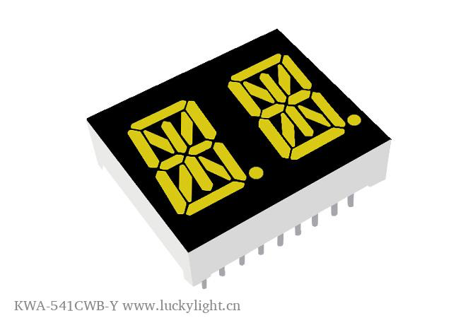

# Yetda Red Alphanumeric Display

## Details

- **Location**: Cabinet-1, Bin 17
- **Category**: Alphanumeric Displays
- **Type**: 14-Segment LED Character Display
- **Color**: Red
- **Size**: 0.5 inch character height
- **Quantity**: 8
- **Datasheet**: https://strawberry-linux.com/pub/yetda%20red%20alphanumeric%20S-10012RSK11.pdf

## Description

Yetda S-10012RSK11 red alphanumeric LED display with 14-segment configuration for displaying letters, numbers, and some symbols. Single character display with parallel interface suitable for microcontroller projects.

## Specifications

- **Part Number**: S-10012RSK11
- **Character Height**: 0.5 inch (12.7mm)
- **Segments**: 14-segment alphanumeric
- **Color**: Super Red
- **Forward Voltage**: ~2.0V per segment
- **Forward Current**: 20mA per segment (typical)
- **Interface**: Parallel (direct segment control)
- **Package**: DIP-style with pins
- **Operating Temperature**: -40°C to +85°C

## Image

## Pinout

- **Common Anode or Common Cathode**: (Check datasheet for specific configuration)
- **Segment Pins**: Individual pins for each of the 14 segments
- **Decimal Point**: Separate pin for decimal point control

## Applications

- Digital clocks and timers
- Alphanumeric message displays
- Status indicators
- Instrument panels
- Educational electronics projects
- Retro-style displays

## Interface Requirements

- **Microcontroller**: Any MCU with sufficient GPIO pins
- **Current Limiting**: Resistors required for each segment
- **Multiplexing**: For multiple displays, consider multiplexing circuit
- **Driver ICs**: Can use segment driver ICs for easier control

## Notes

- Requires current limiting resistors for each segment
- Can display A-Z, 0-9, and some special characters
- Suitable for both static and multiplexed driving
- Classic through-hole mounting style

## Tags

led-display, alphanumeric, red, 14-segment, yetda, strawberry-linux
